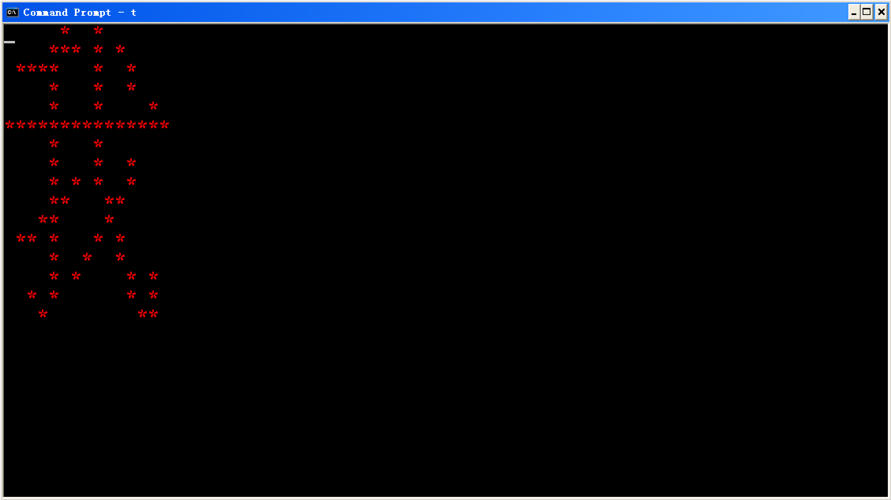

# 19-10-30

### 文本模式Text Mode

用80x25的2000个像素(字)，改变字符


朝显卡内存写入数据改变某一坐标的某一字符及颜色

在(0,0)有对应的显卡地址(B800:0)写东西

==一个字两字节，低是字符，高是颜色==

==颜色分为高四位和低四位，高四位为背景色、低四位为前景色==

```assembly
mov ax,0B800h  ; 0x starts with non-digit needs a 0
mov es,ax
mov byte ptr es:[0],'A'  ; 第一个位置
mov byte ptr es:[1],74h  ; 白底红字
mov byte ptr es:[2],'B'  ; 第二个位置
mov byte ptr es:[3],74h
;
; 也可
mov al,'A'  ; 注意小端规则，低位与低位对应
mov ah,71h
mov di, 0
mov word ptr es[di]:ax

```

|      |      |      |        |
| :--: | :--: | :--: | :----: |
|  0   |  黑  |  8   |  灰色  |
|  1   |  蓝  |  9   |  亮蓝  |
|  2   |  绿  |  a   |  亮绿  |
|  3   |  青  |  b   |  亮青  |
|  4   |  红  |  c   |  亮红  |
|  5   | 洋红 |  d   | 亮洋红 |
|  6   | 棕色 |  e   |   黄   |
|  7   |  白  |  f   |  亮白  |

```assembly
assume cs:CODE
CODE segment
START:
	mov ax,0B800h
	mov es,ax
	mov byte ptr es:[0],'A'
	mov byte ptr es:[1],74h
	mov ah,1  ;键盘输入中断，可以让程序等待，起到pause的效果
	int 21h
	mov ah,4ch
	int 21h
CODE ends
end START
```


#### 空循环等待

```assembly
	mov bx,200h
wait_wait:
	mov dx,0
wait_a_while:
	sub dx,1
	jnz wait_a_while
	sub bx,1
	jnz wait_wait
	
	mov word ptr ds:[di],002h  ; 前后黑色，字符为空格
```


bios 可以调用int 16h来实现键盘 输入，调用int 10h可以实现屏幕输出，int 13h来实现硬盘的读写


### 图形模式编程

调用 int 10h

320x200个pixel(256色？)

从0a000:0开始

```assembly
mov ah, 0  	; 其中AH=0表示int 10h的子功能号为0
mov al, 13h ; 其中AL=13h代表图形模式编号
int 10h     ; int 10h是与显示相关的bios中断
mov ax,0A000h
mov es,ax
mov byte ptr es:[0],4
mov byte ptr es:[1],2
```


#### CXY自制测试代码

```assembly
assume cs:code

code segment
start:
	mov cx,16
	mov dl,0  ; 表颜色
	mov di,0  ; 表地址

	mov ax,0a000h
	mov es,ax

	mov ax,0013h
	int 10h
_loop1:
	push cx
	mov cx,10
_loop2:
	mov byte ptr es:[di+0*320],dl
	mov byte ptr es:[di+1*320],dl
	mov byte ptr es:[di+2*320],dl
	mov byte ptr es:[di+3*320],dl
	inc di
	loop _loop2
	
	pop cx
	inc dl
	loop _loop1

	mov ah,1
	int 21h
	mov ax, 0003h
	int 10h; 切换到80*25文本模式
	mov ah,4ch
	int 21h

code ends
end start
```

效果：

改进测试程序(显示256色)

```assembly
assume cs:code

code segment
start:
	mov cx,256
	mov dl,0  ; 表颜色
	mov di,0  ; 表地址

	mov ax,0a000h
	mov es,ax

	mov ax,0013h
	int 10h
_loop1:
	push cx
	mov cx,1
_loop2:
	mov byte ptr es:[di+0*320],dl
	mov byte ptr es:[di+1*320],dl
	mov byte ptr es:[di+2*320],dl
	mov byte ptr es:[di+3*320],dl
	inc di
	loop _loop2
	
	pop cx
	inc dl
	loop _loop1

	mov ah,1
	int 21h
	mov ax, 0003h
	int 10h; 切换到80*25文本模式
	mov ah,4ch
	int 21h

code ends
end start
```

改进后效果：

#### 例程

block.asm

```assembly
code segment
assume cs:code; cs不需要赋值会自动等于code
main:
   jmp begin
i  dw 0
begin:
   mov ax, 0013h
   int 10h
   mov ax, 0A000h
   mov es, ax
   ;(320/2, 200/2)
   mov di, (100-20)*320+(160-20); (160-20,100-20)
   ;
   ; 上面：编译器masm支持数运算
   ;u
   ;mov cx, 41; rows=41
   mov i, 41
next_row:
   ;push cx
   push di
   mov al, 4; color=red
   mov cx, 41; dots=41
next_dot:
   mov es:[di], al
   add di, 1
   sub cx, 1
   jnz next_dot
   pop di; 左上角(x,y)对应的地址
   ;pop cx; cx=41
   add di, 320; 下一行的起点的地址
   ;sub cx, 1; 行数-1
   sub i, 1
   jnz next_row
   mov ah,0
   int 16h;bios键盘输入,类似int 21h的01h功能
   mov ax, 0003h
   int 10h; 切换到80*25文本模式
   mov ah, 4Ch
   int 21h
code ends
end main
```


cn.asm

```assembly
data segment
hz db 04h,80h,0Eh,0A0h,78h,90h,08h,90h
   db 08h,84h,0FFh,0FEh,08h,80h,08h,90h
   db 0Ah,90h,0Ch,60h,18h,40h,68h,0A0h
   db 09h,20h,0Ah,14h,28h,14h,10h,0Ch
data ends
code segment
assume cs:code, ds:data
main:
   mov ax, data
   mov ds, ax
   mov ax, 0A000h
   mov es, ax
   mov di, 0
   mov ax, 0013h
   int 10h
   mov dx, 16
   mov si, 0
next_row:
   mov ah, hz[si]
   mov al, hz[si+1]
   add si, 2
   mov cx, 16
check_next_dot:
   shl ax, 1; 刚移出的位会自动进入CF(进位标志)
   jnc no_dot; 若没有进位即CF=0则跳到no_dot
is_dot:
   mov byte ptr es:[di], 0Ch
no_dot:
   add di, 1
   sub cx, 1
   jnz check_next_dot
   sub di, 16
   add di, 320
   sub dx, 1
   jnz next_row
   mov ah, 1
   int 21h
   mov ax, 0003h
   int 10h
   mov ah, 4Ch
   int 21h
code ends
end main
```

效果：

cnt.asm

点阵字

还记得Arduino上的8x8显示矩阵的点阵取模吗

<u>巧妙：利用2个byte存储一行的点阵数据，然后利用左移位操作读取每个点的 布尔值 (具体是利用CF标志寄存器) 来判断该点是否需要点亮</u>

```assembly
data segment
hz db 04h,80h,0Eh,0A0h,78h,90h,08h,90h  ; line 1-4
   db 08h,84h,0FFh,0FEh,08h,80h,08h,90h ; line 5-8
   db 0Ah,90h,0Ch,60h,18h,40h,68h,0A0h  ; line 9-12
   db 09h,20h,0Ah,14h,28h,14h,10h,0Ch   ; line 13-16
data ends
code segment
assume cs:code, ds:data
main:
   mov ax, data
   mov ds, ax
   mov ax, 0B800h
   mov es, ax
   mov ax, 0003h
   int 10h
   mov di, 0
   mov dx, 16
   mov si, 0
next_row:
   mov ah, hz[si]
   mov al, hz[si+1]
   add si, 2
   mov cx, 16
check_next_dot:
   shl ax, 1  ; 刚移出的一位会进入CF
   jnc no_dot ; 若无进位(CF=0)则跳转
is_dot:
   mov byte ptr es:[di], '*'
   mov byte ptr es:[di+1], 0Ch
no_dot:
   add di, 2
   sub cx, 1
   jnz check_next_dot
   sub di, 32
   add di, 160
   sub dx, 1
   jnz next_row
   mov ah, 1
   int 21h
   mov ah, 4Ch
   int 21h
code ends
end main
```

效果：