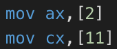
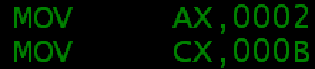

# 汇编总结

需要通过中间寄存器(ax)赋值的寄存器：段寄存器（CS, DS, SS, ES(附加段)）

> 因为CPU的设计里面一次指令只能读写内存一次的流程设计。立即数直接赋值给段寄存器的话，相当于读一次内存，一次内存流程了，再写一次内存，二次内存流程了。
>
> [高分：为什么立即数不能直接赋给段寄存器-CSDN论坛](https://bbs.csdn.net/topics/340215235)

---

能用于[]中的寄存器：变址（index，指SI, DI）或基址（base，指BX, BP）寄存器。

---

==第一个是字母的前面要加个0，如0A000h==

---

源程序中的[ads]不表示(DS:[ads])，会被masm当做数值ads处理

 $\Longrightarrow$ 

但若[寻址寄存器]，则会默认为是偏移地址

---

扩充包括零扩充及符号扩充两种。

* 零扩充针对无符号数
* 符号扩充针对符号数
  * 原变量为正数，补0；
  * 原变量为负数，补1；

---

$\begin{cases} push: & sp-=2 \\ pop: & sp += 2 \end{cases}$

---

画图

```assembly
; Text Mode 直接填充字符(80x25x2 Bytes)(字符+前景(L)+背景(H)，均为16色)
mov ax,0B800h
mov es,ax
; 键盘输入中断，可以让程序等待，起到pause的效果
mov ah,1
int 21h
; 开始画画
mov ah, 0  	; 其中AH=0表示int 10h的子功能号为0
mov al, 13h ; 其中AL=13h代表图形模式编号
int 10h     ; int 10h是与显示相关的bios中断
; Graph Mode 开始创作(320x200x1 Bytes，256色)
mov ax,0A000h
mov es,ax
; 回到command，防止花屏
mov ax, 0003h
int 10h; 切换到80*25文本模式
```

---

**int 21h**(这是软件中断)

ah = 1h：读入一个字符，存在AL(按回车则是0Dh而不是0Ah)

ah = 9h：输出首地址存在DX的'$'结尾的字符串

ah = 2h：输出DL中单个字符

ah = 0ah：返回后第二个字节是实际读取字符数，不包括CR，但是第三位开始读进来的字符包括最后的CR(没有LF)；调用时注意小端规则


硬件中断包括`int 9h`键盘输入，`int 8h` CPU clk

---

**add(mov, sub同)**

* 操作数
  * add reg, reg
  
    * add ax, bh 会报错
  
  * add reg, const (如2)
  
  * add reg, var (如ds:[1000h])
  
  * add var, reg
  
  * add var, const 
  
    * add ==word ptr ds:[1000h]==, 2
  
      * ==word prt 用于申明数据类型为word==
  
      * Ex.
  
        ```assembly
        ;ds:[1000h]为FE，ds:[1001h]为01
        
        add word ptr ds:[1000h], 2
        ;变为0200h
        
        add byte ptr ds:[1000h], 2
        ;变为0100h(低位的溢出不影响到高位)
        ```
  
        
  
      * 类似还有 byte ptr, dword ptr
  
  * ~~add var, var~~
  
  * ~~add 段寄存器,段寄存器~~

---

==push、pop至少16位==

==8086只能十六位，就算加dword ptr也不行==

经尝试，`push 2`这样压立即数会报错`Immediate Type Illegal`

---

call 会把ip压栈，所以子程序的栈操作要小心

---

小端规则

```
video_addr dw 0000h, 0B800h, 160, 0B800h
;上述定义也可以写成:
;video_addr dd 0B8000000h, 0B80000A0h
```

---

`mul reg或内存单元`

| 位数         | 存在固定reg的常数 | 另一个随意存的常数 | 积    |
| ------------ | ----------------- | ------------------ | ----- |
| 8 * 8 = 16   | AL                | 8位reg或内存单元   | AX    |
| 16 * 16 = 32 | AX                | 16位reg或内存单元  | DX:AX |

`div 除数`

| 位数                         | 除数              | 被除数 | 结果(L...H) |
| ---------------------------- | ----------------- | ------ | ----------- |
| 8 div 16(16/8) = 8 ... 8     | 8位reg或内存单元  | AX     | AL...AH     |
| 16 div 32(32/16) = 16 ... 16 | 16位reg或内存单元 | DX:AX  | AX...DX     |

`imul`

---

<u>inc不影响CF位, add指令会影响CF:</u>

---

<u>无论是哪种移位，出去的那位都在CF</u>

---

一次性读一行的操作

```assembly
	dw 6h	; ValidBits + ActualBits, little-end rule so is 0006h = 06h,00h
	mov ah,0ah
	mov dx,offset str1-2
	int 21h
```

---

<u>小端规则时刻牢记</u>

如上面那个是0006h而不是0600h

---

移位操作

sh若移动位数超过1位则必须将移动位数存在cl，`shl reg,cl`

`rol`, `ror`是循环左右移

---

标志寄存器


---

[bx+si+2] [bx+di-2] [bp+si+1] [bp+di-1]

---

**xchg**交换两个数(至多一个变量，不可是立即数)

```assembly
mov ax, 1
mov bx, 2
xchg ax, bx; 则ax=2, bx=1
```

---

pushf popf

将标志寄存器的栈操作，没有跟操作数

---

lea

把label的偏移地址传给reg, ~~var(不可)~~，`mov ax,offset main`

特殊作用：`lea bx, ds[bx+si+3]`(用`mov` + `offset`会报错)

---

**缺省段地址**：有bp就是缺省段地址就是ss，否则都是ds

---

cbw, cwd是符号扩充(AL-->AX-->DX:AX-->EDX:EAX)，movsx是 `movzx eax, al` 这样用的零扩展

---

adc, sbb带进位CF加减法

`adc dx, 5678h; DX=DX+5678h+CF`

`sbb dx, 1111h; DX=5678h-1111h-CF`

---

xlat

bx存表格(数组)地址，al存下标

```assembly
lea bx,array
mov al,1
xlat        ;返回值AL=array[AL]
```
---

**neg**：当做非符号数取补

---

**sal sar**(a是arithmetic)带符号左右移，其中sal和shl是一样的

**rol, ror, rcl, rcr**(c表示carry)：$\begin{cases};ROL: 循环左移, 高位到低位并送 CF\\;ROR: 循环右移, 低位到高位并送 CF\\;RCL: 循环左移, 进位值(原CF)到低位, 高位进 CF\\;RCR: 循环右移, 进位值(原CF)到高位, 低位进 CF\end{cases}{}$

---

**堆栈传参**

```assembly
f:
   push bp
   mov bp, sp
   mov ax, [bp+4]; 从堆栈中取得参数
   add ax, ax
   pop bp
   ret
main:
   mov ax, 3
   push ax; 参数压入到堆栈
   call f
   add sp, 2
```

压入bp保护，然后把栈顶偏移地址传给bp，然后+4可以跳过栈顶的bp和次顶的ip拿到参数(且由于是用mov=因此不会改变栈顶的位置)，出来到main之后再把sp+2可以使栈顶的3被略过

==[bp]默认段地址是ss，剩下三个都是ds==

**栈底位置很大，进栈sp减小，出栈sp增大**

---

