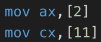
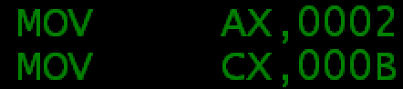
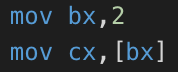
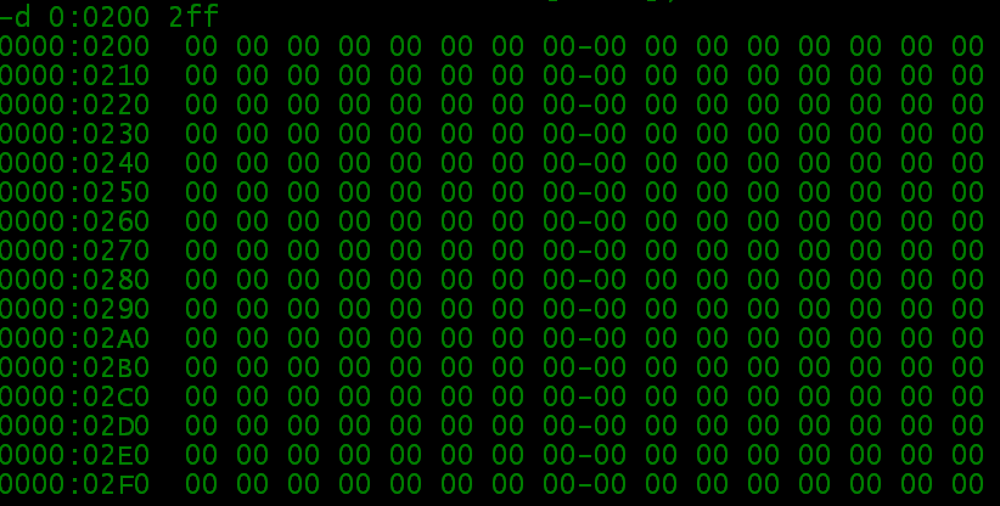
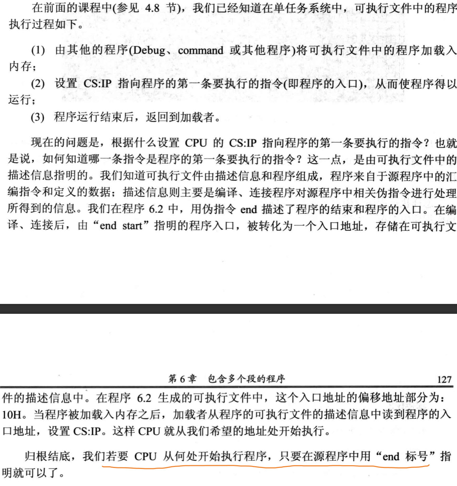

## Sep25

注意这个啊：

**CRLF：DOS中字符串得`abc db "Hello", 0Dh, 0Ah, '$'`即C中的`"Hello\r\n"`**


### int 21h

asm中的'\$'作用

* int 21h的9号功能(打印字符串)要求字符串以'\$'结束  ;非标准格式，MS在DOS里搞的

int 21h的2号功能输出单个字符，因此'\$'可以使用int 21h


`int 21h`表示调用操作系统的函数集，集合编号为21h；

用AH规定子函数编号


`offset abc`取abc(seg标号)偏移地址


ds不能直接由常数赋值(除寄存器以外都算常数)


大部分`int 21h`中指令的段地址在ds，偏移地址是dx(==不是csip别记错啦==)

==可以用中断大全查==


AH=4ch, AL=返回码

```assembly
mov ah, 4ch
mov al, 0
int 21h
; == `return 0;`
```


16位不能用ret返回只能用4ch21h


### 16位汇编编译：

写好$\Longrightarrow$masm .asm$\Longrightarrow$link .obj$\Longrightarrow$get .exe


### 32位debug

masm32$\Longrightarrow$qeditor$\Longrightarrow$编译$\Longrightarrow$把.exe拖到桌面并退出qeditor$\Longrightarrow$把.exe拖到OD

### 16位debug

masm$\Longrightarrow$masm$\Longrightarrow$link$\Longrightarrow$用td打开


### TD使用

F8：单步执行

上边栏 $\Rightarrow$ window $\Rightarrow$ User Screen  $\Rightarrow$ 调用命令行

移到某个button，按下F1可以看到Help

在？？输入"ds:3"可以查看ds:3处内容


### Linux 汇编

bhh的hello.s

```assembly
# hello.s
# display a string "Hello, world." 
# commands for compiling & linking
# as hello.s -o hello.o
# ld hello.o -o hello
# ./hello

.section .data
msg:
.ascii "Hello, world.\n" 

.section .text
.globl _start
_start:
movl $4, %eax     # sys_write
                  # movl stands for "move long(32)"
movl $1, %ebx     # stdout
movl $msg, %ecx   # assign address of string msg to ecx
movl $14, %edx    # assign len of string msg to edx
int  $0x80

movl $1, %eax     # sys_exit
movl $0, %ebx     # return code
int  $0x80
```

常数前加'\$'

指令集`int $0x80`


#### 案例分析 Out.asm

```assembly
data segment       ; 注意：a与s的段地址相同，偏移地址分别为0h,3h
a db "ABC"
s db "Hello$world!", 0Dh, 0Ah, 0; 采用C格式(末尾0)
data ends

code segment
assume cs:code, ds:data
main:
   mov ax, data
   mov ds, ax
   mov bx, 0
next:
   mov dl, s[bx]    ; 经过编译后变成mov dl, ds:[3+bx]
   cmp dl, 0
   je exit          ; dl为0则到exit
   mov ah, 2
   int 21h
   add bx, 1
   jmp next
exit:
   mov ah, 4Ch
   int 21h
code ends
end main
```


## 国庆期间学习笔记

masm16 中的 debug 后加的文件名是区分大小写的，并且masm和link指令生成的文件名均是全大写的；并且.exe也要写上。

==debug默认数字都是16进制==

16位汇编程序中没跟h/H的数都是当做十进制处理


loop是先减1再判断是否为0

[reg]默认为 ds:[reg] 即为((ds)\*16+(reg))


debug中-p是一次运行到cx=0的loop处(loop还未执行)


"-g ads"可以直接执行到CS:ads处

-u可以查看制定地址段机器码反汇编后的代码


源程序中的[ads]不表示(DS:[ads])，会被masm当做数值ads处理

 $\Longrightarrow$ 

但若[reg]，则会默认为是偏移地址，注意，reg需为`must be index or base register`

> 1. 使用[寄存器间接寻址](https://www.baidu.com/s?wd=寄存器间接寻址&tn=SE_PcZhidaonwhc_ngpagmjz&rsv_dl=gh_pc_zhidao)时，只可以使用 BX, BP, SI, DI 这四个寄存器中的一个，不可以使用其它寄存器。
> 2. 提示的意思是（方括号里）必须是变址（index，指SI, DI）或基址（base，指BX, BP）寄存器。
> 3. 16位汇编才有限制，32位汇编随意

 $\Longrightarrow$ 

==段地址寄存器：ds,cs,ss,es==

安全内存空间：0:0200~0:02ff



```assembly
assume cs:code
code segment
    dw 123h
    start:  mov bx,0
            mov ax,0

            mov cx,8
        s:  add ax,cs:[bx]
            add bx,2
            loop s

            mov ax,4c00h
            int 21h
code ends
end start
;end指令指明了程序入口在标号start处
```

