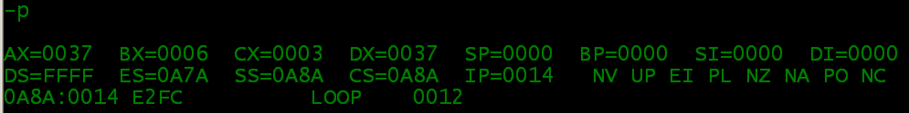

-t 是trace into

debug中-p是一次运行到cx=0的loop处(loop还未执行)

> step into就是单步执行，遇到子函数就进入并且继续单步执行；
>
> step over是在单步执行时，在函数内遇到子函数时不会进入子函数内单步执行，而是将子函数整个执行完再停止，也就是把子函数整个作为一步。
>
> step out就是但单步执行到子函数内时，用step out就可以执行完子函数余下部分，并返回到上一层函数。
>
> step into：进入子函数
>
> step over：越过子函数，但子函数会执行
>
> step out：跳出子函数
> ————————————————
> 版权声明：本文为CSDN博主「wuyinling1984」的原创文章，遵循 CC 4.0 BY-SA 版权协议，转载请附上原文出处链接及本声明。
> 原文链接：https://blog.csdn.net/wuyinling1984/article/details/2043100

"-g ads"可以直接执行到CS:ads处

-u可以查看制定地址段机器码反汇编后的代码

-d以字符形式查看指定内存信息