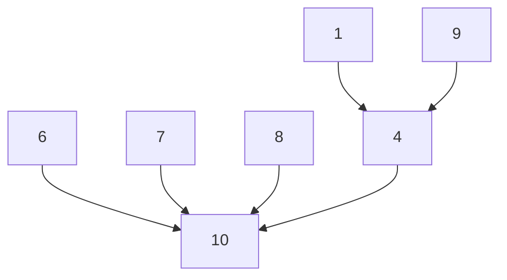

并查集的第二种实现方式

根节点key为0，其余在找根时一直到key为0位=位置的节点作为根节点



union 时将该component的根(key = 0)的key改为 另一component的根的位置，如下

| val  | 10   | 6    | 7    | 8    | 4    | 1    | 9    |
| ---- | ---- | ---- | ---- | ---- | ---- | ---- | ---- |
| key  | 0    | 10   | 10   | 10   | 10   | 4    | 4    |


其他Union方式

- Union by size 小入大，其中root的key可以用于存储该component的大小 `key[root] = -size`
- Union by height：会更合理一些，同样，用根节点的key存储-height


其他find方式

- 路径压缩

  ```c
  SetType  Find ( ElementType  X, DisjSet  S )
  {
      if ( S[ X ] <= 0 )
        return  X;
      else
        return  S[ X ] = Find( S[ X ], S );
  }
  ```

  ```c
  SetType  Find ( ElementType  X, DisjSet  S )
  {   ElementType  root,  trail,  lead;
      for ( root = X; S[ root ] > 0; root = S[ root ] )
          ;  /* find the root */
      for ( trail = X; trail != root; trail = lead ) {
         lead = S[ trail ] ;   
         S[ trail ] = root ;   
      }  /* collapsing */
      return  root ;
  }
  ```

  ==Not compatible with union-by-height since it changes the heights. Just take “height” as an estimated rank.==