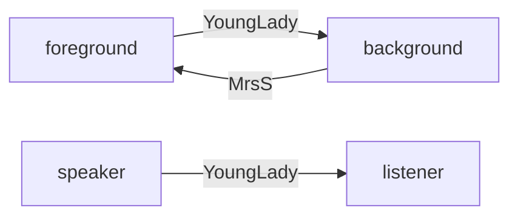

# Dec9

shudder: 

1. 自己故事很恐怖
2. 怕被姨妈听到

make a fine mess 搞得一塌糊涂

---

**Why MrsSpa starts to talk about the open window？**

overheard the last word *window*, so continue the topic to talk about the window

full stop = period句号

侄女的结尾用了dash而不是period，这又是craftsmanship，并且此处的window承上启下

---

文章有3episode，第一个是开始到window，第二个MrsS和MrF的对话

MrsS抱怨没鸟了：作者的嘲讽，鸟是自己打没的

chance acquaintances 萍水相逢的人

"Here they are at last" 与 "My anut will be down presently" 异曲同工