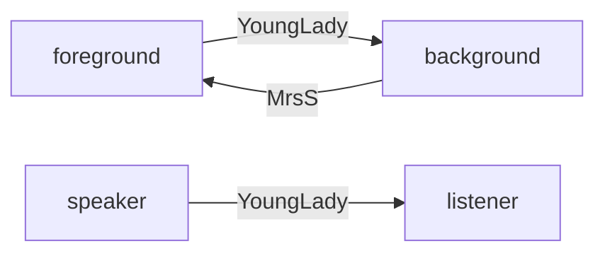

# Appreciating English short stories

考试会考上课内容

# Sep9

short novel means 短的长篇小说

understanding / enterpretating / 

#### 3 language

* everday / ordinary
* scientific lgn
  * Accurate 
  * precise
  * crystal-clear
  * transparent
* literal lang
  * ~~vivid~~
  * ~~imaginative~~
  * Ambiguous
    * against sci lang

#### genre 体裁

* prose
* Poetry
* novel
* narrative?
* diary
* drama
* fable 预言
* autobiography
* folklore
* epic
* fairy tale

3 acknowledged ones: 

* drama (Zero Article)
* poetry (Zero Article)
* the novel

No correct answer which come first

round up 自圆其说

==**liberal art 文科**==

==**humanities 人文学科**==

Creatively 

Critically 

* learn to differ, learn to challenge

#### major obj of this course is not impr eng?? it's just the byproduct

lis, reading, wri, trnslating are just skill, thinking C&C is more impor

#### What's the func of literature?

* Education
* Entertainment
  * people turn to lit most for fun
* Information
  * instruct / enlighten / inform

古人 ~~work~~ labor

work是只有几百年历史的新词

# Sep16

这个看你哦，做笔记肯定是好的，因为考试可能考到他讲的内容；但是因为非常无聊所以做笔记挺艰难的[捂脸]

他上课的文意、句意理解可以记一记，考判断题；重难点句子、表达可以记一记，考翻译题

---

#### Poetry

How ancestors entertain other?

* only on their physical bodies
  * easiest
* mouth mainly
  * speaking
  * singing
  * no oral language
    * meanlingless sound $\Longrightarrow$ original language
* hands, legs, move their bodies

That's why the poetry is the first one

<u>Poetry is just the speech(oraly deliveredl, not written)</u>

#### Drama

##### Why drama earlier then novels

* Drama is very close to poetry???
  * d is 
    * the earliest lines in D were all in verse(诗句)
    * D = speech(P) + action
  * D evolves from P

#### Novel

from D to N: ~~evolution~~ revolution

P & D are predecessors 

production - product - consumption

|                          production                          | product |            consumption             |
| :----------------------------------------------------------: | :-----: | :--------------------------------: |
| (poets, poetesses) ~~laborers, lovers, everyone~~, speaker+singer |    P    |         (listener)everyone         |
| cast(演职人员：director, conductor(指挥), actor, lighting, costume makers), dramatist/playwright(write scripts) |    D    | (audience: listen + ~~watch~~ see) |
|                                                              |    N    |                                    |

DEV of Human Soci: Primitive(P) $\Longrightarrow$ Slavery $\Longrightarrow$ feudal $\Longrightarrow$ capitalism $\Longrightarrow$ Communism 

|           | Primitive                                                    | Slavery    | feudal | capitalism | Communism                          |
| --------- | ------------------------------------------------------------ | ---------- | ------ | ---------- | ---------------------------------- |
| Hierarchy | Classless                                                    | Class Soci |        |            | Classless(Socialism is class soci) |
|           | Equal                                                        |            |        |            |                                    |
| How       | Everyone do the samething for survival; No division of labor(不分工) |            |        |            |                                    |

Inherent

# Sep23

3soc: Primitive, Slavery, Feudal entertained themselves by drama

奴隶shehui是第一个Class Soc$\Longrightarrow$产生对立class：ruling & ruled (slave-owning/holding class & slaves)

|         |        Ruling Class        |               Ruled Class                |
| :-----: | :------------------------: | :--------------------------------------: |
|         |          minority          |                 majority                 |
| Slavery | slave-owning/holding class |                  slaves                  |
| Fedual  |         landlords          | peasants/tenants(现代：租客；封建：佃农) |

到阶级社会 奴隶也可以看戏

到封建社会还在看戏

小说是资本主义的产物

<b>Rise of novels needs conditions:</b>     Premise

* Intro of paper
* Printer
* Edu

<i>Novel is unique to the previous two because it's a book</i>      <b>its meteriality</b>

books can be produced but novels can be <b>massly</b> produced / copied

So the pre is industry and machinery

$$
\left\{  
             \begin{array}{}  
             literacy\ means\ the\ abi\ to\ read\ and\ write, &  \\  
             literate\ means\ educate, &\\  
             illterate\ means\ not\ able\ to\ read\ and\ write\ 文盲的, &    
             \end{array}  
\right.
$$

First readers of novels are citizens / city-dwellers

* actually workers who were 之前是 villagers

Q：How the workers who used to be villagers be highly educated enough to read novels?

A: They have to get education to work in the factory?

圈地运动 Enclosure Movement

villiage$\Longrightarrow$organic community

city$\Longrightarrow$inorganic community

从农村到城市$ \Longrightarrow$这些人被uprooted, disorientated$\Longrightarrow$ 周围陌生$\Longrightarrow$ 生活方式改变$\Longrightarrow$ 只好看小说
$$
\left\{
	\begin{array}{}
	a\\
  b&b
	\end{array}
\right.
$$

#### What's Novel New In / The novelty of n

* can be enjoyed and **conducted** in private / individually
* can anytime / anywhere / any circumstances / 
* totally as your disposed (<b>at one's disposed</b>)
* everything in the novel

<b>Hading said all that 话是这么说</b>

之前的文学主人公是upper class 帝王将相，小说变成小人物 self-made man 暗喻白手起家的资本家 From rags to riches

# Sep30

## Indian Camp

Ernest Hemingway

Hemingway is a economical writer 用词简练、惜墨如金

$\Uparrow$  telegraphic style

Iceberg Theory / principle

Writers should hide the most of info to make the novel seemingly simple

Seemingly / Deceptively simple

> At the lake shore there was another rowboat drawn up. The two Indians stood waiting.  --P1

<!--唐突：another,。但实际上是接上文的-->

<!--Nick 是贯穿整个短篇小说集的主人公-->

<!--craftsmanship 精工细作-->

**stood is a simple word, but hemingway use it effectively**

* suggest the situation is urgent
  * they must had been waiting for a long time
  * even standing up took time

> P2

"Stern of the boat" 与 "shove it off"反复重复

Some patterns are repeated. 这与H少说话的风格不符

是为了反托出他们的沉默

* 没有说话的必要

  

> P3
>
> The Boat started off in the dark

全段"Dark" 和 "Mist"反复重复

Q: why H st

最后一句，一艘(带乔治叔叔的)很快另一艘更快强调了情况紧急？

> where are we going dad
>
> over to the indian camp, there is an Indian lady very sick
>
> oh

H是描写对话的高手

描写了Nick打破沉默，非常写实

"where are we going dad"具有哲学意义

内容深刻？？

> Across the bay they found th other boat beached

"In the dark": 

"cigar": Uncle G 抽雪茄，暗示有钱，后文中印第安人只能抽pipe

> They walked up

"dew"暗示已经过了午夜了

> > Then they went into the woods and followed a trail that led to a logging road that ran back into the hills. 

从句套从句

到亮的地方就灭灯笼，说明此处很穷

> They came  around

> > a dog cam out barking

说明他们此前没来过？

> Inside on the wooden 

"Inside" 将文章分开

# Oct19

> Inside on a wooden

"Inside" 

​	此段以vowel(元音)开头

生孩子2天了，砍到脚3天了

男

* far enough: terrified by the scream
* close enough: helping hands

but husband was there in the upper bunk

* Why? Cut his foot

生孩子2天了，砍到脚3天了

* Hemingway的craftsmanship
* 故意砍还是意外？
  * 句型让人感觉是故意的
  * 但八成不是故意的
    * 没有理由

一般来说不应该抽烟，因为对孕妇和小孩不利，但是仍在抽烟

>  dialog2

用simple lang 解释what in labor mean, acting as a teacher

doctor has the convience to tell his boy how the life comes

> "Oh daddy

daddy

* 这是第二次叫他爹，第一次叫的的"dad"（正常情况下会叫dad），

can't you 而不是 can you

* show the disappointment or even anger about his father
* show the boy's automatic sympathetic heart
  * he had never had such terrible screaming before

"I don't hear because they are not important"

> The husband in the upper bunk rolled over against the wall

是在听到父子对话之后做出的反应

"All right"出现三次，由三个不同人说

Reminiscently 若有所思地，仿佛联想起什么地

<!--玩手机错过了-->

> That's one for the medical journal

技艺精湛，甚至没带手术刀，用的是jack-knife(钓鱼用刀)

他 feel triumphant，在跟uncle G show off

> "You are a great man, all right." he(Uncle G) said

乔治叔叔缺心眼，医生装逼装一半被打断，乔治对他装逼不感兴趣

- overstatement：夸张
- statement
- understatement：低调、轻描淡写

> "I must say he(丈夫) took it all pretty quietly"

irony(反讽)

- verbal
- situational
- dramatic

医生还不知道丈夫已经自杀

拿着灯表示

**light is the symbol of knowledge(知道)**

**darkness means ignorance**

> 3rd dialog

称呼变成"Nickie"

- Nickie is more intimate (亲切的，亲密的) 
- 感情复杂

> 结尾
>
> > he felt quite sure that he would never died

died 指自杀

## Q

1. NIck's curiostity has been gone for a long time after he witnessed the labor. But we can find  in the last past that he still asked many questions, it shows that his curiosity had returned why?

   - ~~之前是对分娩本身，之后是对生命的思考~~
   - The previous curiosity came from his ignorance of the process of labor itself. But the latter curiosity came from what he saw, the mental shock he had when seeing the suicide Indian

   A: WHy the indian suddenly killed him

   HE WORRIED THAT HIS FATHER WILL ALSO KILL HIMSELF FOR NO REASON.

   TABOO: WE WON'T TALK ABOUT PARENTS' DEATH WITH THEM, BUT HAS TO IN A ROUNDABOUT WAY(WILL NICK'S DAD KILL HIMSELF)

2. 为什么问"Why did he killed himself, daddy?"，他认为他爸知道答案，但也不知道，为了不让N失望，所以稍稍猜了一下

   

3. 第五行"Daddy?"喊了一声是要干什么(means)？他爹回答"Yes."，然后N又问了不相干的问题"Where did Uncle G go?"，为什么要问这个，背后有什么联系，N脑袋里在想什么

   回答Yes：

   HIS FATHER THINK: ARE YOU SURE SOME KILL THEM SELVES

   NICK'S REAL MEANING: WHAT ABOUT YOU？

   THEY ARE IN DIFFERENT channel / track 

   问叔叔去哪：

   怕叔叔自杀

   "He will turn out all right":

   MEANING: "HE WILL TURN UP ANYWAY" + "HE WON'T SUICIDE / HE WILL BE SAFE AND SOUND"

# Oct21

## Q

1. NIck's curiostity has been gone for a long time after he witnessed the labor. But we can find  in the last past that he still asked many questions, it shows that his curiosity had returned why?

   - ~~之前是对分娩本身，之后是对生命的思考~~
   - The previous curiosity came from his ignorance of the process of labor itself. But the latter curiosity came from what he saw, the mental shock he had when seeing the suicide Indian

   A: WHy the indian suddenly killed him

   HE WORRIED THAT HIS FATHER WILL ALSO KILL HIMSELF FOR NO REASON.

   TABOO: WE WON'T TALK ABOUT PARENTS' DEATH WITH THEM, BUT HAS TO IN A ROUNDABOUT WAY(WILL NICK'S DAD KILL HIMSELF)

2. 为什么问"Why did he killed himself, daddy?"，他认为他爸知道答案，但也不知道，为了不让N失望，所以稍稍猜了一下

    

3. 第五行"Daddy?"喊了一声是要干什么(means)？他爹回答"Yes."，然后N又问了不相干的问题"Where did Uncle G go?"，为什么要问这个，背后有什么联系，N脑袋里在想什么

   回答Yes：

   HIS FATHER THINK: ARE YOU SURE SOME KILL THEM SELVES

   NICK'S REAL MEANING: WHAT ABOUT YOU？

   THEY ARE IN DIFFERENT channel / track 

   问叔叔去哪：

   怕叔叔自杀

   "He will turn out all right":

   MEANING: "HE WILL TURN UP ANYWAY" + "HE WON'T SUICIDE / HE WILL BE SAFE AND SOUND"

为什么自杀？

失去尊严，没面子

出生死亡率较高

the husband kill himself before the operation

听不到scream $\Longrightarrow$ 说明他是有经验的医生，这种情况见的多了 professional surety

$\Longrightarrow$ 也说明他indifferent to his patients，甚至习以为常

但是印第安人认为 这个医生水平高所以小孩不会死了，自己就不活了

（如果水平很差小孩会死掉(abortion流产)那还行）

# Oct28

Some formulation from the story

1. life can be violent, although we often associate death with violence

   1. the baby is born unnaturally
   2. more and more lives came to 
   3. violence $\Longrightarrow$ caesarean

2. life can be bloody, although we often connect blood with death

$\Longrightarrow$ life and death can be very closed to each others

在小说中生死靠的很近

death can be easy while life can be diffcult

He killed himeself so that his baby could be born

Such a baby can't not be naturally born but can only be  brought to this world by force

---

## The Story of an Hour

heart trouble 和 heart disease在此篇小说中不能互换、                                   

设定Richards的身份：he is well-informed

Time and Truth are 2 souls of news

took the time 慢悠悠

先慢悠悠地确认再马不停蹄地去

椅子并不舒服，说明她进房间之后就停止伤心了，因为悲伤的人无法感觉椅子是否舒适

甚至可以看到树梢在抖动

She saw what she wanted to see

并且只看到树梢说明非常写实

our eyes and nose and ears are picky 选择性看树梢，选择性闻雨后清新，选择性听叫卖声和音乐

### Q

1. she was imagining herself of sth 她把自己想想成某种动物
2. heart trouble 和 heart disease 有什么区别

# NOV11

imagine herself as a bird, a **caged** bird

- fly: 
- rest: perch on the top of tree
  - make its nest at the top of the tree

means she is confined there, she wants to chase freedom

> she sad with her head...

weeping and crying has stopped $\Longrightarrow$ sobbing

从限制视角转为全知视角

<u>away off yonder 遥远的地方</u>

<u>foreshadow 埋下伏笔</u>

something was 向她而来，她fear for it，但是太subtle

> now her bosom rose and fell

<u>bosom ~~心潮~~ 女子乳房</u>

<u>under one's breath 上气不接下气</u>

<u>monstrous 骇人的，不公正的</u>

<u>tender 温柔体贴的</u>

<u>save with love "save"作介词except</u>

看到尸体的一瞬间是痛苦的一瞬间

illumination

> and yet she had loved him -- sometimes

what could love count for in the face of self-assertion

~~被叫**Louise**，说明她重新获得自己的名字~~

​	平常也叫Louise

life might be long

​	出现两次，含义完全相反

- 第一次是嫌太长
- 今天嫌不够

importunity 请求、坚持

importunities 再三要求

travel-stained 风尘仆仆的

composedly 镇定自若地

piercing cry 尖锐叫声

Richard is responding

最后一句是最反讽的

heart trouble &  heart disease

- heart trouble
- heart disease

## Q

- HT&HD
- 最后一句反讽在何处
  - 我猜是因为医生想错了死因
    - 本来很高兴丈夫死了没想到没死

# Nov18

## 一小时的故事

> When the doctors came

**Doctor** stands for **authority**, but  their  judgement is not **totally** right.

半对半错：heart disease是真，joy是假

他们不知道the whole story

### Heart disease 与 heart trouble 的区别

平常同义，可以互换；此处不行

heart disease 表示 clinic condition，心脏病

heart trouble is ambiguous ，可以表示心脏病，此外还有*心病* 的意思

 

没人知道MrsMallard心里对自己的婚姻不满意，可能连MrMallard都不知道，let alone other people

<u>heart attack</u>

it was not joy but despair that kills her 

the lost of freedom that lasted only <u>an hour</u>(story of an hour)
$$
\large
\left. \begin{array} {}
	only
	\\
	as\ long\ as
	\\
\end{array} \right \}
an\ hour
$$

∂œ∑´∑®†¥¨øΩ≈ç≈∫∫˜˜Ωµ≈˚øµµ¨ˆÔÂŒΩ≈∑∂∂ƒ∂∂ƒƒƒ∑∂ç≈Ω≈≈πøø¥µ∫√®†©¥∆˚¬∆˙©∂∂ç√µµ√∫∫∫∫√√√√

> 第三段末尾"Her room"
>
> > close the door  but  leave the window open

认为这个卧室变自己的了，默认MrMallard已死

self-imposed / imprisonment

**Paradox**: when she confine herself in the room she has freedom, but outside not

## Lamb to the Slaughter

> Paragraph 1: Cosy atmosphere

## HW

MM smiles at everythings around, she presented herself as a smiling woman

1. smiling $\Longrightarrow$ giggling

2. dialog with Sam 
   1. func?
   2. serverl loophole

# Nov15

First Suspect

重读

* 'suspect n.嫌疑人
* sus'pect v.

alibi 不在犯罪现场的证明

italic 斜体的

对话的loopholes

* mechanic answer to "How are you?"
  * also reveal that she is very nervous
* she talks too much
  * deliberately providing infomation

(见面good evening，道别good night没毛病

gradually become more and more at ease

<u>triumph</u>ant

instantaneous 瞬时的

well up 像井水一样涌出 (gush)

outwit [VERB 动词] 智胜；用计击败或超过；

giggle 的三种 feelings

* victorious
* grief
* guilt

Evidence is very important:Evidence is everything; No evidence, no convinction

<u>produce 拿出</u>

因为证据被毁，所以目前law不能对MrsM do anything, they will never <u>find her guilty</u> (给...定罪)，But she finds herself guilt。

That meams she herself will never find peace

She couldn't thinks things through

Her mind simply jumble up

insane / hysterical

**标题**

* lamb
  * innocent
  * victime

不止女的是lambToTheSlaughter，男的也是

不止男女，警察也是，因为他们被outwitted

Sam 也是lambtotTS

小孩也是，出生枇杷树

# Dec2

## The Open Window

> My anut will be down presently

**Self-possessed**: calm

> You <u>must</u> try and put up with me

**must**: sounds abrupt

**try**: indicates the story is puzzling and confusing

**perplex**:  使困惑

migrate: indicate that Mr.Nuttle 每年都来此地

down there: 从城市到乡村

> worse  than ever before <u>from</u> moping

from: because of

**silent communion(communication)**: Both are thinking to themself and try to figure out what the other is thinking about.

> Do you <u>know</u> many of the people round there

> "<u>Then</u> you know practically nothing about my aunt? ", pursued the <u>self-possessed</u>

She has to confirm that she can tell the story

一点也不Self-possessed

> An undefinable something

> That would be since your sister's time

生怕MrNuttle不知道

> You may <u>wonder</u> why we keep that window open

wonder一般是用在第一第三人称，很少用在第二人称，在此处是attempt to impose knowledge upon listener

Try to lead and control the direction and going of the conversation

> It's quite warm for the time of the year

对于十月来说是算暖和的了

**telling**：[ADJ-GRADED 能被表示程度的副词或介词词组修饰的形容词] 反映本性的;显露真实情况的；If something is telling, it shows the true nature of a person or situation.

讲得生动的原因
$\displaystyle{\begin{cases} 细节丰富 \\ 副词等修饰词很多 \\ 元音开头的词的使用 \\ 重读第一个音节的多音节单词 \end{cases}}$

## Q

为什么设定在dusk？

# Dec9

shudder: 

1. 自己故事很恐怖
2. 怕被姨妈听到

make a fine mess 搞得一塌糊涂

---

**Why MrsSpa starts to talk about the open window？**

overheard the last word *window*, so continue the topic to talk about the window

full stop = period句号

侄女的结尾用了dash而不是period，这又是craftsmanship，并且此处的window承上启下

---

文章有3episode，第一个是开始到window，第二个MrsS和MrF的对话

MrsS抱怨没鸟了：作者的嘲讽，鸟是自己打没的

chance acquaintances 萍水相逢的人

"Here they are at last" 与 "My anut will be down presently" 异曲同工

exclaim 惊呼

像鬼

* ~~3 people~~ 3 firgure
* no noise

### 为什么吧故事设在dusk

黄昏 很 ambigious，介于白天和晚上

halldoor gravel drive frontgate 是他逃跑路上经过的三个东西

bolt out：bolt：门、窗的金属插销，闩；；常指人或动物因受惊吓迅速逃跑，逃窜；

"a Mr.Nuttel" a用来描述陌生人

romance 故事

short notice = within the shortest possible time

“她的专长是在最短的时间内编造故事”

"I expect it was the spaniel" 重读在 I

fabrication

Ganges 恒河

# Dec13

## A&P

the tone(基调) of literature is diffcult to catch

> 第一句

IN 元音副词开头

also partially inverted

he regards the 3 girls as unit rather than individuals

visualize

---

two-piece 两点式

can 臀部

crescent 新月形的

ring up 扫描

---

> witch

这个人喜欢给别人nickname(作动词)

---

make one’s day 使。。。高兴

trip sb. up 抓现行

> trip up
>
> [1](entry://#page_top)[PHRASAL VERB-ERG ] See also:[trip 2](entry://trip);[3](entry://trip); 使犯错;使失误；If someone or something trips a person up, or if they trip up, they fail or make a mistake. [V n P] [V P n (not pron)] [V P]
>
> * Your own lies will trip you up...
>
>   你会因自己的谎言而犯错误。
>
> * He will do all he can to trip up the new right-wing government...
>
>   他将用尽一切手段让新右翼政府出现失误。
>
> * The two occasions she tripped up tell you nothing about how often she gotaway with it.
>
>   你看到了她的两次失手，却根本不知道有多少次她都得逞了。

---

第一段定下了小说诙谐的基调

---

figure of speech 修辞

---

>  got her feathers smooth and her goodies into a bag

feathers是比喻(metaphor)，比作愤怒的鸟

> Salem
>
> >美国塞林小镇（Salem）位于[波士顿](https://baike.baidu.com/item/波士顿/81031)以北25公里处，被人昵称为“女巫城”，早在1692年有一场[声名狼藉](https://baike.baidu.com/item/声名狼藉)的[女巫审判](https://baike.baidu.com/item/女巫审判/8464072)，当时小镇上1500人口当中，有150人被误认为是女巫而被吊死，史称[塞勒姆女巫审判案](https://baike.baidu.com/item/塞勒姆女巫审判案/2500347)。镇上的[女巫雕像](https://baike.baidu.com/item/女巫雕像/4851242)随处可见，巫术氛围浓厚。
> >

puritan 清教徒

---

开始对三个姑娘分别加以点评

> prima donna
>
> [1](entry://#page_top)[N-COUNT 可数名词] 歌剧中的女主角，首席女歌手；A prima donna is the main female singer in an opera. 
>
> * Her career began as prima donna with the Royal Carl Rosa Opera Company.
>
>   事业刚起步的时候，她在皇家卡尔·罗莎歌剧团担任首席女歌手。
>
> [2](entry://#page_top)[N-COUNT 可数名词] 恃才傲物的人；自命不凡的人；妄自尊大的人；If you describe someone as a prima donna, you disapprove of them because they think they can behave badly or get what they want because they have a particular talent. [disapproval]
>
> * Nobody who comes to this club is allowed to behave like a prima donna.
>
>   加入这个俱乐部的任何人都不许自以为是。
>
> * //...prima donna behaviour.
>
>   自命不凡的行为

---

> (do you really think it's mind in there or just a little buzz like a bee in a glass jar)
>
> 你认为女人脑袋里真有思想吗，或者只是像玻璃罐里的蜜蜂一样嗡嗡叫

---

coin 杜撰

anticipate 预估

---

> The sheep pushing theri catrs donw the aisle

sheep refer to other customers

---

> they were walking against the usual traffic

---

> glare 

同样是泳装，在沙滩和超时效果不一样

$\Longrightarrow$ locality(场合) 很重要

---

Why was Sami now become suddenly sympathy to 3 girls

我认为就是自由精神和上一代的冲突吧

Tweens wave

# Dec16

> Is it done?---Page 15 Bottom

Is it appropriate?

> Alexandrov and Petrooshki $\Longrightarrow$ A&P 讽刺

Sami thinks

美国社会：~~melting pot~~ $\Longrightarrow$ Tossed Salad

> Old McMahon was pattiing his mounth and looking after the  sizing up their joints

size up their joints：从butcher的角度把女孩当猪肉，professionally

> it being Thursday afternoon. so there

六十年代美国是周薪，而且喜欢有钱就花，所以到周四就剩下不多钱了

old party 老家伙

social dum 社会渣滓

> finges icy col

很紧张 因为他怕三个女孩会去Stokes那里结账自己没机会了

tony：tone的形容词

拿腔捏调

> All of a sudden I slid right down her voice into her living room
>
> 突然，我循着她的声音溜进她的起居室 (yysy我觉得老师翻译得挺烂的)

==翻译遵循原文，不加个人解读==

想到别人爹妈，接连想起自己的爹妈，作对比

喝饮料的杯也要提一下，上面有cartoon，说明是低档酒杯

> His repeating this struck me as funny
>
> 他的重复让我感到好笑

super-intendent 宿管

> remember her place

place指1家庭地位2实际位置

crummy  劣质的;低劣的;糟糕的；

blue eye：blue stands for nobility

unsuspected hero

# Dec23

## Araby

James Joyce

* 现代派作家
  * 意识流写法：stream of consciousness

> being blind(死胡同)

萧条的气氛

> <u>gazed</u> at one another with brown imperturbable faces

tenant还可表示封建时的佃农

drawing room 客厅

musty霉味的

> *The Abbot*, *The Devout Communicant*, *The Memoirs of Vidocq*

1. Walter Scott是浪漫主义小说
2. Devout是关于新教的宣传册，但是Ireland是天主教
3. Vidocq 是个大盗

> We watched her from our shadow peer up and down the street.

> Walked up to M's steps resignedly(无奈地)

==重读元音开头的词==

> foolish blood

foolish indicates 叙述者描述的是他很久之前的事情

hostile to romance

charlice 圣杯

> She asked me was I going to Araby

Mixed Speech

Why used Mixed Speech? 在她跟我讲话的时候我就很困惑 

Cannot used straight word but crooked

retreat 静修(a period of time for concentrated study)

follies 再次证明这是多年之后narrowtor的描述

> I strove(力争) to read

看不下书了

idle 无所事事 虚度时光

### Q：

1. 女主的名字叫什么？
2. Mrs Mercer的作用是什么

# Dec30

## 考试说明

1. 单项选择 10道每道1分
   * 均来自于上课内容
2. 对错判断 10道每道1分
   * 均来自于上课内容
3. 简答题 2道每道15分
   * 一道来自课堂，一道来自书
   * 尽量详细
4. 翻译中译英 5大句每句 4分
   * 4道来自课堂
5. questions 30分
   * 没上过的短篇小说

开卷考试

* 纸质材料
  * 字典
  * 笔记

平时成绩占30%

时间会比较紧张

---

### Q：

1. 女主的名字叫什么？
2. Mrs Mercer的作用是什么
   * 她在等uncle，我也在等uncle拿到钱去Araby
   * 等的目的：不是来拿邮票而是来拿借给uncle的钱
     * uncle也在门外等MM走(MM一走就回来了)
     * 说明叔叔很吝啬
   * 后果
     * 延迟了我去araby的时间(delayed, put off)

等到她真正到arby的时候，对路边破败场景的描写反应了他的心境

service 

* military \~ 兵役
* religious \~ 礼拜

remark：注意到，辨认出

English accent 英格兰口音

> 一女两男的对话

这三个人无聊的对话让她想到了自己和sister无聊的对话

小朋友对sister的情感到底是什么？

在"Her image accompanied...hostile to romance"这段中有confused adoration

女名是Maria/Mary？？>> Virgin Mary 圣母玛利亚

说明小孩心目中她是goddess:$\displaystyle \begin{cases} Beauty \\ Purity \end{cases}{}$

respect instead of love

and "respect" $\Longrightarrow$ distance (loop up to her, no equality)

另外一个线索：举着圣杯通过荆棘

adoration is divine/religious love, which requires distance, while sexual attraction means physically closeness

Why confusion? <u>He was a young boy, M'sister was a yonug girl. Undoubtedly between not just adoration but also sexual attraction. The boy feels this attraction, but has to keep distance because of his adroation</u>

这种在宗教色彩浓烈的国家很常见，会让青年人无所适从

---

