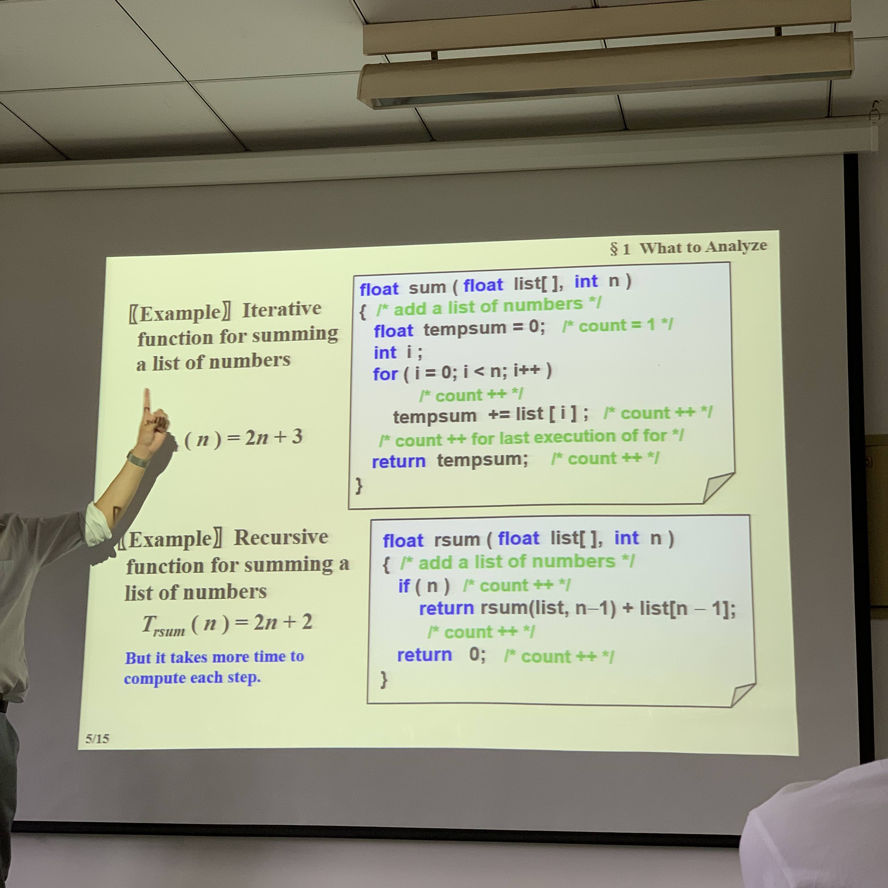

## Sep10

dif prog and alg:

* prog can be inf: operating syst


dif compiler can have dif run time, mode debug and mode relaease also have dif r time

read faster than write

io reg > io memory > io hd

直接调用运算式 > 存储计算结果调用


T~avg~(N) & T~worst~(N) 


`for(int i = 0; i < n; i++)`的复杂度是n+1


```c
for(int i = 0; i < rows; i++)  //n+1
  for(int j = 0; j < cols; j++)  //rows(cols+1)
    a[i][j] = b[i][j] + c[i][j];  //rows*cols
```

T(rows, cols)= 2 * rows * cols +2 * rows +1

如果 rows




Asymptotic Notation

SEE: [离散课件](file:///Users/ulysses/Documents/大一下/离散数学及其应用_51/pdf课件/3算法 DS-wu-3&4&5.4(2019).pdf)

运算规则：

* O(fN) + O(gN) = max(O(fN), O(gN))
* O(fN) \* O(gN) = O(O(fN) * O(gN))
* T(N) is a n-deg poly, then T(N) = θ (N^k^)
* log~k~N=O(N)


