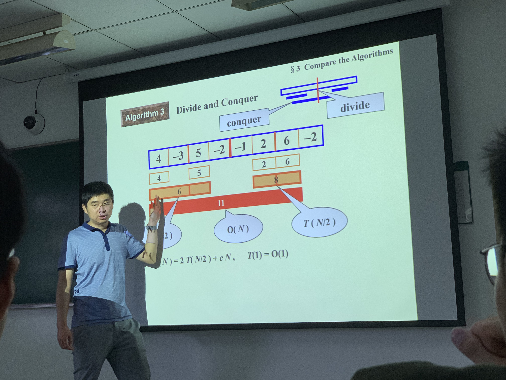
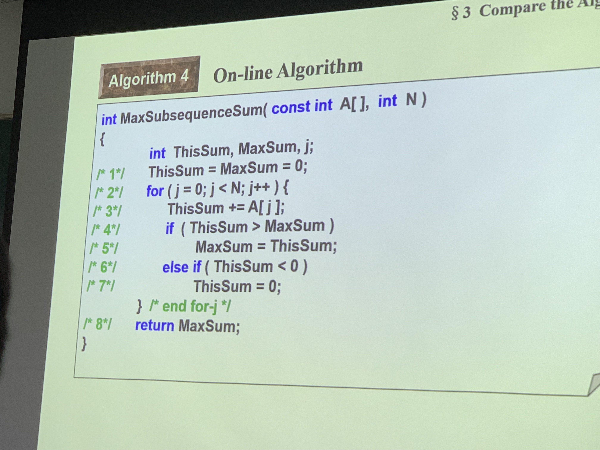
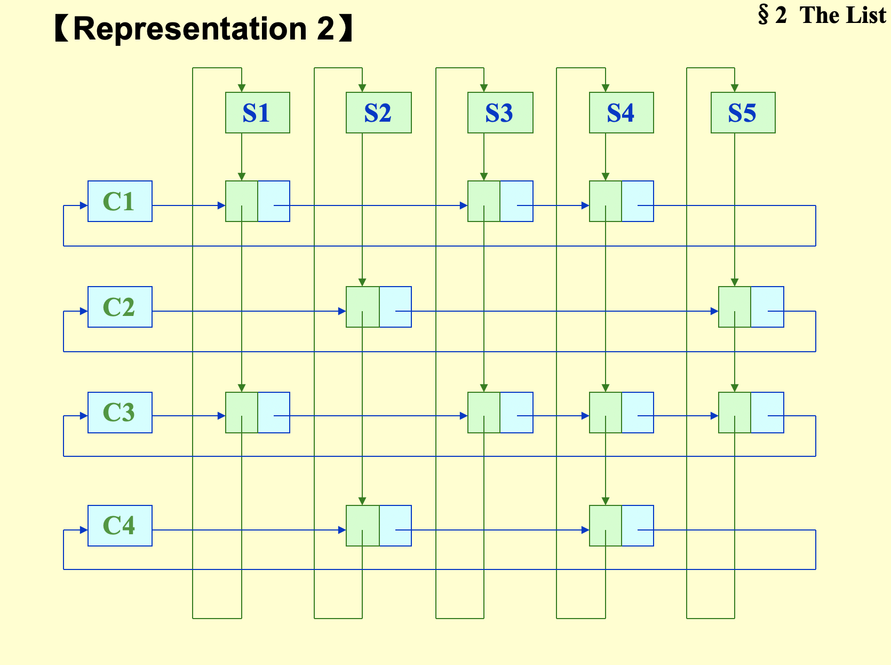
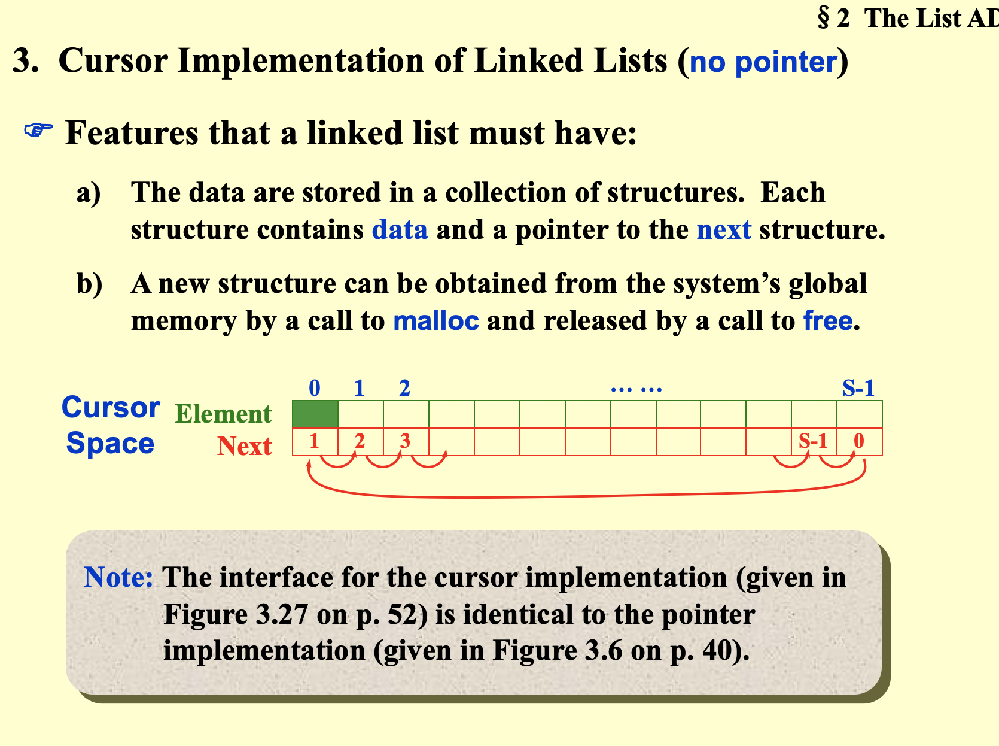
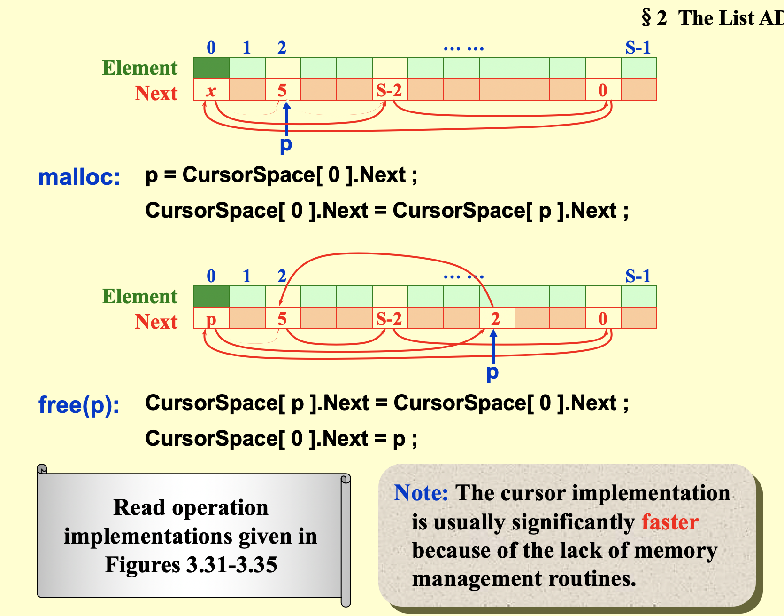

## Sep17

### 例题：

找$\displaystyle\sum_{k=i}^ja_k$的最大值，~~若有小于0的和则置0~~

```
i = 0 to n
	j = i to i
		k = i to j
		
```


```
i = 0 to n-1
	j = n-1 to i
		即可
		
```

#### 分治

divide & conquer 运算主要在conquer部分



T(N)=2T(N/2)+cN

T(N/2)=2T(N/2^2^)+cN/2

T(N/2^2^)=2T(N/2^3^)+cN/2^2^

∴ ==T(N) = 4T(N/2^2^)+2cN = 2^k^T(N/2^k^)+kcN = NT(N/N)+logNcN = O(NlogN)==

#### On-Line alg



O(N)求中位数

T(N)=T(N/2)+O(1)

T(N)=T(N/2^k^)+kO(1)=O(logN)

**CXY’s implementation**

```c
#include <stdio.h>
#define __get_int() ({int _TMP; scanf("%d", &_TMP); _TMP;})
int main(int argc, char const *argv[])
{
	int n;
	n = __get_int();
	int ary[100] = {0};
	for (int i = 0; i < n; i++)
		ary[i] = __get_int();

	int thisSum = 0, maxSum = 0;
	for (int i = 0; i < n; i++) {
		thisSum += ary[i];
		if (thisSum > maxSum)
			maxSum = thisSum;
		if (thisSum < 0)
			thisSum = 0;
	}
	printf("\n%d\n", maxSum);
	return 0;
}
```

### List

#### array

#### Linked List

```c
typedef struct listnode list;
typedef list{
	int;
  list *next;
};
```

#### Doubly Linked List

可以做成


#### 多项式运算

1. 用数组，下标表示次数，不适合稀疏的数据
2. 用链表


#### Multilist

40000学生选2500门课的表示方法





