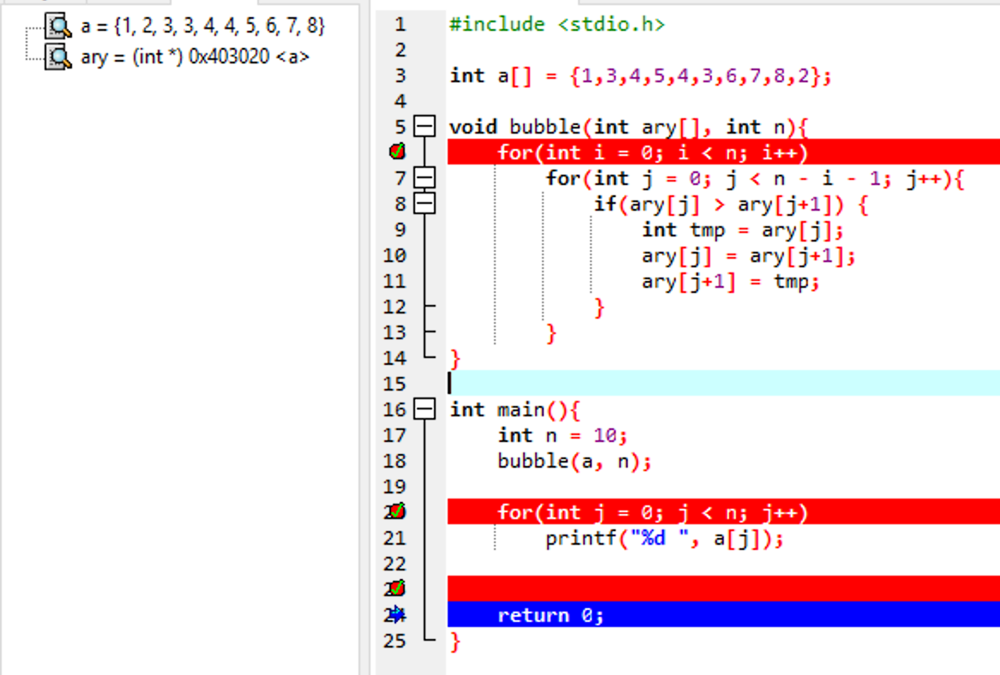

拓扑排序仅针对无圈图

---

radixSort用的是队列不是栈！！！

---

排序稳定性

| 稳定                   | 不稳定               |
| ---------------------- | -------------------- |
| 冒泡、插入、归并、基数 | 选择、快速、希尔、堆 |


---

Prim：找点

Kruskal：找边

---

**逆波兰式**

规则：从左到右遍历中缀表达式的每个数字和符号，若是数字就输出，即成为后缀表达式的一部分；若是符号，则判断其与栈顶符号的优先级，是右括号或优先级低于找顶符号（乘除优先加减）则栈顶元素依次出找并输出，并将当前符号进栈，一直到最终输出后缀表达式为止。

1.遇到操作数：直接输出（添加到后缀表达式中）
2.栈为空时，遇到运算符，直接入栈
3.遇到左括号：将其入栈
4.遇到右括号：执行出栈操作，并将出栈的元素输出，直到弹出栈的是左括号，左括号不输出。
5.遇到其他运算符：加减乘除：弹出所有优先级大于或者等于该运算符的栈顶元素，然后将该运算符入栈
6.最终将栈中的元素依次出栈，输出。

---

LevelOrder

```c
void  levelorder ( tree_ptr  tree ) {
    enqueue ( tree );
    while (queue is not empty) {
        visit ( T = dequeue ( ) );
        for ( each child C of T )
            enqueue ( C );
    }
}
```

---

**Iterative** InOrder

```c
void  iter_inorder ( tree_ptr  tree ) {
    Stack  S = CreateStack( MAX_SIZE );
    for ( ; ; )  {
        for ( ; tree; tree = tree->Left )
            Push ( tree, S ) ;
        tree = Top ( S );
        Pop( S );
        if ( ! tree )
            break;
        visit ( tree->Element );
        tree = tree->Right;
    }
}
```

Implementation见另一个md

---



要用原始IDE调试，需在取名时有所注意

---

Week13

For the quicksort implementation {with (**neither the left nor the right pointer**) <u>stops</u> [when **an element** (with the same key as the pivot) <u>is found</u>] (during the partitioning)}, what is the running time when all keys are equal?

1. O(logN)
2. O(N)
3. O(NlogN)
4. O(N^2^)

---

Topological Sort

1. Find  a vertex with inDeg == 0
   1. if nFound, cylic
2. delete all the edges from it and calculate corresponding inDeg of adjacent verteices
3. repeat 1.

---

