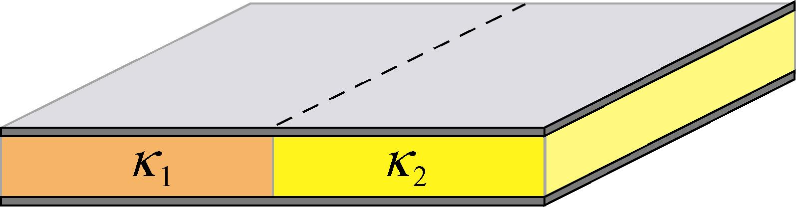
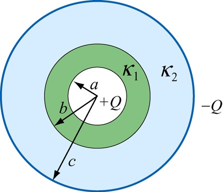
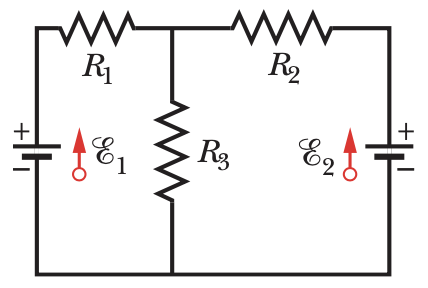
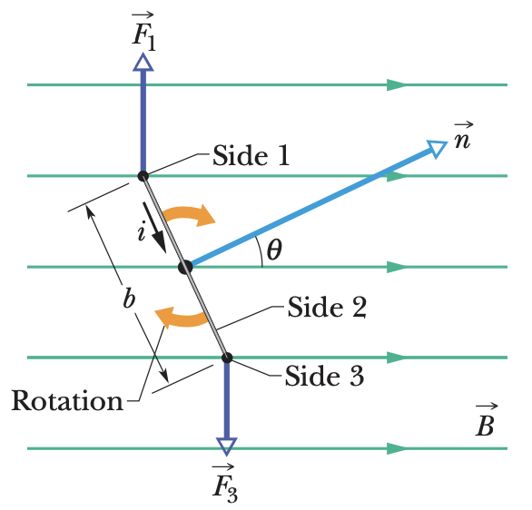
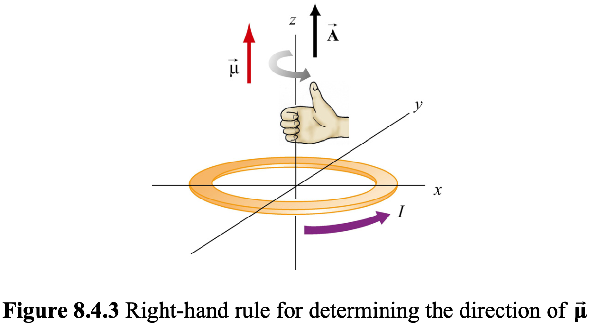
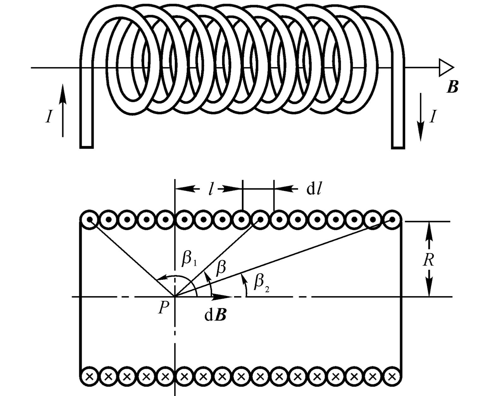
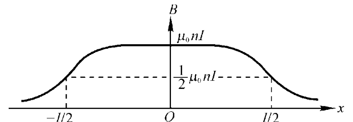
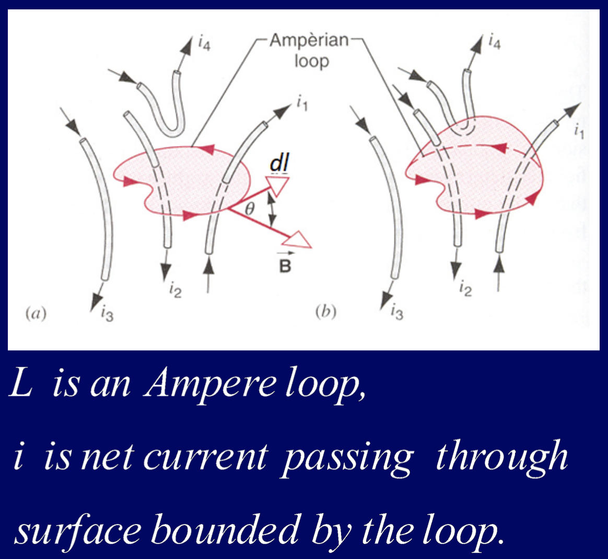
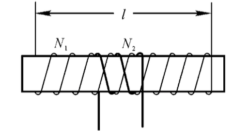
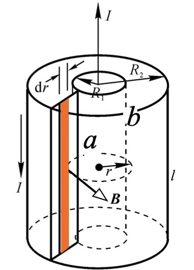

# 普物笔记

[TOC]

## *Electric

> 引入常量：$\varepsilon_0 = 8.854 \times 10^{-12} F \cdot m$
>
> $[\varepsilon_0] = F \cdot m = C \cdot V^{-1} \cdot m$ 

### Ch22-2 Electric Field

**A Charged Electric Dipole**：The configuration of two equal and opposite charges ±*q* separated by a small distance *d*

#### Electric dipole moment $\vec p$ (电偶极矩)

The electric property of “electric dipole ” is described by the so-called electric dipole moment(电偶极矩): 

$\vec p=q\cdot \vec d\ (\vec d方向从-q到+q)$

##### 电偶极矩的电场

推导很麻烦，结论也不好记，看看就好吧能记尽量记

$\vec{E_p} = \frac1{4\pi\varepsilon_0r^3}(-\vec p+3\frac{\vec r \cdot (\vec r \cdot \vec p)}{r^2})$($\vec r$为从dipole中心到该点的位移矢量)

##### 能量

$U = W_{+q\rightarrow\infty}+W_{-q\rightarrow\infty} = qU_+ +(-q)U_- = q(U_+-U_-) = q(-Elcos<\vec E, \vec l>) \\ = -\vec p \cdot \vec E$

#### Some conclusion

**==一些较复杂的可通过求电势的方向导数获得==**(Ex.大物P44)

- 无限大带电平面：$E=\frac{\sigma}{2\varepsilon_0}$
- 有限长带电棒任意点：$\left\{\begin{array}{}	E_x = \frac{\lambda}{4\pi\varepsilon_0z}(sin\theta_2-sin\theta_1)\\E_y = \frac{\lambda}{4\pi\varepsilon_0z}(cos\theta_1-cos\theta_2)	\end{array}\right.$(大物P17，挺好算的)

  - 有限长带电棒中点：$E = \frac{Q}{4\pi\varepsilon_0}\frac{1}{z\sqrt{(\frac L 2)^2+z^2}}$
  - 无限长带电棒：$E=\frac{\lambda}{2\pi\varepsilon_0r}$
- 带电圆环：$E=\frac{1}{4\pi\varepsilon_0}\frac{\lambda(2\pi R)z}{(R^2+z^2)^\frac{3}{2}}\hat k=\frac{Q}{4\pi\varepsilon_0}\frac{z}{(R^2+z^2)^\frac{3}{2}}\hat k$

  - 带电圆盘：$\frac{\sigma}{2\varepsilon_0}(1-\frac{z}{\sqrt{z^2+R^2}})\hat k$
    
    - $当z\gg R，等效为点电荷，\frac{z}{\sqrt{z^2+R^2}}=[1+\frac{R^2}{z^2}]^{-\frac1 2}\approx 1-\frac 1 2\frac{R^2}{z^2}，代入得E=\frac{Q}{4\pi \varepsilon_0z^2}\hat k\\$
    - $当R\gg z，等效为无限面，E=\frac{\sigma}{2\varepsilon_0}\hat k\\$
- 球、球壳均可等效为点电荷。

### Ch23 Gauss's Law

#### 立体角

$d\Omega = sin\theta d\theta d\varphi$

以观测点为球心，构造一个单位球面；任意物体投影到该单位球面上的投影面积，即为该物体相对于该观测点的立体角。因此，<u>立体角是单位球面上的一块面积，这和“平面角是单位圆上的一段弧长”类似</u>。

*Electeic Flux* 电通量
$$
Gauss'Law:\Phi=\oint_S \vec E \cdot d\vec A=\frac{1}{\varepsilon_0}\sum_{ins}q_i
$$

无论导体是否有cavity，cavity里是否有charge，导体的电荷仅在表面(内/外)上有，导体内部无电荷。

### Ch24 Electric Potential

**混合积公式**：$ \vec a \cdot(\vec b \times \vec c)=\vec b \cdot(\vec c \times \vec a)=\vec c \cdot(\vec a \times \vec b) $

#### 梯度散度旋度

[如何直观形象的理解梯度，散度，旋度？ - 知乎](https://www.zhihu.com/question/24074028) ([第一个回答](https://www.zhihu.com/question/24074028/answer/26657334)较浅显，[第二个回答](https://www.zhihu.com/question/24074028/answer/31526009)较清晰)

[4.6: Gradient, Divergence, Curl, and Laplacian - Mathematics LibreTexts](https://math.libretexts.org/Bookshelves/Calculus/Book%3A_Vector_Calculus_(Corral)/4%3A_Line_and_Surface_Integrals/4.6%3A_Gradient%2C_Divergence%2C_Curl%2C_and_Laplacian)
$$
\nabla=\frac{d}{d\vec n}\hat{e_n}
=\frac{\partial}{\partial x}\hat i+\frac{\partial}{\partial y}\hat j+\frac{\partial}{\partial z}\hat k\\
$$

##### 梯度

计算标量场中f的变化速率，包括该点变化率最大的大小及方向

标量$\Longrightarrow$向量

$$
grad f=\nabla f
=\frac{\partial f}{\partial x}\hat i+\frac{\partial f}{\partial y}\hat j+\frac{\partial f}{\partial z}\hat k\\
$$

##### 散度

计算向量场

向量$\Longrightarrow$标量

$$
div f=\nabla\cdot f=\frac{\partial f}{\partial x}+\frac{\partial f}{\partial y}+\frac{\partial f}{\partial z}\\
\left \{ \begin{array}{}
	divf>0 & 该点有散发通量的正源(发散源/source)\\
	divf<0 & 该点有吸收通量的负源(洞或汇/sink)\\
	divf=0 & 该点无源\\
\end{array}\right.\\
$$

(若是单位体积不包含该电荷，那么毫无疑问，有多少电场线进入就有多少电场线出，散度为0；
但若选取的单位体积内包含了一个正点电荷，则电场线只出不进，因而散度不为零)

##### 旋度

[旋度 - 维基百科，自由的百科全书](https://zh.wikipedia.org/zh-hans/旋度)

向量$\Longrightarrow$向量

$$
curlf=\nabla\times f= 
\left[ \begin{array}{}
	\frac{\partial}{\partial x} \\
	\frac{\partial}{\partial y} \\
	\frac{\partial}{\partial z}
\end{array}\right]
\times
\left[ \begin{array}{}
	f_x\\f_y\\f_z
\end{array}\right]
=\left[ \begin{array}{} 
	\frac{\partial z}{\partial y}-\frac{\partial y}{\partial z}\\
	\frac{\partial x}{\partial z}-\frac{\partial z}{\partial x}\\
	\frac{\partial y}{\partial x}-\frac{\partial x}{\partial y}
\end{array}\right]\\
= (\frac{\partial z}{\partial y}-\frac{\partial y}{\partial z})\hat i+
	(\frac{\partial x}{\partial z}-\frac{\partial z}{\partial x})\hat j+
	(\frac{\partial y}{\partial x}-\frac{\partial x}{\partial y})\hat k\\
$$

旋度与第二类曲线积分的路径无关性有联系，其运算结果与 路径无关四个等价条件 的$$可互推。

##### Ex. 场

* 电场是有源无旋场
* 磁场是无源有旋场

#### 电势

$$
从点电荷出发，V_i(r_i)=\int_r^\infty\frac{q_i}{4\pi\varepsilon_0{r_i}^2}dr=\frac{q_i}{4\pi\varepsilon_0r_i}，因此V=\Sigma V_i(r_i)=\frac 1{4\pi\varepsilon_0}\Sigma\frac{q_i}{r_i}；\\
从电场出发，V=\int_r^\infty \vec E\cdot d\vec l\\
$$

#### 电势差

$$
从功能角度：dW_{Electric\ Field\ on\ charge}=q_0\vec E\cdot d\vec l，W=\int_i^fq_0\vec E\cdot d\vec l，\\
又\because W=-\Delta U=-q\Delta V=-q(V_f -V_i)，\therefore \Delta V=-\int_i^f\vec E\cdot d\vec l\\
从电场：\Delta V=(\int_f^\infty-\int_i^\infty)(\vec E\cdot d\vec l)=-\int_i^f\vec E\cdot d\vec l
$$

#### 电势与电压梯度

$$
E_\vec l=-\frac{\partial V}{\partial\vec l}=-\nabla V
$$

#### ==自能与互能==

$$
U_互=\frac1 2\Sigma q_i V_{其他q在q_i处}=\frac1 2\int_? Vdq\\
U_自=\int_0^QV_{体系中已有的电荷在dq处}dq
$$

[自能与互能(百度百科)](https://baike.baidu.com/item/静电能)

[静电势能中的自能和互能有什么区别？还有就是电势能和静电势能的区别？ - FUTURETECH6的回答 - 知乎](https://www.zhihu.com/question/303819123/answer/843921203)

> 所谓“自能”就是将一个带电体看成无穷个带电微元，将这些无穷多个带电体微元从无限分散状态聚集成该带电体，外力所做功的大小。所谓“互能”则是将带电体系统中，各带电体从现在位置彼此分开至无穷远时，它们之间的静电力所做的功。
>
> 静电能包括自能和互能。点电荷的自能是无穷大，一般在静电学问题中都不考虑点电荷的自能。

互能算两次有1/2 自能无1/2

**Ex.半径R带电Q的球体能量计算**

<u>注意：仅在表面有电荷</u>
$$
U = 
\left \{ \begin{array}{}
	互能：\frac 1 2\int \frac{Q}{4\pi \varepsilon_0 R}dq = \frac{Q}{8\pi \varepsilon_0 R} \int dq
	\\
	自能：\int_0^Q \frac{q}{4\pi \varepsilon_0 R}dq
	\\
	电容：\frac{Q^2}{2C} = \frac{Q^2}{2(4\pi \varepsilon_0 R)}
\end{array} \right \}
= \frac{Q^2}{8 \pi \varepsilon_0 R}
$$

*第三种算法中$C = 4\pi \varepsilon_0 (\frac{\infty R}{\infty - R})$。因为仅球壳外表面(外侧)带电，因此可视作由外表面到无穷远的电容器，也可算$V = \frac{Q}{4 \pi \varepsilon_0 R}, C = \frac Q V$。*

### Ch25 Conductors

#### 等势体

**Ex**.
$$
两个相距无限远的导电圆球，总电量为Q，用导线将两者表面相连，求电荷分布\\
\frac{q_1}{4\pi\varepsilon_0R_1}=\frac{q_2}{4\pi\varepsilon_0R_2}\\
\Longrightarrow \frac {q_1} {q_2}= \frac {R_1} {R_2}
$$

#### Hall Effect

正负有别：无论载流子带何种电荷，由于漂移方向不同，终是会偏向同一侧。

### Ch26-1 Capacitance

#### 计算方式

$$
设电量为q，利用\Delta V=V_+-V_-=\int_+^-(-\nabla V)\cdot d\vec l=\int_+^-\vec E\cdot d\vec l\\
可以获得\Delta V=(...)\cdot q
$$

#### Conclusion

- **Parallel-Plate Capacitor**

$$
E=\frac \sigma {\varepsilon_0}(G's\ Law)\\
C=\frac{\varepsilon_0A}d\\
$$

- **Cylindrical Capacitor**

$$
C=2\pi\varepsilon_0\frac L{ln(R)-ln(r)}\\
$$

- **Spherical Capacitor**

$$
C=\frac{4\pi\varepsilon_0}{\frac1r-\frac1R}
=4\pi\varepsilon_0(\frac{Rr}{R-r})
$$

**单个平行板电容器，仅在向对面有电荷，外面不带电荷**

==注意，平行板电容器的电场是$\frac \sigma {\varepsilon_0}$。因为两板都有电荷，因此高斯定律得分成两部分计算==

#### 串并联

- Series Connection, 串联，q相同，$\frac 1 C = \Sigma \frac 1 C_i$
- Parallel Connection, 并联，V相同，$C = \Sigma C_i$

##### 应用

<u>将导体插入平行板中，$C'=\frac{\varepsilon_0A}{d-t}$(视作串联即可)</u>

#### 能量

$$
U =
\left \{ \begin{array}{}
	\frac{q^2}{2C}
	\\
	\frac{q \Delta V}{2}
	\\
	\frac{\varepsilon_0 E^2 \Omega}{2}
\end{array} \right.
$$

##### 能量计算

$$
微分中，\left|\Delta V'\right|=\frac {q'}c，dU=dq'\left|\Delta V'\right|=\frac{q'dq'}C\\
若全程，则U=\int_0^UdU=\int_0^q\frac{q'}Cdq'
\\
=\frac{q^2}{2C}\\
=\frac{q\Delta V}2\\
(q'和\Delta V'都表示过程量)
$$

##### 能量密度

$$
(由平行板电容器推出的普适结论)\\
U=\frac{q^2}{2C}=\frac{q^2d}{2\varepsilon A}=\frac{\varepsilon}2(\frac q{\varepsilon A})^2(Ad)=\frac{\varepsilon}2E^2\Omega\\
u=\frac U \Omega
\\
=\frac{\varepsilon E^2}2
\\
= \frac12 DE
$$

---

### Ch26-2 Dielectrics

Q一定时，X表示插入电介质后的量值，X~0~表示真空时的量值

==不要忘了最基本的这几个==
$$
\left \{ \begin{array}{}
	C=\kappa_eC_0\\
	\Delta V=\frac Q C=\frac Q{\kappa_eC_0}=\frac {\Delta V_0}{\kappa_e}\\
	E = \frac{\Delta V} d = \frac{E_0} {\kappa_e}\\
\end{array} \right.
\\
另外有，\\
\because \frac{Q}{\varepsilon_0A}
= \frac {(Q_0 - Q')}{\varepsilon_0A}
\xlongequal[始终成立]{GaussLaw} E
= \frac {E_0}{\kappa_e}
= \frac {Q_0} {\kappa_e \varepsilon_0 A}
\\
\therefore Q_0
= \kappa_e (Q_0 - Q') \longrightarrow Q'
= (1-\frac 1 {\varepsilon_e})Q_0
$$

==注意：此处Q~0~表示**<u>极板上自由电荷(全程不变)</u>**，而Q’是电介质上induced电荷==

==本质上$\frac{E_0}{\kappa_e} = \frac{E}{1} = \frac{E'}{\kappa_e-1}$==

#### 分子角度解释

取向极化(Alignment polarization)与位移极化(Displacement polarization)

> 取向不能完全与电场线平行的原因：Because the molecules are continuously jostling each other as a result of their random thermal motion, this alignment is not complete

#### Polarization (极化强度矢量P(大写))

$$
\vec P = \frac{\sum\vec {p_i}}{\Delta V}\\
此处\Delta V表示体积\\
dQ'=qdN'
= q(\frac{dN'}{d\Delta V})lcos\theta dA =PdAcos\theta=\vec P\cdot d\vec A\\
\therefore \sigma' = \frac {dQ'}{dA}=Pcos\theta =\vec P \cdot \vec n = P_{\vec n}\\
$$

(可使用斜圆柱模型推导，大物P71)

**一个重要结论**
$$
\mathop\oint_s\vec P \cdot d \vec A = - \sum_{(ins)}q'_i
$$

#### Depolarization field E’ (退极化场)

$$
\vec E = \vec {E_0} + \vec {E'}
$$

#### Polarization law of dielectrics (电介质的极化规律)

$$
\vec P \Longrightarrow \sigma' \Longrightarrow \vec E' \Longrightarrow \vec E\\
$$

####  Polarization coefficient $\chi_e$ (极化率)

for general isotropic(各向同性) materials
$$
\vec P = \chi_e \varepsilon_0 \vec E\\
其中，\chi_e = \kappa_e - 1
$$

#### Electric displacement vector $\vec D$ (电位移矢量)

$\vec D = \varepsilon_0 \vec E + \vec P\\ = \varepsilon_0 \vec E + \chi_e \varepsilon_0 \vec E = (\kappa_e \varepsilon_0) \vec E$

**CXY猜想**：
$$
\left \{ \begin{array}{}
	D = \varepsilon E
	\\
	P = \chi_E\varepsilon_0E
\end{array} \right.
\Longrightarrow
\left \{ \begin{array}{}
	D \sim E
	\\
	P \sim E_0-E
\end{array} \right.
$$
**产生原因**：
$$
In\ Dielectric,\ \vec E \neq 0\\
\vec {E_0} \longrightarrow \vec P \longrightarrow \sigma_e' \longrightarrow \vec{E'} \longrightarrow \vec E = \vec {E_0} + \vec {E'}\\
$$
##### 重要定理：环积分等于原电量

$\oint \vec D \cdot d \vec A= \Sigma_{i}q_0$(介质中的高斯定理)

==因此计算时可以使用介质中的高斯定理求出D，进而用$\vec D = \kappa_e \varepsilon_0 \vec E$求出E==

**介质中的高斯定理的Proof**:

在某电介质中，有带电+Q_0的球，

$$
\oint \vec P \cdot d \vec A = - \sum_{ins} q'
(P = |\sigma'|，然后负号是因为定义d\vec A方向向外而\vec P是向内的？)
$$

取一个包住内表面的高斯面

$$
\therefore \varepsilon_0 \oint \vec E \cdot d \vec A
\xlongequal{Gauss} \sum_{ins} (q_0 + q')
\xlongequal{上式} \sum_{ins}q_0 - \oint \vec P \cdot d \vec A\\
\therefore \oint (\varepsilon_0 \vec E + \vec P) \cdot d \vec A
= \sum_{ins}q_0\\
\vec D \overset {\triangle} {=} \varepsilon_0 \vec E + \vec P\\
\therefore \oint \vec D \cdot d \vec A
= \sum_{ins}q_0\\
$$
**Also,**
$$
\vec D = \varepsilon_0 \vec E + \vec P\\
= \varepsilon_0 \vec E + \chi_e \varepsilon_0 \vec E\\
= (1+\chi_e)\varepsilon_0 \vec E\\
= \kappa_e \varepsilon_0 \vec E
$$

(非正规地写成：$\vec D = \varepsilon_0 \vec E_0$)

证明用图：

#### 多种介电质(Dielectrics)

**PP**

$$
同并联，C=\frac {\varepsilon_0 \frac A2}{d}(\kappa_1+\kappa_2)
$$

若上下两种电介质

$$
C_i = \frac{\kappa _i \varepsilon_0 A}{d_i}\\
$$

**复杂一点：Sepherical**

$$
\because C=4\pi\varepsilon_e(\frac{Rr}{R-r})\\
\frac1C=\frac1{4\pi\varepsilon_0\kappa_1(\frac{ba}{b-a})}
+\frac1{4\pi\varepsilon_0\kappa_1(\frac{ba}{b-a})}\\
\Longrightarrow C=\frac{4\pi\varepsilon_0\kappa_1\kappa_2 abc}{\kappa_1a(c-b)+\kappa_2c(b-a)}
$$

### Ch27 Ohm's Law

Electric Density (电流密度)
$$
j = \frac {di}{dS_{\bot}} = \frac {dq}{dtdS_\bot} 
$$
Drift Velocity $v_d$ (漂移速度)

载流子移动速度
$$
i = -e \cdot n \cdot (Av_d)\\
j = \frac i A = -nev_d
$$

### Ch28 Circuit Theory

#### Kirchhoff's Law

- **First Law: Junction Rule**

  At any junction in an electric circuit, the total current entering the junction must be the same as the total current leaving the junction.

- **Second Law: Loop Rule**

   The algebraic sum of all differences in potential around a complete circuit loop($\forall$ loop​) must be zero.

**Ex.** Problem 12

$\varepsilon_1=10V,\varepsilon_2=5V,R_1=R_2=R_3=4\Omega$

$$
假设i_1向右，i_2向右，i_3向下
\\
\left \{ \begin{array}{}
	i_1 = i_2 + i_3\\
	\varepsilon_1-i_1R_1-i_3R_3 = 0\\
	-i_2R_2-\varepsilon_2+i_3R_3 = 0\\
\end{array} \right.
\\\Longrightarrow i_1 = 1.25A, i_2 = 0
$$
==注意：方向应先假设，求出是负的再反向即可==

#### RC Circuit(串联RC)

> $\tau = RC$

##### 充电

$$
\varepsilon - iR - \frac q C = 0 \Longrightarrow 
i = \frac{dq}{dt} = \frac{C\varepsilon-q}{RC}
\\
\therefore \frac{dt}{RC} = \frac{dq}{C\varepsilon-q}
\\
解微分方程得：
\\
q(t) \xlongequal{\tau \triangleq RC} C\varepsilon(1-e^{-\frac t \tau})
\\
V(t) = \frac q C = \varepsilon(1-e^{-\frac t \tau})
\\
i(t) = \frac{dq}{dt} = \frac \varepsilon Re^{-\frac t \tau}
$$

##### 放电

$$
q = q_0 e^\frac t \tau
\\
i = \frac \varepsilon Re^{-\frac t \tau}
$$

## *Magnet

> 新引入常量：$\mu_0 = 4\pi \times 10^{-7} T \cdot m \cdot A^{-1}$
>
> $[\mu_0] = N \cdot A^{-2}(N = A \cdot m \cdot T)$

### Ch29 Magnitude Force

==磁感应强度B != 磁场强度H==（但是并不重要因为H已经废弃，仅在磁介质的磁化问题中作为辅助量使用）

真空中有$B = \mu_0H$

$\mu_0$:Vacuum Permeability Constant 真空磁导率，值为$4\pi \times 10^{-7}\ T \cdot m \cdot A^{-1}$

#### 洛伦兹力与安培力

$$
\vec F_L = q \vec v \times \vec B\\
\vec F_A = i \vec L \times \vec B
$$

##### 通电导线

##### 通电线圈

$$
F_\tau = N i a B sin\theta
\\
\tau = 2 F_\tau \frac b 2 =NiabBsin\theta = NiABsin\theta(\theta = <\vec n, \vec B>)
\\
= (NiSB)sin\theta 
\\
\vec \tau \parallel \hat n \times \vec B
$$

#### Magnitude Dipole

- **电偶极子**是两个分隔一段距离，[电量](https://zh.wikipedia.org/wiki/电量)相等，正负相反的[电荷](https://zh.wikipedia.org/wiki/電荷)。
- **磁偶极子**是一圈封闭循环的[电流](https://zh.wikipedia.org/wiki/電流)。例如一个有常定[电流](https://zh.wikipedia.org/wiki/電流)运行的线圈。

#### Magnetic dipole moment 磁偶极矩μ(Loop Model)

==磁矩与磁偶极矩量纲有个μ~0~的差别，磁偶极矩是(J/T = (N·m)/($\frac{N}{A\cdot m}$)  = A·m^2^)==

> 由于没有发现单独存在的[磁单极子](https://baike.baidu.com/item/磁单极子/380283)，因此磁偶极子的物理模型不是两个[磁单极子](https://baike.baidu.com/item/磁单极子/380283)，而是一段封闭回路电流。

> 引入磁偶极矩$\vec \mu = Ni \vec A$
>
> 一般[磁性物质](https://zh.wikipedia.org/wiki/磁性物質)的磁场，其[泰勒展开](https://zh.wikipedia.org/wiki/泰勒展开)的[多极展开式](https://zh.wikipedia.org/wiki/多極展開式)，由于[磁单极子](https://zh.wikipedia.org/wiki/磁單極子)项目恒等于零，第一个项目是[磁偶极子](https://zh.wikipedia.org/wiki/磁偶極子)项、第二个项目是[磁四极子](https://zh.wikipedia.org/wiki/磁四極子)（quadrupole）项，以此类推。磁矩也分为磁偶极矩、磁四极矩等等部分。从磁矩的磁偶极矩、磁四极矩等等，可以分别计算出磁场的磁偶极子项目、磁四极子项目等等。随着距离的增远，磁偶极矩部分会变得越加重要，成为主要项目，因此，磁矩这术语时常用来指称磁偶极矩。有些教科书内，磁矩的定义与磁偶极矩的定义相同[[1\]](https://zh.wikipedia.org/wiki/磁矩#cite_note-Jackson1999-1)。

在磁场中力矩：$\vec \tau = \vec \mu \times \vec B$

在磁场中能量：$U = -\vec \mu \cdot \vec B$

对于圆周运动的电子，$\mu_{orb} = iA = (\frac{e}{2\pi r/v})(\pi r^2) = \frac{evr}2,$

角动量：$(\vec L = \vec r \times \vec p):\ |\vec L_{orb}| = |m(\vec r \times \vec v)| = mrv \\ \therefore \vec \mu_{orb} = -\frac e {2m}\vec L_{orb}$

### Ch30 Current – Produced Magnetic Fields 

#### Biot-Savart

$dB = \frac{\mu_0}{4\pi} \frac{i\ dl\ sin\theta}{r^2}	\\	d\vec B = \frac{\mu_0}{4\pi} \frac{i\ d\vec l \times \hat r}{r^2} = \frac{\mu_0}{4\pi} \frac{i\ d\vec l \times \vec r}{r^3}$

$\vec r$：电流微元所在点到目标点(求B处)的位移矢量

#### 电流生磁

##### Conclusion

\# THIS IS SCRIPT CALING THE MAGF OF STRAIGHT WIRE

$$
sin\theta = \frac R {\sqrt{R^2+L^2}}
\\
dB= A \frac{iRdl}{(R^2+L^2)^\frac 3 2}
\\
B = \int_a^b dB= \frac{i\mu_0R}{4\pi} \int_a^b \frac{dl}{(R^2+L^2)^\frac 3 2}
\\
(\int \frac{dl}{(R^2+L^2)^\frac 3 2} (L \triangleq \frac{Rsin\theta}{cos\theta})
= \int \frac{\frac{1}{cos^2\theta}Rd\theta}{R^3\frac 1 {cos^3\theta}}
=\frac 1 {R^2} \int cos\theta d\theta = \frac{sin(atan(\frac L R))}{R^2}+C = \frac{L}{R^2\sqrt{R^2+L^2}}+C)
\\
\therefore B = \frac{\mu_0i}{4\pi R} (\frac L {\sqrt{R^2+L^2}})|_{L=a}^{b}
$$

---

* **长直导线**：$\left \{ \begin{array}{} 中部：B = \frac{\mu_0i}{2 \pi R}\\ 一端：B = \frac{\mu_0i}{4 \pi R} \\ \end{array} \right.$

* **弧形(单层单匝)导线圆心**：$B = \frac{\mu_0i\varphi}{4\pi R}(\varphi \leqslant 2\pi)$

* **距圆导线圆心L处**：$B= \frac{\mu_0 i R^2}{2(L^2 + R^2)^\frac 3 2} \\ (用BS定律而不是用圆环的结论-FMH's\ Slide\ 27,\ WYW的没有)$

##### Conclusion2-coil

\* $[n] = \frac 1 m$ The number of turns per unit length 单位长度匝数

$$
螺线管coil：dB = \frac{(ndl)\mu_0iR^2}{2(l^2+R^2)^\frac 3 2}\\
(\frac{R/sin\beta}{dl} = sin\beta)\\
= \frac{\mu_0i(2\pi n)}{4\pi } (cos\beta_2 - cos\beta_1)[= (sin(\frac \pi 2-\beta_2) + sin(\beta_1 - \frac \pi 2))]\\
特殊的，当coil\ length \rightarrow \infty，有
\left \{ \begin{array}{}
	B_内 = n\mu_0i\\
	B_侧 = \frac 1 2 n\mu_0i\\
\end{array} \right.\\
$$

##### Conclusion3-Parallel Current

$$
F_{12}= F_{21} = \frac{\mu_0i_1i_2L}{2\pi d}\\
$$

#### 粒子生磁

$d\vec B = \frac{\mu_0}{4\pi} \frac{i\ d\vec s \times \hat r}{r^2} = \frac{\mu_0}{4\pi} \frac{i\ d\vec s \times \vec r}{r^3}, i = \frac{dq}{dt} \Longrightarrow id\vec s = \vec vdq,$ when there is only one particle carrying a single charge, $dq = q, d\vec B = \frac{\mu_0}{4\pi} \frac{dq\ \vec v \times \hat r}{r^2}$

$\therefore \vec B = \frac{\mu_0}{4\pi} \frac{q\ \vec v \times \hat r}{r^2}$

#### Ampere Circuital Theorem(电生磁)

$\mathop\oint_L \vec B \cdot d\vec l = \mu_0 \sum i_{ins}(\forall surface\ bounded\ by\ Amper\_Loop)$

右式正方向同$\vec L(\vec n)$

若导线有限长，则必存在一曲面使得该面上净电流为0，因此安培定律不适用

### Ch31-1 Electromagnetic-Induction

#### Gauss's Law

$$
\left \{ \begin{array}{}
	\Phi_E = \oint \vec E \cdot d\vec A = \frac{q_i}{\varepsilon_0}\\
	\Phi_B = \oint \vec B \cdot d\vec A = 0\\
\end{array} \right.
$$

#### Faraday’s Law(感应电动势)

$$
\varepsilon = \oint \vec E \cdot d\vec l = -\frac{d\Phi _B}{dt}
$$

#### Inductance

> 引入$自感系数L = \frac{N\Phi_B}{i},\Psi_B = N\Phi_B=Li$

结合法拉第电磁感应定律， $\varepsilon_L = -\frac{d\Psi_B}{dt} = -L\frac{di}{dt}$

##### Conclusion

* **Solenoid**

  $L = \frac{(nl) (\mu_0 ni) S}{i} = \mu_0n^2lS$

* **Toroid**

  > h为螺绕环厚度

  $L = \frac{N\int_a^b(\frac{\mu_0iN}{2\pi r})(hdr)}{i} = \frac{\mu_0 N^2 h}{2\pi}ln\frac b a$

#### 感应电动势

$$
L = \frac{N\Phi_B}{i}，单位为H
\\
\varepsilon_L = -\frac{d\Psi_B}{dt} = -\frac{d(\frac{N\Phi_B}{i}i)}{dt} = -L\frac{di}{dt}
$$

##### 感生电动势

$$
\varepsilon = -\int \frac{\partial \vec B}{\partial t} \cdot d\vec A
\\
= \frac{dB}{dt}A/\frac{dA}{dt}B
$$

##### 动生电动势

$$
\varepsilon = \int (\vec v \times \vec B) \cdot d \vec l
\\
= \vec l \cdot \vec v \times \vec B
$$

##### 动感混合

Ex.

1. **分开考虑**（使用矩形模型

   $V_动 = v_\perp l_\perp B_{t_0}; \\ V_感 = A \frac{dB}{dt}; \\ V_合 = V_动+V_感;$

2. **一起考虑**（推荐使用此种，防止出现错误

   $\Phi = (B_{t_0} + \frac{dB}{dt}t)(A+vt \cdot l) \\ V = |-\frac{d\Phi}{dt}| = \frac{d(AB_{t_0}+(vlB_{t_0}+A\frac{dB}{dt})t)+o(dt)}{dt} = vlB_{t_0} + A \frac{dB}{dt};$

#### 自感

依然使用已知自感系数和法拉第定律通过$\varepsilon_L = -L\frac{di}{dt}$来进行计算

#### LR电路

> $\tau = \frac L R$

<u>与RC电路对比着看</u>
$$
\varepsilon - iR - L\frac{di}{dt} = 0
$$
此外，到$tau$时的电流还是0.63i和0.37i ($1-\frac1e$与$\frac1e$)

#### 磁场能量

对上述LR电路，有$\varepsilon i = i^2 R + Li\frac{di}{dt}$，故$\large U_B = \int_0^i Lidi = \frac12Li^2$

另外能量密度为$\large u_B = \frac{B^2}{2\mu_0} = \frac{B \cdot H}2$

#### 互感

> 互感系数：$M = M_{12} = M_{21}= \frac{d\Phi_{12}}{di_1} = \frac{d\Phi_{21}}{di_2} = K\sqrt{L_1L_2}$ ，其中$K\in[0,1]，平行嵌套时为1，垂直时为0$

两个线圈，穿过一个的磁通量与另一个的电流成线性关系：$\Phi_{12} = M_{12}i_1 \\ \Phi_{21} = M_{21}i_2 \\ $，系数称为[互感](https://zh.wikipedia.org/wiki/电感#互感)系数

**Ex**.

平行重叠情况的两个螺线管，管1中通电了

1. 对管1：$B_1 = \mu_0 \mu_r \frac{N_1}{l}i_1 = \mu \frac{N_1}{l} i_1$
2. 对管2：$\Phi_{12} = N_2B_1S = \mu \frac{N_1N_2}{l}i_1S$
3. 所以有：$M = \mu \frac{N_1N_2}{l}S$
4. 另外有：$L_1 = \mu \frac{N_1^2}{l}S, L_2 = \mu \frac{N_2^2}{l}S$
5. 显然有：$M = \sqrt{L_1L_2}$

**非恒流情况**：若$i_1$变化，则$\varepsilon_2 \xlongequal{法拉第} -\frac{d\Phi_{12}}{dt} = -M\frac{di_2}{dt}$，LC电路便是一种情况

#### LC电路

##### 无损耗

$\large\frac q C = \varepsilon_L = -L\frac{di}{dt} = -L\frac{d\frac{dq}{dt}}{dt} = -L\frac{d^2q}{dt^2}$

获得二阶微分方程：$\large\frac{d^2q}{dt^2} + \frac{q}{\omega^2} = 0,\omega = \frac1{\sqrt{LC}} $

解得$\left \{ \begin{array}{}	U_E = \frac{q_0^2}{2C}cos^2(\omega t + \varphi) \\ U_B = \frac{Lq_0^2\omega^2}{2}sin^2(\omega t + \varphi) \end{array}\right.$

显然有：$\large U_E+U_B = \frac{q_0^2}{C} = Lq_0^2\omega^2$

##### Damped and Forced oscillations

<u>Damp</u>: *Physics* progressively reduce the amplitude of (an oscillation or vibration): *concrete structures* damp out *any vibrations*.

**Ex**. 

**有电流，求磁场能量**

* 算法一，直接积分：$\large u_B = \frac1{2\mu_0}(\frac{\mu_0i}{2\pi r})^2 = \frac{\mu_0 i^2}{8\pi^2r^2}	\\	U_B = \int u_Bd\Omega = \int_a^b \frac{\mu_0 i^2}{8\pi^2r^2} (2\pi rdrl) = \frac{\mu_0 i^2 l}{4\pi}\ln\frac b a$
* 算法二，算出电感套公式：$\large L = \frac{\Phi_B}i = \frac{\int_a^B \frac{\mu_0i}{2\pi r}ldr}i = \frac{\mu_0l}{2\pi}\ln\frac b a \\  U_B = \frac{Li^2}2 = \frac{\mu_0 i^2 l}{4\pi}\ln\frac b a$

==[Chap.31-2.pdf](file:///Users/ulysses/Documents/大二上/普物2_14/WYW课件/Chap.31-2.pdf)和[Chap.31-3.pdf](file:///Users/ulysses/Documents/大二上/普物2_14/WYW课件/Chap.31-3.pdf)后有关于电场与磁场的对比==

### Ch31-3 Magnetic Properties of Materials

#### 磁化

已知圆周电子的磁矩为$\vec \mu_{orb} = -\frac e {2m}\vec L_{orb}$

顺磁抗磁的原理见大物课本

| 电                                                           | 磁                                                           |
| ------------------------------------------------------------ | ------------------------------------------------------------ |
| D=ε~0~E~0~  E=E~0~-E'  P=ε~0~E'                    | H  B  M                                            |
| $\vec P = \frac{\sum \vec p_i}{\Omega}$                      | $\vec M = \frac{\sum \vec \mu_i}{\Omega}$                    |
| $\vec P = \chi_e \varepsilon_0 \vec E$ $\vec D = (\kappa_e \varepsilon_0) \vec E$ | $\vec M = \chi_m \vec H$ $\vec B = (\mu_r\mu_0) \vec H$ |
| $\mathop\oint_s\vec P \cdot d \vec A = - \sum_{(ins)}q'_i$   | $\mathop\oint_s\vec M \cdot d \vec l = \sum_{(ins)}i_m$      |
| $\vec D = \varepsilon_0 \vec E + \vec P= \varepsilon_0 \vec E_0$ | $\vec H = \frac{\vec B}{\mu_0} - \vec M$                     |
| $\oint \vec D \cdot d \vec A = \sum_{ins}q_0$                | $\oint \vec H \cdot d \vec l = \sum_{ins}i_0$                |

### Ch33 Nature of Electromagnetic Waves

#### 位移电流

> 定义$\large i_d = \varepsilon_0 \frac{d\Phi_E}{dt}$

对于充电中的平行板电容器，安培环路定理在通过导线与通过两极板之间的磁感应强度环积分不匹配。传导电流强度为$i = \frac{dq}{dt} = A \frac{d\sigma}{dt}$，传导电流密度为$j = \frac{d\sigma}{dt}$；极板之间存在的电位移为$D = \sigma$，电位移通量为$\Phi_D = D \cdot A$，二者关于时间的变化率分别为$\frac{dD}{dt} = \frac{d\sigma}{dt} =j$，$\frac{d\Phi_D}{dt} = A \frac{d\sigma}{dt} = i$，且方向相同，因此说明虽然传导电流在两极板间中断，但存在着与传导电流等价的电通量变化率

故有：$j_d = \frac{dD}{dt}	\\	i_d = \frac{d\Phi_D}{dt} = \varepsilon_0 \frac{d\Phi_E}{dt}$

==注意，真空中$\vec P = 0$，因此有$\vec E = \vec E_0$与$\vec D = \varepsilon_0 \vec E$==

##### 位移电流密度

$j_d = \frac{\partial \vec D}{\partial t} = \varepsilon_0\frac{\partial \vec E}{\partial t} + \frac{\partial \vec P}{\partial t}$

##### 全电流

全电流安培环路定理

$$
\mathop\oint_L \vec B \cdot d\vec l
= \mu_0(\sum(i+i_d))
= \mu_0(\sum i + \mathop\oint_A \frac{\partial \vec D}{\partial t}\cdot d \vec S)
$$

#### 麦克斯韦方程组

**真空条件下**(否则本来应该用D与H来表示)
$$
\left \{ \begin{array}{}
	\mathop\oint_A \vec E \cdot d \vec A = \frac{\sum q}{\varepsilon_0}
	\\
	\mathop\oint_A \vec B \cdot d \vec A = 0
	\\
	\mathop\oint_L \vec E \cdot d \vec l = -\int \frac{\partial \vec B}{\partial t} \cdot d \vec A
	\\
	\mathop\oint_L \vec B \cdot d \vec l = \mu_0(\sum i + \varepsilon_0\int \frac{\partial \vec E}{\partial t} \cdot d \vec A)
\end{array} \right.

\Longrightarrow

\left \{ \begin{array}{}
	\nabla \cdot \vec E = \frac{\rho}{\varepsilon_0}
	\\
	\nabla \cdot \vec B = 0
	\\
	\nabla \times \vec E = -\frac{\partial \vec B}{\partial t}
	\\
	\nabla \times \vec B = \mu_0(j + \varepsilon_0\frac{\partial \vec E}{\partial t})
\end{array} \right.
$$

#### 振动磁偶极子

$\displaystyle \oint_L \vec E \cdot d \vec l = - \int \frac{\partial \vec B}{\partial t} \cdot d \vec A$

$\displaystyle \oint_L \vec B \cdot d \vec l = \mu_0 \varepsilon_0\int \frac{\partial \vec E}{\partial t} \cdot d \vec A$

#### 电磁波的性质

$\omega = \frac{1}{\sqrt{LC}}$

$c^2 = \frac{1}{\varepsilon_0\mu_0}$

* E(z,t) = E~m~sin(kz-ωt)
* B(z,t) = B~m~sin(kz-ωt)

这个偏微分方程的形式与电位移，磁场强度也有关系。此处仅与电场强度和磁感应强度有关的是导出式

$\frac{\partial \vec E}{\partial z} = - \frac{\partial \vec B}{\partial t} \xRightarrow{变化的磁场产生电场} kE_msin(kz-ωt) = \omega B_msin(kz-ωt) \\ \Longrightarrow \frac E B = \frac{E_m}{B_m} = \frac\omega k = c$

#### Poynting Vector & Intensity

> $\vec S = \vec E \times \vec H$

> Def $P = \frac{P}{A}$

$P = \overline S = S_{avg}$

==注意：电磁波传播方向与坡印廷矢量相同==

**S的变形**：

利用公式$c^2 = \frac{1}{\varepsilon_0\mu_0}$与$\frac E B = c$

$\vec S = \frac{\vec E \times \vec B}{\mu_0} =$

### Ch32 Alternating Field and Current

#### 三种负载

* Resistance
  * $\Delta V_R = i_mRsin(\omega t - \phi)$
  * 同相位
* Inductor
  * $\Delta V_L = L\frac{di}{dt} = L\omega i_m sin(\omega t - \phi + \frac\pi 2)$
  * 滞后
  * $X_L = \omega L$
* Capacitor
  * $\Delta V_C = \frac{q}{C} = \frac{i_m}{\omega C}sin(\omega t - \phi - \frac\pi 2)$
  * 提前
  * $X_C = \frac{1}{\omega C}$

将(ΔV, θ)体现在极坐标上，则可以获得$\varepsilon_m = \sqrt{(\Delta V_R)_m^2 + [(\Delta V_L)_m - (\Delta V_C)_m]^2} = i_m\sqrt{R^2 + (X_L - X_C)^2}.$

且位移角$\phi = atan(\frac{(\Delta V_L)_m - (\Delta V_C)_m}{(\Delta V_R)_m}) = atan(\frac{X_L-X_C}{X_R})$

当位移角为0时，产生共振(resonance)

#### 功率

**Average Power**

$P_{av} = i_{rms}^2 R$

($i_rms = \sqrt{(i^2)_{avg}}$)

对于正弦/余弦型的电源，$i_{rms} = \frac i {\sqrt{2}}$

**Power of EMF**

$P_{av} = \frac{\varepsilon_mi_mcos\phi}2$

功率因子：$cos\phi = \frac{R}{\sqrt{R^2 + (X_L - X_C)^2}}$

#### Transformer变压器

等效电阻$Z_{eq} = (\frac{N_p}{N_s})^2 Z$（若是升压则等效电阻更小）

## *Optics

### Ch34 Geometrical Opticals

#### Physcs上的 Cartesian Sign Convention

1. 主轴作x轴，以光学中心为原点
2. 入射光线的方向设为x轴正方向
3. 向上的为y轴正方向

在这种坐标系下的公式有所改变

* 