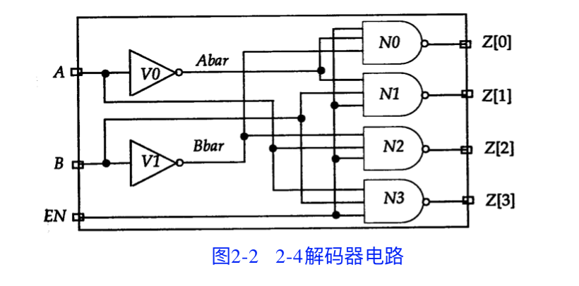
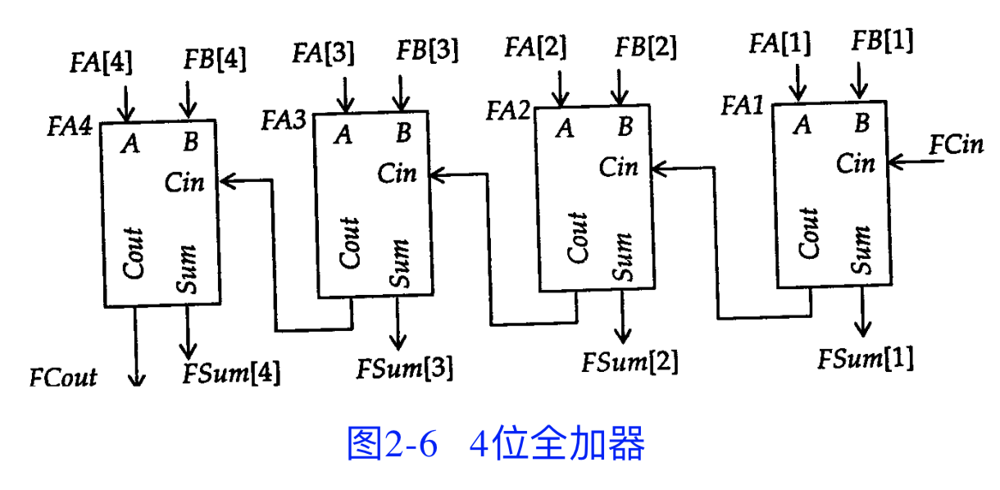

[TOC]

## #2

### 1 模块

#### 基本范式

```verilog
module module_name (port_list); 
  Declarations:  //说明部分用于定义不同的项，例如模块描述中使用的寄存器和参数。
  	//变量、寄存器、线网和参数等的说明部分必须在使用前出现。
  	reg, wire, parameter, input, output, inout, function, task, . . .
	Statements:  //语句定义设计的功能和结构。
		Initial statement
    Always statement
    Module instantiation
    Gate instantiation
    UDP instantiation
    Continuous assignment
endmodule
```

**<u>为了使模块描述清晰和具有良好的可读性 , 最好将所有的说明部分放在语句前。本书中的所有实例都遵守这一规范。</u>**

#### Ex.

```verilog
module HalfAdder (A, B, Sum, Carry);
  input A, B;
  output Sum, Carry;
  
  assign #2 Sum = A ^ B;
  assign #5 Carry = A & B;
endmodule
```

半加器电路示意图


### 2 时延

如上程序中 `assign #2 Sum = A ^ B;` #2 表示2个时间单位

单位时间在编译器中定义

```verilog
`timescale 1ns /100ps  //`表示编译器指令
```

表示时延时间单位为 1ns 并且时间精度为 100ps (时间精度是指所有的时延必须被限定在 0.1ns 内) 
因此上面 #2 表示 2ns

注意：如果没有这样的编译器指令，VerilogHDL模拟器会指定一个缺省时间单位。==IEEEVerilogHDL标准中没有规定缺省时间单位。==

### 3 数据流描述方式(连续赋值语句assign)

#### 语法

```verilog
assign [delay] LHS_net = RHS_expression;  //右边表达式使用的操作数无论何时发生变化，右边表达式都重新计算，并且在指定的时延后变化值被赋予左边表达式的线网变量。
```

<u>**连续赋值语句是并发执行的，也就是说各语句的执行顺序与其在描述中出现的顺序无关。**</u>

#### Ex. 2-4解码器电路

```verilog
`timescale 1ns/1ns
module Decoder2x4 (A, B, EN, Z);
  input A, B, EN;
  output [0:3] Z;  //四位输出端口
  wire Abar, Bbar;
  
  assign #1 Abar = ~ A;                   //语句1
  assign #1 Bbar = ~ B;                   //语句2
  assign #2 Z[0] = ~ (Abar & Bbar & EN);  //语句3
  assign #2 Z[1] = ~ (Abar & B & EN);     //语句4
  assign #2 Z[2] = ~ (A & Bbar & EN);     //语句5
  assign #2 Z[3] = ~ (A & B & EN);        //语句6
endmodule
```

2-4解码器电路图




波形图：输入的A、B、EN 对 Z 的影响


### 4 行为描述方式(init, alwa)

用于结构描述的过程语句

* initial 语句：只执行一次
* always 语句：总是循环执行

<u><b>只有寄存器类型数据能够在这两种语句中被赋值。</b></u>寄存器类型数据在被赋新值前保持原有值不变。<u><b>所有的初始化语句和 always 语句在0时刻并发执行。</b></u>

#### Ex. 用always对1位全加器建模

```verilog
module FA_Seq (A,B,Cin,Sum,Cout);
  input A,B,Cin;
  output Sum,Cout;
  reg Sum,Cout;  //只有寄存器类型数据能够在这两种语句中被赋值。
  reg T1,T2,T3;
  always@(A or B or Cin) begin  //只要A、B或Cin上发生事件，即A、B或Cin之一的值发生变化，顺序过程就执行。  顺序过程执行完成后，always语句再次等待A、B或Cin上发生的事件。
      
      Sum=(A^B)^Cin;
      T1=A & Cin;
      T2=B & Cin;
      T3=A & B;
      Cout=(T1 | T2) | T3;
    end
endmodule
```


在顺序过程中出现的语句是过程赋值模块化的实例。模块化过程赋值在下一条语句执行前完成执行。过程赋值可以有一个可选的时延。

###### 时延可以细分为两种类型 :

* 语句间时延: 这是时延语句执行的时延。

  ```verilog
  //第一条语句执行后等待4个时间单位，然后执行第二条语句。
  Sum=(A^B)^Cin;
  #4 T1=A&Cin;
  ```

* 语句内时延: 这是右边表达式数值计算与左边表达式赋值间的时延。

  ```verilog
  //首先计算右边表达式的值，等待3个时间单位，然后赋值给Sum。
  Sum = #3 (A^B)^Cin;
  ```

==如果在过程赋值中未定义时延，缺省值为0时延，也就是说，赋值立即发生。==

#### Ex. initial语句示例

```verilog
module Test (Pop,Pid);
  output Pop, Pid;
  reg Pop,Pid;
  
  initial
    begin
      Pop = 0；
      Pid = 0;
      Pop = #5 1;
      Pid = #3 1;
      Pop = #6 0;
      Pid = #2 0;
    end;  //执行完后initial将被永远挂起(类似于Arduino中的void loop(){})
endmodule;
```

产生波形：


### 5 结构化描述形式

在Verilog HDL中可使用如下方式描述结构：

* 内置门原语(在门级)
* 开关级原语(在晶体管级)
* 用户定义的原语(在门级)
* 模块实例 (创建层次结构)

#### Ex. 使用内置门原语描述的1位全加器电路

```verilog
module FA_Str (A, B, Cin, Sum, Cout);
  input A, B, Cin;
  output Sum, Cout;
  wire S1, T1, T2, T3;
  
  xor
  	X1 (S1, A, B),
  	X2 (Sum, S1, Cin);
  
  and
  	A1 (T3, A, B),
  	A2 (T2, B, Cin),
  	A3 (T1, A, Cin),
  
  or
  	O1 (Cout, T1, T2, T3);
endmodule
```

xor、and和or是内置门原语；X1、X2、A1、O1等是实例名称。


```verilog
module FourBitFA (FA,FB,FCin,FSum,FCout);
  parameterSIZE=4;
  input [SIZE:1] FA,FB;
  output [SIZE:1] FSum
  input FCin;
  input FCout;
  wire [1:SIZE-1] FTemp;
FA_Str
  FA1(.A(FA[1]),.B(FB[1]),.Cin(FCin),.Sum(FSum[1]),.Cout(FTemp[2])),
  FA2(.A(FA[2]),.B(FB[2]),.Cin(FTemp[1]),.Sum(FSum[2]),.Cout(FTemp[2])),
  FA3(FA[3],FB[3],FTemp[2],FSum[3],FTemp[3]),
  FA4(FA[4],FB[4],FTemp[3],FSum[4],FCout);
endmodule
```



### 6 混合设计描述方式

结构的和行为的描述可以混合，

### 7 设计模拟

Ex. 验证与非门交叉连接构成的RS_FF模块的测试模块


==实测这个程序甚至没法通过语法检测==

```verilog
`timescale 10ns/1ns
module RS_FF (Q,Qbar,R,S);
  output Q,Qbar;
  input R,S;

  nand #1 (Q,R,Qbar);
  nand #1 (Qbar,S,Q);
    //在门实例语句中，实例名称是可选的。
endmodule

module Test;
  reg TS,TR;
  wire TQ,TQb;

  //测试模块的实例语句:
  RS_FFNSTA(.Q(TQ),.S(TS),.R(TR),.Qbar(TQb));
    //采用端口名相关联的连接方式。

  //加载激励:
  initial
    begin:
      TR=0;
      TS=0;
      #5 TS=1;
      #5 TS=0;
      TR=1;
      #5 TS=1;
      TR=0;
      #5 TS=0;
      #5 TR=1
    end
    //输出显示:
    initial
      $monitor ("At time %t ,", $time, "TR=%b,TS=%b,TQ=%b,TQb=%b", TR, TS, TQ, TQb);
endmodule
```


### q

默认数据类型：1位wire

## #3

* 按位操作符

  ```verilog
  ~
  &
  |
  ^
  ~^ / ^~
  ```

* 规约操作符

  ```verilog
  & ; &A == A[0] & A[1] & ... & A[n]
  ~& ; ~&A == ~(A[0] & A[1] & ... & A[n])
  |
  ~|
  ^
  ~^
  ```

  

