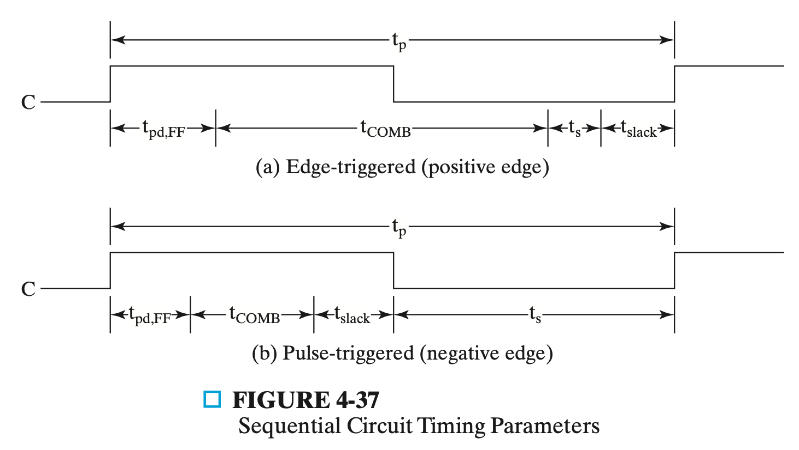

无符号数补码直接取反+1

有符号数视情况

无符号数减法就是拿第一个数和第二个数的补码做加法运算，若A>=B = (A-B); if(A<B) = (A-B)_2’sc

有符号数减法就是拿两个数的补码做减法运算

---

* PROM
  
  * a **fixed** array of AND gates and a **programmable** array of OR gates
  
* Programmable Array Logic
  
  * having a **programmable** set of ANDs combined with **fixed** ORs.
  
* Programmable Logic Array
  
  * having a **programmable** set of ANDs combined with a **programmable** set of ORs.
  
* CPLD: Complex Programmable Logic Device

  * 可断电、擦写次数低
  * **复杂可编程逻辑器件 (CPLD )**由完全可编程与/或阵列以及宏单元库构成。 AND/OR 阵列可重编程，能够执行众多逻辑功能。宏单元是执行组合逻辑或时序逻辑的功能块，同时还提供了真值或补码输出和以不同的路径反馈等更高灵活性。

* FPGA: Programmable Gate Array
  
  * Use look-up table
  
* LUT

  * 当用户通过原理图或HDL语言描述了一个逻辑电路以后，PLD/FPGA开发软件会自动计算逻辑电路的所有可能的结果，并把结果事先写入RAM,这样，每输入一个信号进行逻辑运算就等于输入一个地址进行查表，找出地址对应的内容，然后输出即可。

  * 如四输入与门

    | 理论输入 | 理论输出 | 实际输入 | LUT输出 |
    | -------- | -------- | -------- | ------- |
    | 0000     | 0        | 0000     | 0       |
    | 0001     | 0        | 0001     | 0       |
    | ...      | 0        | ...      | 0       |
    | 1111     | 1        | 1111     | 1       |

    

---

Moore 和 Mealy

---

Gate Input Cost: 门电路输入引脚的个数

* G表示不考虑非门
* GN表示考虑非门

---

$\sum_d(,,)$表示 Don't care

---

(r-1)'s complement: (2^n^-1) - N

r's complement: (2^n^-1) - N + 1 = 2^n^ - N

---

Cannonical与Standard的区别？？明天问一下

~~(SOP与POS就是指的sum of mint 和 prod of maxt)(课件里并不是，Chap02.104)~~

https://www.geeksforgeeks.org/canonical-and-standard-form/

---

扇入：是指直接调用该模块的上级模块的个数。扇入大表示模块的复用程序高。 

扇出：是指该模块直接调用的下级模块的个数。扇出大表示模块的复杂度高，需要控制和协调过多的下级模块；但扇出过小（例如总是1）也不好。

---

* AND-OR style
  * ABC + AbarBC
* OR-AND style
  * (A+B+C)(Abar+B+C)

---

(1) a flip-flop propagation delay, *t*~pd~, FF, 

(2) a combinational logic delay through the chain of gates along the path, *t*~pd,COMB~, and

(3) a flip-flop setup time, *t*~s~

获得公式 t~p~ = t~slack~ + (t~pd,FF~ + t~pd,COMB~ + t~s~)

Each path has a slack time, *t*~slack~, the extra time allowed in the clock period beyond that required by the path. 它指在时钟周期内，路径上传播信号所需时间之外的额外时间。为保证信号的变化值能够被接收触发器捕获，松弛时间必须大于等于0，即 t~p~ >= max(t~pd,FF~ + t~pd,COMB~ + t~s~) = t~p,min~

---

计数器

* 行波：C端口与上一个的输出端口Qn相连；每个D触发器的D端口都与自己的Qn相连
* 串行同步：D来自上一个寄存器的Q与自己的Q的异或
* 并行同步：当前面的Q全为1时C为1，即`C = Q_0 & Q_1 & ... & Q_(n-1)`；D接Qn

---

**奇偶校验**

三位奇校验器（~~同样也作为odd function生成器~~）：两个XOR门（一个XOR门有四个NAND门）

其实用递推即可：若前面以为奇，下一个是1变为偶，输出0；下一个是0仍是奇，输出1，如此一直堆叠XOR即可

用N-2^N^译码器的方法：一一对应

—-

四异或：\Sigma_m(1,2,4,7,8,11,13,14)