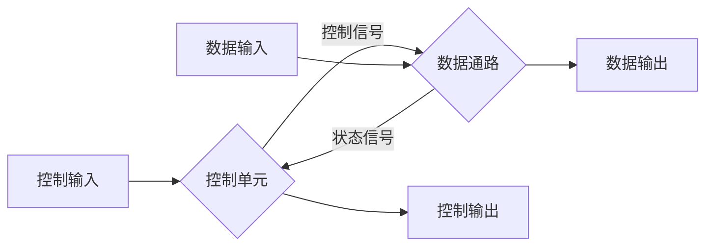

[TOC]

> 写在之前
>
> 1. 施青松老师要求逻辑证明题要写出两补之间是用什么公式推出的

## Ch1&2 布尔代数

### Basic Equation

#### Covering Law:

$$
A(A+B)=A+AB=A(1+B)=A\\
A(\overline A+B)=AB\\
absorption:A+\overline AB=A+B\\
$$

#### Consensus Law:

$$
(A+B)(\overline A+C)(B+C)=(A+B)(\overline A+C)\\
AB+\overline AC+BC=AB+\overline AC
$$

####Duality Rules

将F中

'and' $\Longrightarrow$ 'OR';

'OR' $\Longrightarrow$ 'AND'

0 $\Longrightarrow$ 1

1$\Longrightarrow$ 0

记作F'

#### Substitution rules

将逻辑等式中的变量A全部换为函数F，则等式仍成立

Ex.
$$
X(Y+Z)=XY+XZ， if\ X + YZ\\Instead\ of\ X，then\ equation\ still\ holds:\\
(X+YZ) (Y+Z)=(X+YZ)Y+(X+YZ)Z
$$


#### Shannon Formula

$$
xf(x,\overline x,...,z)=xf(1,0,...,z)\\
\overline xf(x,\overline x,...,z)=xf(0,1,...,z)\\
x+f(x,\overline x,...,z)=x+f(0,1,...,z)\\
\overline x+f(x,\overline x,...,z)=\overline x+f(1,0,...,z)\\
$$

##### Shannon Expansion

$$
f(x1,x2,x3)\\
=x1x2x3f(1,1,1)+ x1x2\overline x3f(1,1,0)\\
+ x1\overline x2x3f(1,0,1)+ x1\overline x2\overline x3f(1,0,0)\\
+ \overline x1x2x3f(0,1,1)+ \overline x1x2\overline x3f(0,1,0)\\
+ \overline x1\overline x2x3f(0,0,1)+ \overline x1\overline x2\overline x3f(0,0,0)
$$


---

### Logic Gate Circuit

#### Gate Delay

##### Propagation Delay

==HL & LH==


##### Delay Mode

Transport delay & Inertial delay (interval <= *rejection time*)


#### Primitive Logic Gate Circuit

 

##### NAND

$\overline {AB} = \overline A+\overline B$

##### NOR

$\overline {A+B} = \overline A\overline B$

---

#### Complex Logic Gate Circuit

 

##### AND-OR-INVERT

##### Exclusive OR (XOR)

$A \oplus B = A\overline B+\overline AB$

<u>also called half adder(没得进位的加法器)</u>

若有两个则为全加器

##### Exclusive NOR(XNOR/异或非/同或)

$A\odot B=\overline{A\oplus B} = AB+\overline A\overline B$

---

#### Hi-Impedance(Hi-Z)

add a third logic value

##### 3-state 

##### Ex. 3-state buffer


两个3-state buffer


##### Ex. 3-state gate

Transmission gate(TG)


2个传输门实现XOR门


---

### Simplification

#### Condition(Requests)

##### AND-OR style

1. "AND-item" is least in expression; (与项最少)
2. 满足1的条件下，与项中变量最少

##### OR-AND style

要求同上

获得方法：

1. 直接算

2. 用对偶规则获得与或形式，化简后再DeM

   

#### Canonical Forms

##### Miniterm

denots as m~i~

m~i~m~j~=0

###### ==Sum-of-Miniterms：找1term1==

##### Maxterm

denotes as M~i~

M~i~+M~j~=1

###### ==Product-of-Maxterms：找0term0==

##### Relationship

==Miniterm(E+F) = Miniterm(E) + Miniterm(F); Miniterm(E·F) = Miniterm(E) · Miniterm(F);==

可以表示成$\displaystyle\sum$或$\displaystyle\prod$的形式


#### K-Map

|  00  |  01  |  11  |  10  |      |      |      |      |
| :--: | :--: | :--: | :--: | :--: | :--: | :--: | :--: |
| 000  | 001  | 011  | 010  | 110  | 111  | 101  | 100  |
##### Implicant

Dimensional Block constitute by the "AND-term" in the K-map (fill 1 grid rectangle)

##### Prime Implicant

质蕴涵项，简称为质项。

性质：

1. 质项都是由1个、2个、2^2^个、2^3^个……最小项合并而成的。
2. 质项都是蕴含项。

is a product term obtained by combining the maximum possible number of adjacent squares in the map into a rectangle with the number of squares a power of 2.

##### Essential Prime Implicant

> If a minterm of a function is included in only one prime implicant, that prime implicant is said to be *essential*.
>
> 有一个miniterm，只在这个PM中出现，这个PM就是EPM

~~it is the **only** prime implicant that covers (includes) one or more minterms~~(施青松ppt里这个only乱加)

without in another prime implicant.


##### 两个K-Map的融合


##### K-MAP化简为AND-OR形式

找相邻的、翻转对称的

Miniterm：找1

Maxterm：找0取反


> In most cases, this results in a simplified, although not necessarily optimum, sum-of-products expression.
>
> **WHY??**

##### K-MAP化简为OR-AND形式

找0的 $\Longrightarrow$ 写出 $\overline F$ 的AND-OR形式 $\Longrightarrow$ 直接取反

> Ex. 
>
> Simplify the following Boolean function in product-of-sums form:
>
> $F(A,B,C,D) = \Sigma m(0,1,2,5,8,9,10)$
>The 1s marked in the map of Figure 2-20 represent the minterms of the function. The squares marked with 0s represent the minterms not included in F and therefore denote the complement of F. Combining the squares marked with 0s, we obtain the optimized complemented function
> $\overline F= AB+CD+B\overline D$
>Taking the dual and complementing each literal gives the complement of F.This is F in product-of-sums form:
>
> $F = (\overline A + \overline B)(\overline C + \overline D)(\overline B + D)$

#### Implicant Table(蕴含表达式)

#### Don't-Care

## 语言

```verilog
input wire s1;

reg [7:0] C;
```


## Ch4 时序电路

### 基础模块

#### SR锁存器（NOR）

| 状态           | S    | R    | Q    | Qn   |
| -------------- | ---- | ---- | ---- | ---- |
| 保持           | 0    | 0    | Q    | Qn   |
| 置位           | 1    | 0    | 1    | 0    |
| 置位           | 0    | 0    | 1    | 0    |
| 复位           | 0    | 1    | 0    | 1    |
| 复位           | 0    | 0    | 0    | 1    |
| 未定义（同时） | 1    | 1    | x    | x    |

#### SnRn锁存器（NAND）

| 状态           | Sn   | Rn   | Q    | Qn   |
| -------------- | ---- | ---- | ---- | ---- |
| 保持           | 1    | 1    | Q    | Qn   |
| 置位           | 0    | 1    | 1    | 0    |
| 置位           | 1    | 1    | 1    | 0    |
| 复位           | 1    | 0    | 0    | 1    |
| 复位           | 1    | 1    | 0    | 1    |
| 未定义（同时） | 0    | 0    | x    | x    |

#### D锁存器

D指的是Data

| 状态 | C    | D    |
| ---- | ---- | ---- |
| 不变 | 0    | x    |
| 复位 | 1    | 0    |
| 置位 | 1    | 1    |

#### 锁存器局限

**时序问题**

一个触发周期内会一直改变输出无法只改变一次，会不断变化（称为分块）

### 进阶

#### SR触发器（Clocked SR Latch）

**两种实现方式**

- 2 × NAND2 + NAND_Latch
- 2 × AND2 + NOR_Latch

| 状态   | C    | S    | R    |
| ------ | ---- | ---- | ---- |
| 不变   | 0    | x    | x    |
| 不变   | 1    | 0    | 0    |
| 复位   | 1    | 0    | 1    |
| 置位   | 1    | 1    | 0    |
| 未定义 | 1    | 1    | 1    |

#### D触发器

* **正边(上升)沿D触发器**
  * DLatch + SRLatch + 2 × NOR
  * symbol：C处有尖角
* **负边(下降)沿D触发器**
  * DLatch + SRLatch + 1 × NOR
  * symbol：C处有尖角，外侧有小圆

### 时序电路设计

#### Moore & Mealy

主要区别在于[]中的只有输出还是输入和输出都有

* **Moore**：输出**只**依赖<u>当前</u>

  * Outputs are a function ONLY of states
* On circle with output included:
    * <u>[state/output]</u>

  ```mermaid
  graph LR
  
  a(state/output)
  b(state/output)
  
  a --input--> b
  a --input--> a
  b --input--> b
  b --input--> a
  ```
  
  **Ex**.  X is input; state/output in the [].
  
  当然state/output也可以是010/01这样的多位的，Ex里state是用dec表示bin，或者你<u>也可以用字母或其他符号表示状态</u>
  
  ```mermaid
  graph LR
  
  a(0/0)
  b(1/0)
  c(2/1)
  a --X=1--> b
  b --X=0--> a
  a --X=0--> a
  b --X=1--> c
  c --X=1--> c
  c --X=0--> a
  ```
  
* **Mealy**：输出依赖<u>当前和输入</u>

  * Outputs are a function of inputs AND states
  * On directed arc with the output included:
    * <u>--input/output--></u>
  
  ```mermaid
  graph LR
  
  a(state)
  b(state)
  
  a --input/output--> b
  a --input/output--> a
  b --input/output--> b
  b --input/output--> a
  ```
  
  **Ex**. X is input; Y is output; wires state in the [].
  
  ```mermaid
  graph LR
  
  0 --X=1/Y=0--> 1
  1 --X=0/Y=0--> 0
  0 --X=0/Y=0--> 0
  1 --X=1/Y=1--> 1
  ```

#### State Table

==注意：输出值一般是与当前量有关==

**Ex**.

对于：

$D_A = B  \\  D_B = \overline{(A \oplus X)} = A \odot X  \\  Y = (A \oplus X) \oplus B$

==注意触发器的函数，即Q是否与D相等，此处$\because Q = D(C上升), \therefore A(t+1) = D_A(t)$==

| A(t) | X(t) | B(t) | A(t+1) | B(t+1) | Y(t) |
| ---- | ---- | ---- | ------ | ------ | ---- |
| 0    | 0    | 0    | 0      | 1      | 0    |
| 0    | 0    | 1    | 1      | 1      | 1    |
| 1    | 0    | 0    | 0      | 0      | 1    |
| 1    | 0    | 1    | 1      | 0      | 0    |
| 0    | 1    | 0    | 0      | 0      | 1    |
| 0    | 1    | 1    | 1      | 0      | 0    |
| 1    | 1    | 0    | 0      | 1      | 0    |
| 1    | 1    | 1    | 1      | 1      | 1    |

#### State Diagram

Label form:

* On circle with output included:
  * state/output
  * Moore type output depends only on state
* On directed arc with the output included:
  * input/output
  * Mealy type output depends on state and input

**Diagram -> Table -> Equations**

**Ex**.

检测1101，注意(110(1)101)

1. **Mealy**

   ABCD分别表示四种状态，x表示输入

   | Present State | Next State (x=0) | Next State (x=1) | Output (x=0) | Output (x=1) |
   | ------------- | ---------------- | ---------------- | ------------ | ------------ |
   | A             | A                | B                | 0            | 0            |
   | B             | A                | C                | 0            | 0            |
   | C             | D                | C                | 0            | 0            |
   | D             | A                | B                | 0            | **1**        |
   
   ```mermaid
   graph LR
   A --1/0--> B
   B --1/0--> C
   C --0/0--> D
   D --1/1--> B
   D --0/0--> A
   B --0/0--> A
   A --0/0--> A
   C --1/0--> C
   ```

2. **Moore**

   * Arcs now show only state transitions
   * Add a new state E to produce the output 1
   * Note that the new state, E produces the same behavior in the future as state B. But it gives a different output at the present time. Thus these states do represent a different abstraction of the input history.

   | Present State | Next State (x=0) | Next State (x=1) | Output |
   | ------------- | ---------------- | ---------------- | ------ |
   | A             | A                | B                | 0      |
| B             | A                | C                | 0      |
   | C             | D                | C                | 0      |
   | D             | A                | E                | 0      |
   | E             | A                | C                | **1**  |
   
   ```mermaid
   graph LR
   
   a(A/0)
   b(B/0)
   c(C/0)
   d(D/0)
   e(E/1)
   
   a --0--> a
   a --1--> b
   b --0--> a
   b --1--> c
   c --1--> c
   c --0--> d
   d --1--> e
   d --0--> a
   e --1--> c
   e --0--> a
   ```
   
#### 状态赋值

**规则方法**

* 直接按顺序
* 用格雷码(较常用)
  * 优点：与K-Map适配，便于化简
* 特殊的
  * 单热点(one-hot)赋值（独热码）
    * 类似于译码器输出

<u>例题见中文版P160开始</u>

**选择原则**

* 安全（本课程中不重要）
* 相邻项越多越好，这样消掉的多，电路可简化

**Unused State的处理**

根据具体情况有三种方式，具体操作见习题4-29

* 
* 
* 

#### 状态方程

**化简**

* K-Map
  * 顺序赋值也得化简
  * 格雷码可以直接移植（PPT slide38）
* 独热码需要的触发器比较多

#### 状态机设计

跳过设计状态图和状态表的步骤直接写代码，用`case()`语句。

<u>注意：若在时钟上升沿最后赋output，应是下一个状态的output；若是另写一个always赋值output，则因为是实时赋值，所以是当前状态的output</u>

#### Appendix

* **t~s~与t~h~**
  * 建立(Setup)时间(t~s~)：时钟沿到来前输入数据D必须要稳定的时间
  * 保持(Hold)时间(t~h~)：时钟沿到来后输入数据D必须要稳定的时间

### 其他触发器

JK触发器

* 同SR，但在J=K=1时会到相反电平

T触发器

* T=1时到相反电平

## Ch6

### 基本定义与概念

* 数据通路
  * 包括数据处理逻辑和一组用与执行数据处理的寄存器
* 控制单元
  * 由一些逻辑单元组成
  * 决定数据通路处理数据过程中各种操作的**顺序**
* 微操作
  * 即寄存器传输记号
  * 描述了基本数据处理行为
* 寄存器传输
  * 在寄存器之间、寄存器与存储器之间、以及通过数据处理逻辑传输信息
  * 由专门的传输硬件（如多路复用器）和总线一起实现

### 寄存器与加载使能

**并行加载寄存器**

避免时钟偏移(clock skew)

### 寄存器传输

数据通路与控制单元的交互



数字系统的寄存器传输系统可以由一下三个方面进行描述：

1. 系统中的寄存器组
2. 对寄存器中存储数据执行的操作
3. 系统中操作执行顺序的控制

**基本操作**

* 一个寄存器可以完成多个基本操作，比如加载、计数、加减法、移位

**微操作(microoperation)**

* 对存储器存储结构执行的基本操作成为微操作，比如装载一个寄存器的内容至另一个寄存器，将两个寄存器内容相加，将一个寄存器内容加1

\* RTL(Reg Trans Level/Language)

