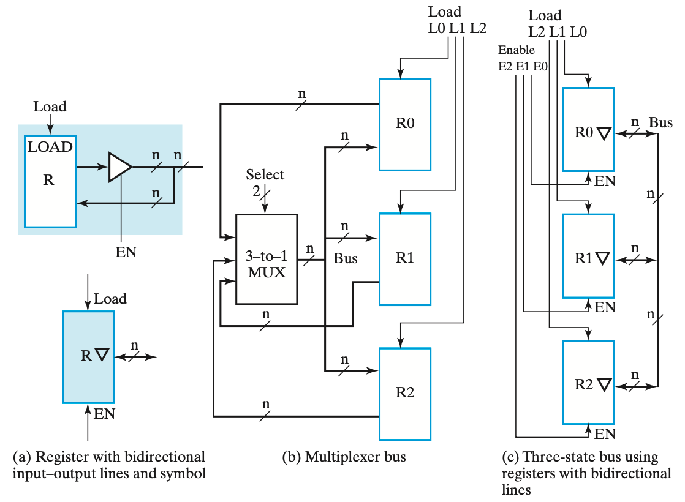

[TOC]

> 写在之前
>
> 1. 施青松老师要求逻辑证明题要写出两补之间是用什么公式推出的

## Ch1&2 布尔代数

### Basic Equation

#### Covering Law:

$$
A(A+B)=A+AB=A(1+B)=A\\
A(\overline A+B)=AB\\
absorption:A+\overline AB=A+B\\
$$

#### Consensus Law:

$$
(A+B)(\overline A+C)(B+C)=(A+B)(\overline A+C)\\
AB+\overline AC+BC=AB+\overline AC
$$

#### Duality Rules

将F中

'and' $\Longrightarrow$ 'OR';

'OR' $\Longrightarrow$ 'AND'

0 $\Longrightarrow$ 1

1$\Longrightarrow$ 0

记作F'

#### Substitution rules

将逻辑等式中的变量A全部换为函数F，则等式仍成立

Ex.
$$
X(Y+Z)=XY+XZ， if\ X + YZ\\Instead\ of\ X，then\ equation\ still\ holds:\\
(X+YZ) (Y+Z)=(X+YZ)Y+(X+YZ)Z
$$


#### Shannon Formula

$$
xf(x,\overline x,...,z)=xf(1,0,...,z)\\
\overline xf(x,\overline x,...,z)=xf(0,1,...,z)\\
x+f(x,\overline x,...,z)=x+f(0,1,...,z)\\
\overline x+f(x,\overline x,...,z)=\overline x+f(1,0,...,z)\\
$$

##### Shannon Expansion

$$
f(x1,x2,x3)\\
=x1x2x3f(1,1,1)+ x1x2\overline x3f(1,1,0)\\
+ x1\overline x2x3f(1,0,1)+ x1\overline x2\overline x3f(1,0,0)\\
+ \overline x1x2x3f(0,1,1)+ \overline x1x2\overline x3f(0,1,0)\\
+ \overline x1\overline x2x3f(0,0,1)+ \overline x1\overline x2\overline x3f(0,0,0)
$$


---

### Logic Gate Circuit

#### Gate Delay

##### Propagation Delay

==HL & LH==


##### Delay Mode

Transport delay & Inertial delay (interval <= *rejection time*)


#### Primitive Logic Gate Circuit

 

##### NAND

$\overline {AB} = \overline A+\overline B$

##### NOR

$\overline {A+B} = \overline A\overline B$

---

#### Complex Logic Gate Circuit

 

##### AND-OR-INVERT

##### Exclusive OR (XOR)

$A \oplus B = A\overline B+\overline AB$

<u>also called half adder(没得进位的加法器)</u>

若有两个则为全加器

##### Exclusive NOR(XNOR/异或非/同或)

$A\odot B=\overline{A\oplus B} = AB+\overline A\overline B$

---

#### Hi-Impedance(Hi-Z)

add a third logic value

##### 3-state 

##### Ex. 3-state buffer


两个3-state buffer


##### Ex. 3-state gate

Transmission gate(TG)


2个传输门实现XOR门


---

### Simplification

#### Condition(Requests)

##### AND-OR style

1. "AND-item" is least in expression; (与项最少)
2. 满足1的条件下，与项中变量最少

##### OR-AND style

要求同上

获得方法：

1. 直接算

2. 用对偶规则获得与或形式，化简后再DeM

   

#### Canonical Forms

##### Miniterm

denots as m~i~

m~i~m~j~=0

###### ==Sum-of-Miniterms：找1term1==

##### Maxterm

denotes as M~i~

M~i~+M~j~=1

###### ==Product-of-Maxterms：找0term0==

##### Relationship

==Miniterm(E+F) = Miniterm(E) + Miniterm(F); Miniterm(E·F) = Miniterm(E) · Miniterm(F);==

可以表示成$\displaystyle\sum$或$\displaystyle\prod$的形式


#### K-Map

|  00  |  01  |  11  |  10  |      |      |      |      |
| :--: | :--: | :--: | :--: | :--: | :--: | :--: | :--: |
| 000  | 001  | 011  | 010  | 110  | 111  | 101  | 100  |
##### Implicant

Dimensional Block constitute by the "AND-term" in the K-map (fill 1 grid rectangle)

##### Prime Implicant

质蕴涵项，简称为质项。

性质：

1. 质项都是由1个、2个、2^2^个、2^3^个……最小项合并而成的。
2. 质项都是蕴含项。

is a product term obtained by combining the maximum possible number of adjacent squares in the map into a rectangle with the number of squares a power of 2.

##### Essential Prime Implicant

> If a minterm of a function is included in only one prime implicant, that prime implicant is said to be *essential*.
>
> 有一个miniterm，只在这个PM中出现，这个PM就是EPM

~~it is the **only** prime implicant that covers (includes) one or more minterms~~(施青松ppt里这个only乱加)

without in another prime implicant.


##### 两个K-Map的融合


##### K-MAP化简为AND-OR形式

找相邻的、翻转对称的

Miniterm：找1

Maxterm：找0取反


> In most cases, this results in a simplified, although not necessarily optimum, sum-of-products expression.
>
> **WHY??**
> 
> I know why now

##### K-MAP化简为OR-AND形式

找0的 $\Longrightarrow$ 写出 $\overline F$ 的AND-OR形式 $\Longrightarrow$ 直接取反

> Ex. 
>
> Simplify the following Boolean function in product-of-sums form:
>
> $F(A,B,C,D) = \Sigma m(0,1,2,5,8,9,10)$
>The 1s marked in the map of Figure 2-20 represent the minterms of the function. The squares marked with 0s represent the minterms not included in F and therefore denote the complement of F. Combining the squares marked with 0s, we obtain the optimized complemented function
> $\overline F= AB+CD+B\overline D$
>Taking the dual and complementing each literal gives the complement of F.This is F in product-of-sums form:
>
> $F = (\overline A + \overline B)(\overline C + \overline D)(\overline B + D)$

#### Implicant Table(蕴含表达式)

#### Don't-Care

## 语言

```verilog
input wire s1;

reg [7:0] C;
```

## Ch3

#### 二补码

(r-1)'s complement: (2^n^-1) - N

r's complement: (2^n^-1) - N + 1 = 2^n^ - N

## Ch4 时序电路

### 基本概念

同步电路与异步电路

最显著的差别就是**是否由同一个信号触发**。异步计数器进位信号是逐步传送的

* Depends on the times at which:
  * storage elements observe their inputs, and
  * storage elements change their state 
* Synchronous
  * 行为根据离散的时间点、其信号线(clk pulse)上的相关信息来进行定义
  * Behavior defined from knowledge of its signals at discrete instances of time
  * Storage elements observe inputs and can change state only in relation to a timing signal (clock pulses from a clock)
* Asynchronous
  * 行为依赖于某一时刻的输入信号及输入信号在连续时间内变化的顺序
  * Behavior defined from knowledge of inputs an any instant of time and the order in continuous time in which inputs change
  * If clock just regarded as another input, all circuits are asynchronous!
  * Nevertheless, the synchronous abstraction makes complex designs tractable!

### 基础模块

#### SR锁存器（NOR）

| 状态           | S    | R    | Q    | Qn   |
| ------------- | ---- | ---- | ---- | ---- |
| 保持           | 0    | 0    | Q    | Qn   |
| 置位           | 1    | 0    | 1    | 0    |
| 置位           | 0    | 0    | 1    | 0    |
| 复位           | 0    | 1    | 0    | 1    |
| 复位           | 0    | 0    | 0    | 1    |
| 未定义（同时）   | 1    | 1    | x    | x    |

#### SnRn锁存器（NAND）

| 状态           | Sn   | Rn   | Q    | Qn   |
| ------------- | ---- | ---- | ---- | ---- |
| 保持           | 1    | 1    | Q    | Qn   |
| 置位           | 0    | 1    | 1    | 0    |
| 置位           | 1    | 1    | 1    | 0    |
| 复位           | 1    | 0    | 0    | 1    |
| 复位           | 1    | 1    | 0    | 1    |
| 未定义（同时）   | 0    | 0    | x    | x    |

#### D锁存器

D指的是Data

| 状态 | C    | D    |
| ---- | ---- | ---- |
| 不变 | 0    | x    |
| 复位 | 1    | 0    |
| 置位 | 1    | 1    |

#### 锁存器局限

**时序问题**

一个触发周期内会一直改变输出无法只改变一次，会不断变化（称为分块）

### 进阶

#### SR触发器（Clocked SR Latch）

**两种实现方式**

- 2 × NAND2 + NAND_Latch
- 2 × AND2 + NOR_Latch

| 状态   | C    | S    | R    |
| ------ | ---- | ---- | ---- |
| 不变   | 0    | x    | x    |
| 不变   | 1    | 0    | 0    |
| 复位   | 1    | 0    | 1    |
| 置位   | 1    | 1    | 0    |
| 未定义 | 1    | 1    | 1    |

#### D触发器

* **正边(上升)沿D触发器**
  * DLatch + SRLatch + 2 × NOR
  * symbol：C处有尖角
* **负边(下降)沿D触发器**
  * DLatch + SRLatch + 1 × NOR
  * symbol：C处有尖角，外侧有小圆

#### 主从与边沿

* master-slave
  * 步骤
    1. 在cp的高电平或低电平期间，输入信号先决定主触发器状态；
    2. cp下降沿或上升沿到来，主触发器状态原样转移给从触发器，表现为整个触发器的状态。转移过去的状态取决于cp的高电平或低电平期间所有的输入。
  * 因此对于主从SR触发器，在cp高电平时应保持SR稳定
* edge-triggered
  * 触发器状态仅仅取决于cp边沿到来那一瞬间的输入。

<u>所以两者的状态方程相同，但边沿触发器更稳定。</u>

==The edge-triggered D flip-flop is the same as the master- slave D flip-flop==

二者的symbol不一样，见[Chap04_1.pdf](file:///Users/ulysses/Documents/%E5%A4%A7%E4%BA%8C%E4%B8%8A/%E6%95%B0%E9%80%BB/%E7%90%86%E8%AE%BA%20%E8%AF%BE%E4%BB%B6/Chap04_1.pdf)的Slide41

*所以Trigger和Flip-Flop还是不是一个东西？*<u>应该都可以</u>

### 时序电路设计

#### Moore & Mealy

主要区别在于[]中的只有输出还是输入和输出都有

* **Moore**：输出**只**依赖<u>当前状态</u>
  
  * Outputs are a function ONLY of states
  * 因此可以将输出与状态放在一个框里，(状态依然会随输入而改变，但是输出不会)
* On circle with output included:
    * <u>[state/output]</u>

  ```mermaid
  graph LR
  
  a(state/output)
  b(state/output)
  
  a --input--> b
  a --input--> a
  b --input--> b
  b --input--> a
  ```
  
  **Ex**.  X is input; state/output in the [].
  
  当然state/output也可以是010/01这样的多位的，Ex里state是用dec表示bin，或者你<u>也可以用字母或其他符号表示状态</u>
  
  ```mermaid
  graph LR
  
  a(0/0)
  b(1/0)
  c(2/1)
  a --X=1--> b
  b --X=0--> a
  a --X=0--> a
  b --X=1--> c
  c --X=1--> c
  c --X=0--> a
  ```
  
* **Mealy**：输出依赖<u>当前状态和输入</u>

  * Outputs are a function of inputs AND states
  * On directed arc with the output included:
    * <u>--input/output--></u>
  
  ```mermaid
  graph LR
  
  a(state)
  b(state)
  
  a --input/output--> b
  a --input/output--> a
  b --input/output--> b
  b --input/output--> a
  ```
  
  **Ex**. X is input; Y is output; wires state in the [].
  
  ```mermaid
  graph LR
  
  0 --X=1/Y=0--> 1
  1 --X=0/Y=0--> 0
  0 --X=0/Y=0--> 0
  1 --X=1/Y=1--> 1
  ```

#### State Table

==注意：输出值一般是与当前量有关==

**Ex**.

对于：

$D_A = B  \\  D_B = \overline{(A \oplus X)} = A \odot X  \\  Y = (A \oplus X) \oplus B$

==注意触发器的函数，即Q是否与D相等，此处$\because Q = D(C上升), \therefore A(t+1) = D_A(t)$==

| A(t) | X(t) | B(t) | A(t+1) | B(t+1) | Y(t) |
| ---- | ---- | ---- | ------ | ------ | ---- |
| 0    | 0    | 0    | 0      | 1      | 0    |
| 0    | 0    | 1    | 1      | 1      | 1    |
| 1    | 0    | 0    | 0      | 0      | 1    |
| 1    | 0    | 1    | 1      | 0      | 0    |
| 0    | 1    | 0    | 0      | 0      | 1    |
| 0    | 1    | 1    | 1      | 0      | 0    |
| 1    | 1    | 0    | 0      | 1      | 0    |
| 1    | 1    | 1    | 1      | 1      | 1    |

#### State Diagram

Label form:

* On circle with output included:
  * state/output
  * Moore type output depends only on state
* On directed arc with the output included:
  * input/output
  * Mealy type output depends on state and input

**Diagram -> Table -> Equations**

**Ex**.

检测1101，注意(110(1)101)

1. **Mealy**

   ABCD分别表示四种状态，x表示输入

   | Present State | Next State (x=0) | Next State (x=1) | Output (x=0) | Output (x=1) |
   | ------------- | ---------------- | ---------------- | ------------ | ------------ |
   | A             | A                | B                | 0            | 0            |
   | B             | A                | C                | 0            | 0            |
   | C             | D                | C                | 0            | 0            |
   | D             | A                | B                | 0            | **1**        |
   
   ```mermaid
   graph LR
   A --1/0--> B
   B --1/0--> C
   C --0/0--> D
   D --1/1--> B
   D --0/0--> A
   B --0/0--> A
   A --0/0--> A
   C --1/0--> C
   ```

2. **Moore**

   * Arcs now show only state transitions
   * Add a new state E to produce the output 1
   * Note that the new state, E produces the same behavior in the future as state B. But it gives a different output at the present time. Thus these states do represent a different abstraction of the input history.

   | Present State | Next State (x=0) | Next State (x=1) | Output |
   | ------------- | ---------------- | ---------------- | ------ |
   | A             | A                | B                | 0      |
   | B             | A                | C                | 0      |
   | C             | D                | C                | 0      |
   | D             | A                | E                | 0      |
   | E             | A                | C                | **1**  |
   
   ```mermaid
   graph LR
   
   a(A/0)
   b(B/0)
   c(C/0)
   d(D/0)
   e(E/1)
   
   a --0--> a
   a --1--> b
   b --0--> a
   b --1--> c
   c --1--> c
   c --0--> d
   d --1--> e
   d --0--> a
   e --1--> c
   e --0--> a
   ```
   
#### 状态赋值

**规则方法**

* 直接按顺序
* 用格雷码(较常用)
  * 优点：与K-Map适配，便于化简
* 特殊的
  * 单热点(one-hot)赋值（独热码）
    * 类似于译码器输出

<u>例题见中文版P160开始</u>

**选择原则**

* 安全（本课程中不重要）
* 相邻项越多越好，这样消掉的多，电路可简化

**Unused State的处理**

根据具体情况有三种方式，具体操作见习题4-29

* 
* 
* 

#### 状态方程

**化简**

* K-Map
  * 顺序赋值也得化简
  * 格雷码可以直接移植（PPT slide38）
* 独热码需要的触发器比较多

#### 状态机设计

跳过设计状态图和状态表的步骤直接写代码，用`case()`语句。

<u>注意：若在时钟上升沿最后赋output，应是下一个状态的output；若是另写一个always赋值output，则因为是实时赋值，所以是当前状态的output</u>

### Appendix

* t~w~: clock pulse width
* t~p**~: propa-gation delay
  * t~pd~ = max(t~PHL~,t~PLH~)

* **t~s~与t~h~**
  * 建立(Setup)时间(t~s~)：时钟沿到来前输入数据D必须要稳定的时间
  * 保持(Hold)时间(t~h~)：时钟沿到来后输入数据D必须要稳定的时间
* **时序电路正确工作所要求的最小时钟周期T为：T>t~Latch~+t~circuit~+t~s~**

* ~~主从触发器与边缘触发器~~
  * ~~主从式SR触发器在整个clk为H器件的输出都依赖与输入~~
  * 看上面的吧

### 其他触发器

JK触发器

* 同SR，但在J=K=1时会到相反电平

T触发器

* T=1时到相反电平

### 触发器描述

* D
  * Q(t+1) = D
* T
  * Q(t+1) = T ^ Q
* SR
  * Q(t+1) = S + Rn \* Q (S \* R = 0)
* JK
  * Q(t+1) = J \* Qn + Kn \* Q

## Ch6

### 基本定义与概念

* 数据通路
  * 包括数据处理逻辑和一组用与执行数据处理的寄存器
* 控制单元
  * 由一些逻辑单元组成
  * 决定数据通路处理数据过程中各种操作的**顺序**
* 微操作
  * 即寄存器传输记号
  * 描述了基本数据处理行为
* 寄存器传输
  * 在寄存器之间、寄存器与存储器之间、以及通过数据处理逻辑传输信息
  * 由专门的传输硬件（如多路复用器，Selectively use a load control to change the register contents.）和总线一起实现

### 寄存器与加载使能

**并行加载寄存器**

避免时钟偏移(clock skew)

### 寄存器传输

数据通路与控制单元的交互


数字系统的寄存器传输系统可以由一下三个方面进行描述：

1. 系统中的寄存器组
2. 对寄存器中存储数据执行的操作
3. 系统中操作执行顺序的控制

Control of Register Transfers (传输状态机:RSM)
* Register transfers performed on registers Control that supervises the

Three essential elements
* Set of registers: mostly in Datapath with some in Control Unit
* Basic operation (micromanipulation): Register transfers performed
* Control: that supervises the sequencing of the register transfers


### 微操作(microoperation)

**基本操作**

* 一个寄存器可以完成多个基本操作，比如加载、计数、加减法、移位

* 对存储器存储结构执行的基本操作成为微操作，比如装载一个寄存器的内容至另一个寄存器，将两个寄存器内容相加，将一个寄存器内容加1

\* RTL(Reg Trans Level/Language)

| Arithmetic operations | Logical operations (BITWISE)    | Shift operations          |
| --------------------- | ------------------------------- | ------------------------- |
| + Addition | $R_0 \leftarrow R_1 \vee R_2$    | $R_0 \leftarrow$ sr $R_0$ |
| – Subtraction: $R_0 \leftarrow R_1 + \overline{R_2} + 1$ | $R_0 \leftarrow R_1 \wedge R_2$   | $R_0 \leftarrow$ sl $R_1$ |
| * Multiplication | $R_0 \leftarrow R_1 \oplus R_2$ |   |
| / Division | $R_0 \leftarrow \overline R_1$  | |

### 对单个寄存器的微操作、计数器初步

**基于多路复用器的传输**

`if(K1 == 1) then (R0 <-- R1) else if (K2 == 1) then (R0 <-- R2)`可分解为：$K_1:R0\leftarrow R1;\ \overline{K_1}K_2: R0 \leftarrow R2$

**具有并行载入功能的双向通用移位寄存器**

(见实验12

* 可并行加载
* 可双向移位
* 可改变移位值(科学的说法是串行输入)

**行波计数器(Ripple Counter)**

不等于串行计数器

* 实现
  * 除了第一个以外的触发器的C端口与上一个的输出端口Qn相连
  * 每当Q~(i)~从1到0跳转，C~(i+1)~=Q~n(i)~从0到1跳转，引起Q~(i+1)~取反的翻转
* 缺点
  * 异步电路，时延大，不稳定

**同步计数器(Synchronous Counters)**

所有触发器的C输入端口使用共用的时钟信号

串行与并行的实现


* 串行
  * 与行波有点像
    * 行波异步是C来自上一个的Qn，D直接接自己的Qn
    * 串行同步是C接共用clk，D来自上一个寄存器的Q与自己的Q的异或(XOR保证了00->01->10->11->00->...)
* 并行
  * 图中的C输出指的是CarryOut，连到D触发器D端口；Q就是对应的D触发器的返回
  * 相对串行的优点：1111到0000只需一个门的延时，串行要四个
  * 串联多个并行同步计数器的方式 可以有效拓展位数并且时延相对较低

**双向二进制计数器**

**具有并行加载功能的二进制计数器**

本质就是加上一个多路选择器

| Load | Count | Action                |
| ---- | ----- | --------------------- |
| 0    | 0     | Hold Stored Value     |
| 0    | 1     | Count Up Stored Value |
| 1    | X     | Load D                |

**拓展方式**

==上一个的CO(Carry Output)连到下一个的Count==

### modulo n计数器

* Count is remainder of division by n; n may not be a power of 2
* Count is arbitrary sequence of n states specifically designed state-by-state(不一定要从0到n-1，只要有n个states并且规定好即可)
* Includes modulo 10 which is the BCD counter

**BCD码计数器(模10计数器)**

* 多了一个Y输出，当且仅当输出Q(t)=1001时，Y=1，使得D(t)=Q(t+1)=0000
* 为了确保不会进入Ah\~Fh，可以加上从那边回到0\~9的状态变化

**任意计数序列**

无用状态的处理

例如对于6个状态的处理器，让3和7为无关条件则可以这样处理：


The following **techniques** use an n-bit binary counter with asynchronous or synchronous clear and/or parallel load:

1. ~~Detect a terminal count of N in a Modulo-N count sequence to asynchronously Clear the count to 0 or asynchronously Load in value 0 (These lead to counts which are present for only a very short time and can fail to work for some timing conditions!)(检测出终止状态N然后(在不到一个clk的时间)用异步清零或者加载零)~~ 不建议使用
2. Detect a terminal count of N - 1 in a Modulo-N count sequence to Clear the count synchronously to 0(检测到N-1然后同步清零)
3. Detect a terminal count of N - 1 in a Modulo-N count sequence to synchronously Load in value 0(检测到N-1然后同步加载零)
4. Detect a terminal count and use Load to preset a count of the terminal count value minus (N - 1)(终止状态减掉N-1)

**举例**：

1. 对于一个模3计数器，用第一种方法，则状态是：$0\xrightarrow{clk}1\xrightarrow{clk}2\xrightarrow{clk}3\xrightarrow{t \ll clk}0\xrightarrow{clk}...$ 强烈建议：**DON’T DO THIS!** 由于是异步清零，可能N存在的时间不够长，导致清零只清了一半
2. 对于一个模7计数器，用第三种方法，则可以让`Load=Q2*Q1` (Q2\*Q1\*Q0来不及出现所以不用写成minimun)，然后

### 寄存器单元(reg cell)设计

将1位的迭代组合电路和一个触发器连接起来就构成了一个具有两个状态的时序电路，称之为寄存器单元；将一个RegCell复制n份组合在一起，就可以构成一个n位寄存器

**优化**

举例1：

对于以下寄存器操作：
* AND:  $A\leftarrow A \wedge B$
* EXOR: $A\leftarrow A \oplus B$
* OR:   $A\leftarrow A \vee B$

获得表达式Di = A(t+1)i = AND\*AiBi + EXOR\*(Ai\~Bi + \~AiBi) + OR*(Ai+Bi)

假设三个使能中仅有一个能为1，则

Di = A(t+1)i = AND\*AiBi + EXOR\*(Ai\~Bi + \~AiBi) + OR*(Ai+Bi) + \~AND\~EXOR\~OR*Ai

化简(应该还是得用卡诺图比较好)得Di=(AND+OR+\~AND\~EXOR\~OR)\*AiBi + (EXOR+OR+\~AND\~EXOR\~OR)\*Ai\~Bi + (EXOR+OR)\*\~AiBi = (AND+OR+\~EXOR)\*AiBi + (EXOR+OR+\~AND)\*Ai\~Bi + (EXOR+OR)\*\~AiBi

<u>从关于使能的函数转化为关于寄存器运算结果的函数</u>

Ex2.

Register A (m-bits) Specification:
* Data input: B
* Control inputs (CX, CY)
* Control input combinations (0,0), (0,1) (1,0)
* Register transfers:
  * CX: A ← B v A
  * CY :A ← B + A
* Hold state: (0,0)

Di's K_Map:

| CXCY\AiBi | 00   | 01   | 11   | 10   |
| --------- | ---- | ---- | ---- | ---- |
| 00        | 0    | 0    | 1    | 1    |
| 01        | 0    | 1    | 0    | 1    |
| 11        | x    | x    | x    | x    |
| 10        | 0    | 1    | 1    | 1    |

Di = CX\*Bi + CY\*\~Ai\*Bi + Ai\*\~Bi + \~CY\*Ai = CX\*Bi + Ai \^ (CY \* Bi)

**Ex**.

Ai+Bi的微操作是((Ai\^Bi)\^Ci); C~i+1~ = (Ai\^Bi)*Ci + AiBi

### 基于muxer和bus的多寄存器传输(Multiple registers transfers)

#### 两种实现方式：

以三位双路选择为例

* ~~Dedicated MUX-Based Transfers(专用多路复用器)~~

 ```mermaid
graph LR

MUX0[MUX2t1_1_0]
MUX1[MUX2t1_1_1]
MUX2[MUX2t1_1_2]

BUS0 --BUS0_0--> MUX0 --BUS'_0--> Reg0
BUS0 --BUS0_1--> MUX1 --BUS'_1--> Reg1
BUS0 --BUS0_2--> MUX2 --BUS'_2--> Reg2

BUS1 --BUS1_0--> MUX0
BUS1 --BUS1_1--> MUX1
BUS1 --BUS1_2--> MUX2
 ```

* Multiplexer Bus(单总线)


#### 三态总线

Hi-Z输出性质
* Hi-Z输出可以互联，但不能同一时刻输出高低的互联
* 既可作为输出又可作为输入

三态缓冲器：单数据输入的基本门

EN=0输出Hi-Z，EN为1正常



(a)：三态缓冲器开启(EN=1)，作为输出；三态缓冲器关闭(EN=0)，作为输入

### 串行传输及其微操作

与并行的不同：由于只有一个串行输入端和串行输出端，因此寄存器中的值不能任意改变

优势：成本较低
劣势：时间慢

**串行加法器**

将两个n位待加数保存在两个n位移位寄存器中，用一位全加器按位加法运算，全加器的输出保存在一个D触发器中(连到D端口)，然后D触发器的输出作为下一位的全加器加法运算的进位输入


## Ch7

字是计算机一次处理数据的最大单位。

1. CPU的寄存器的长度是一个字；
2. CPU一个指令最多从内存中读取的数据量就是一个字；
3. 最大的寻址空间，是2^字长（如果一个字是64位，那么最大的寻址空间就是2的64次方）。

SRAM与DRAM优点对比

* SRAM
  * 易于使用
  * 读写周期短
  * 不需要刷新
* DRAM
  * 功耗低
  * 容量大

### SRAM

**Coincident Selection**

* 用n/2的sel控制行，n/2控制列，然后时分复用

**Word Extension**


* 低位地址线不变
* 高位地址线连到译码器，译码器输出对应多个原RAM
* 数据总线不变
* 片选信号CS选择特定的RAM芯片(是cell上的引脚，接到译码器构成扩展芯片)

**Bit Extension**


* 地址线不变
* 数据总线每一section对于原RAM

### DRAM

DRAM的位片结构与包含刷新逻辑的DRAM框图


* 注意R/C选择器前面是有寄存器的，这是复用地址线的前提
* 行地址加载信号(RAS)bar，列地址加载信号(CAS)bar，(这是用于读写而不是用于刷新的？)，实际时RAS由1变0，行地址传到行地址译码器，然后CAS由1变0，列地址传给列地址寄存器
* 有个刷新控制器与刷新计数器
  * 刷新计数器在 0 ~ 2^Nr^-1之间变化(注意不是按字计数的啊)

**刷新方式**

集中式刷新：在这刷新的时间中中，内存只用来刷新，阻塞一切存取操作，知道一次刷新完全完成。

分散式刷新：在每个存取操作后绑定一个刷新操作。


1. **RAS-only refresh.** A row address is placed on the address lines and RAS is changed to 0. In this case, the refresh addresses must be applied from outside the DRAM chip, typically by an IC called a DRAM controller.
2. **CAS-before-RAS refresh.** The CAS is changed from 1 to 0 followed by a change from 1 to 0 on RAS. Additional refresh cycles can be performed by changing RAS without changing CAS. The refresh addresses for this case come from the refresh counter, which is incremented after the refresh for each cycle.
3. **Hidden refresh.** Following a normal read or write, CAS is left at 0 and RAS is cycled, effectively performing a CAS-before-RAS refresh. During a hidden refresh, the output data from the prior read remains valid. Thus, the refresh is hidden. Unfortunately, the time taken by the hidden refresh is significant, so a subsequent read or write operation is delayed.

**DRAM分类**

|                                   |          |                                                              |
| --------------------------------- | -------- | ------------------------------------------------------------ |
| Synchronous DRAM                  | SDRAM    | Operates with a clock rather than being asynchronous. This permits a tighter interaction between memory and CPU, since the CPU knows exactly when the data will be available. SDRAM also takes advantage of the row value availability and divides memory into distinct banks, permitting overlapped accesses. |
| Double-data-rate synchronous DRAM | DDR SDAM | The same as SDRAM except that data output is provided on both the negative and the positive clock edges. |
| Rambus® DRAM                      | RDRAM    | A proprietary technology that provides very high memory access rates using a relatively narrow bus. |

