[TOC]

## 布尔代数

### Basic Equation

#### Covering Law:

$$
A(A+B)=A+AB=A(1+B)=A\\
A(\overline A+B)=AB\\
absorption:A+\overline AB=A+B\\
$$

#### Consensus Law:

$$
(A+B)(\overline A+C)(B+C)=(A+B)(\overline A+C)\\
AB+\overline AC+BC=AB+\overline AC
$$

####Duality Rules

将F中

'and' $\Longrightarrow$ 'OR';

'OR' $\Longrightarrow$ 'AND'

0 $\Longrightarrow$ 1

1$\Longrightarrow$ 0

记作F'

#### Substitution rules

将逻辑等式中的变量A全部换为函数F，则等式仍成立

Ex.
$$
X(Y+Z)=XY+XZ， if\ X + YZ\\Instead\ of\ X，then\ equation\ still\ holds:\\
(X+YZ) (Y+Z)=(X+YZ)Y+(X+YZ)Z
$$

#### Shannon Formula

$$
xf(x,\overline x,...,z)=xf(1,0,...,z)\\
\overline xf(x,\overline x,...,z)=xf(0,1,...,z)\\
x+f(x,\overline x,...,z)=x+f(0,1,...,z)\\
\overline x+f(x,\overline x,...,z)=\overline x+f(1,0,...,z)\\
$$

##### Shannon Expansion

$$
f(x1,x2,x3)\\
=x1x2x3f(1,1,1)+ x1x2\overline x3f(1,1,0)\\
+ x1\overline x2x3f(1,0,1)+ x1\overline x2\overline x3f(1,0,0)\\
+ \overline x1x2x3f(0,1,1)+ \overline x1x2\overline x3f(0,1,0)\\
+ \overline x1\overline x2x3f(0,0,1)+ \overline x1\overline x2\overline x3f(0,0,0)
$$

---

### Logic Gate Circuit

#### Gate Delay

##### Propagation Delay

==HL & LH==

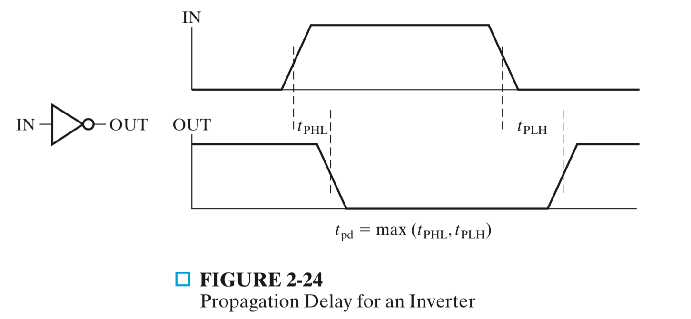

##### Delay Mode

Transport delay & Inertial delay (interval <= *rejection time*)

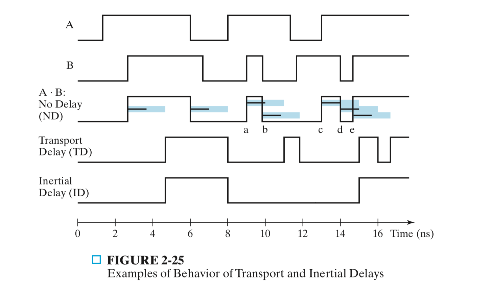

#### Primitive Logic Gate Circuit

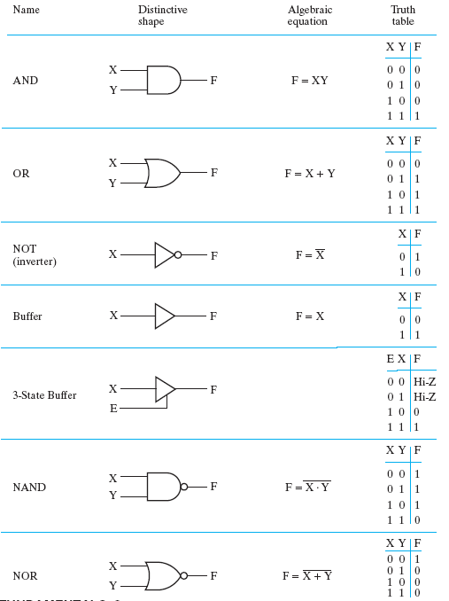 

##### NAND

$\overline {AB} = \overline A+\overline B$

##### NOR

$\overline {A+B} = \overline A\overline B$

---

#### Complex Logic Gate Circuit

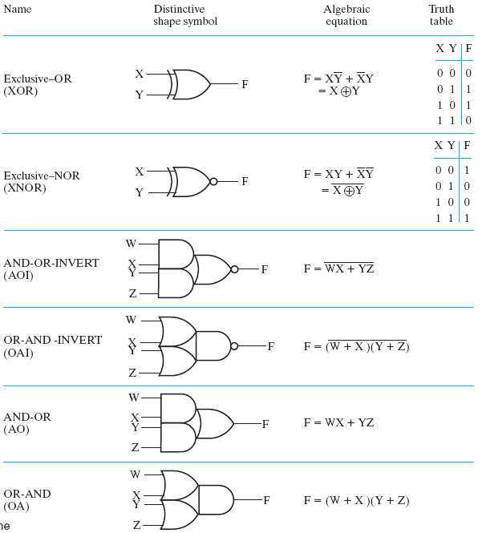 

##### AND-OR-INVERT

##### Exclusive OR (XOR)

$A \oplus B = A\overline B+\overline AB$

<u>also called half adder(没得进位的加法器)</u>

若有两个则为全加器

##### Exclusive NOR(XNOR/异或非/同或)

$A\odot B=\overline{A\oplus B} = AB+\overline A\overline B$

---

#### Hi-Impedance(Hi-Z)

add a third logic value

##### 3-state 

##### Ex. 3-state buffer

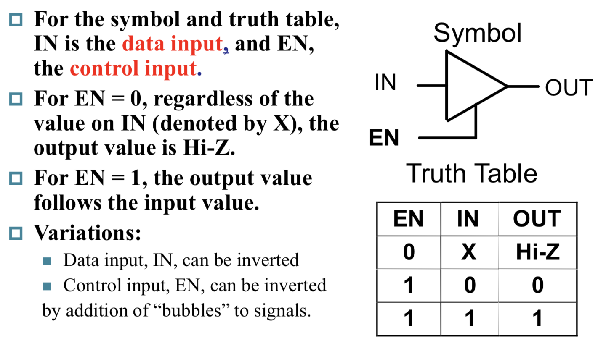

两个3-state buffer

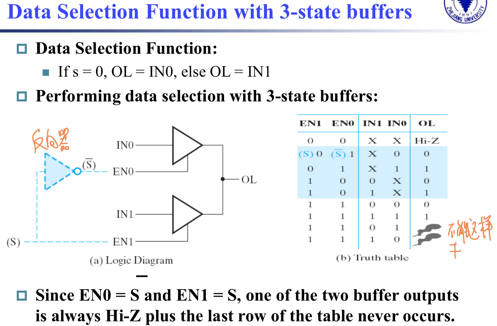

##### Ex. 3-state gate

Transmission gate(TG)

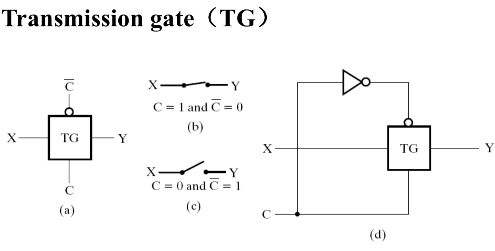

2个传输门实现XOR门

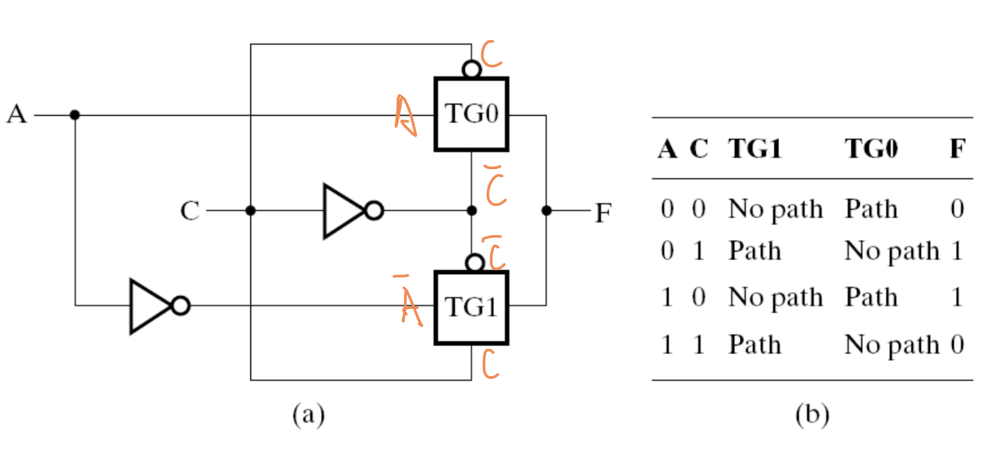

---

### Simplification

#### Condition(Requests)

##### AND-OR style

1. "AND-item" is least in expression; (与项最少)
2. 满足1的条件下，与项中变量最少

##### OR-AND style

要求同上

获得方法：

1. 直接算

2. 用对偶规则获得与或形式，化简后再DeM

   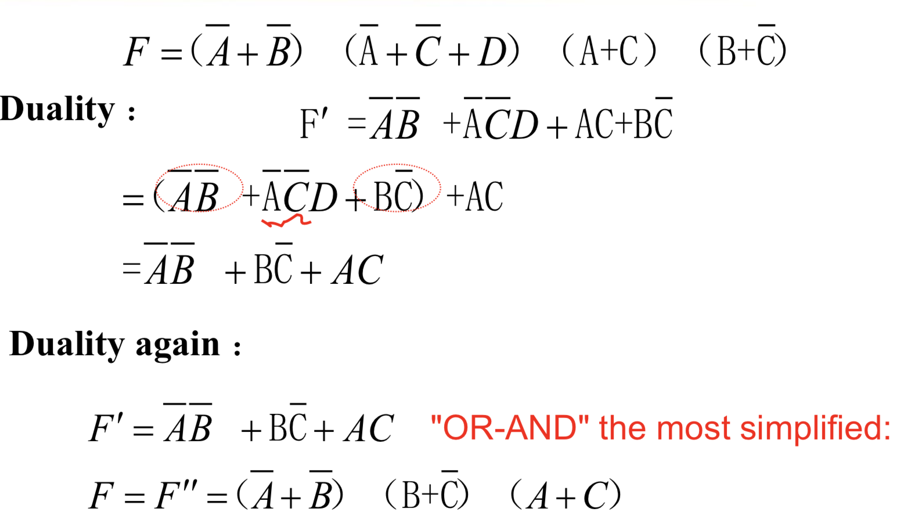

#### Canonical Forms

##### Miniterm

denots as m~i~

m~i~m~j~=0

###### ==Sum-of-Miniterms：找1term1==

##### Maxterm

denotes as M~i~

M~i~+M~j~=1

###### ==Product-of-Maxterms：找0term0==

##### Relationship

#### K-Map

|  00  |  01  |  11  |  10  |      |      |      |      |
| :--: | :--: | :--: | :--: | :--: | :--: | :--: | :--: |
| 000  | 001  | 011  | 010  | 110  | 111  | 101  | 100  |
##### Implicant

Dimensional Block constitute by the "AND-term" in the K-map (fill 1 grid rectangle)

##### Prime Implicant

质蕴涵项，简称为质项。

性质：

1. 质项都是由1个、2个、22个、23个……最小项合并而成的。
2. 质项都是蕴含项。

is a product term obtained by combining the maximum possible number of adjacent squares in the map into a rectangle with the number of squares a power of 2.

##### Essential Prime Implicant

it is the **only** prime implicant that covers (includes) one or more minterms

without in another prime implicant.

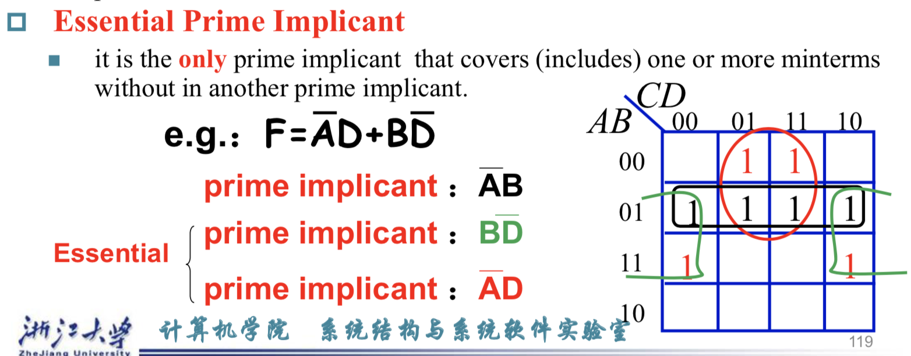

##### 两个K-Map的融合

##### K-MAP化简

找相邻的、翻转对称的

Miniterm：找1

Maxterm：找0取反

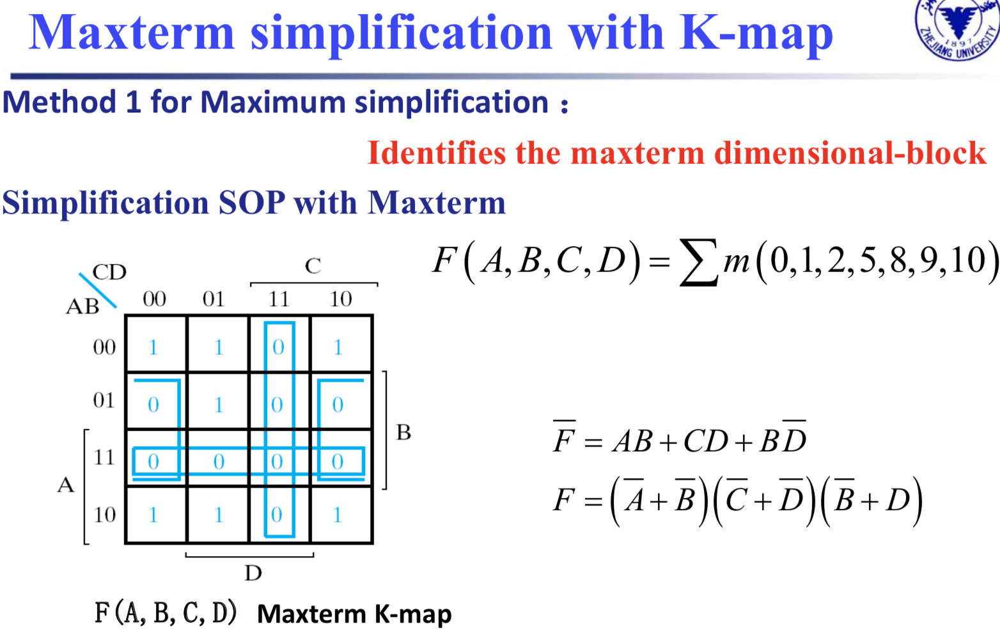

#### Implicant Table(蕴含表达式)

#### Don't-Care