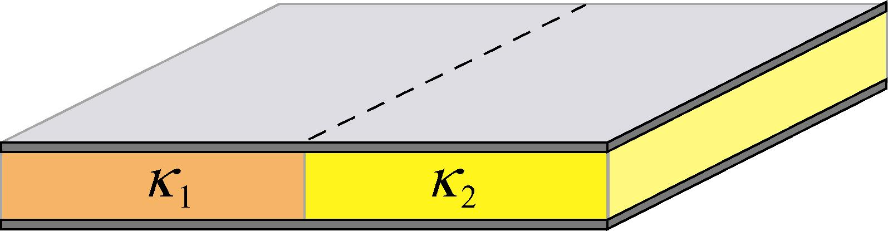
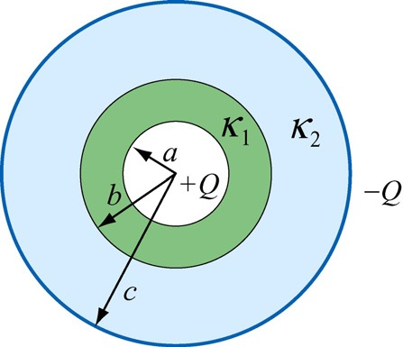

# 普物笔记

[TOC]

## Electric

### Ch22-2 Electric Field

**A Charged Electric Dipole**：The configuration of two equal and opposite charges ±*q* separated by a small distance *d*

#### Electric dipole moment $\vec p$ (电偶极矩)

The electric property of “electric dipole ” is described by the so-called electric dipole moment(电偶极矩): 

$\vec p=q\cdot \vec d\ (\vec d方向从-q到+q)$

#### Some conclusion

$$
1.\ 无限大带电平面：E=\frac{\sigma}{2\epsilon_0}\\
2.\ 无限长带电棒：E=\frac{\lambda}{2\pi\epsilon_0r}\\
3.\ 带电圆环：E=\frac{1}{4\pi\epsilon_0}\frac{\lambda(2\pi R)z}{(R^2+z^2)^\frac{3}{2}}\hat k=\frac{1}{4\pi\epsilon_0}\frac{qz}{(R^2+z^2)^\frac{3}{2}}\hat k\\
4.\ 带电圆盘：\frac{\sigma}{2\epsilon_0}(1-\frac{z}{\sqrt{z^2+R^2}})\hat k\\
当z\gg R，等效为点电荷，\frac{z}{\sqrt{z^2+R^2}}=[1+\frac{R^2}{z^2}]^{-\frac1 2}\approx 1-\frac 1 2\frac{R^2}{z^2}，代入得E=\frac{q}{4\pi \epsilon_0z^2}\hat k\\
当R\gg z，等效为无限面，E=\frac{\sigma}{2\epsilon_0}\hat k\\
5.\ 球、球壳均可等效为点电荷。
$$

### Ch23 Gauss's Law

*Electeic Flux* 电通量
$$
Gauss'Law:\Phi=\oint_S \vec E \cdot d\vec A=\frac{1}{ε0}\sum_{inside\ S}q_i
$$

无论导体是否有cavity，cavity里是否有charge，导体的电荷仅在表面(内/外)上有，导体内部无电荷。

### Ch24 Electric Potential

**混合积公式**：$ \vec a \cdot(\vec b \times \vec c)=\vec b \cdot(\vec c \times \vec a)=\vec c \cdot(\vec a \times \vec b) $

#### 梯度散度旋度

[如何直观形象的理解梯度，散度，旋度？ - 知乎](https://www.zhihu.com/question/24074028) ([第一个回答](https://www.zhihu.com/question/24074028/answer/26657334)较浅显，[第二个回答](https://www.zhihu.com/question/24074028/answer/31526009)较清晰)

[4.6: Gradient, Divergence, Curl, and Laplacian - Mathematics LibreTexts](https://math.libretexts.org/Bookshelves/Calculus/Book%3A_Vector_Calculus_(Corral)/4%3A_Line_and_Surface_Integrals/4.6%3A_Gradient%2C_Divergence%2C_Curl%2C_and_Laplacian)
$$
\nabla=\frac{d}{d\vec n}\hat{e_n}
=\frac{\partial}{\partial x}\hat i+\frac{\partial}{\partial y}\hat j+\frac{\partial}{\partial z}\hat k\\
$$

##### 梯度

$$
计算标量场中f的变化速率，包括该点变化率最大的大小及方向\\
标量\Longrightarrow向量\\
grad f=\nabla f
=\frac{\partial f}{\partial x}\hat i+\frac{\partial f}{\partial y}\hat j+\frac{\partial f}{\partial z}\hat k\\
$$

##### 散度

$$
计算向量场\\
向量\Longrightarrow标量\\
div f=\nabla\cdot f=\frac{\partial f}{\partial x}+\frac{\partial f}{\partial y}+\frac{\partial f}{\partial z}\\
\left \{ \begin{array}{}
	divf>0 & 该点有散发通量的正源(发散源/source)\\
	divf<0 & 该点有吸收通量的负源(洞或汇/sink)\\
	divf=0 & 该点无源\\
\end{array}\right.\\
(若是单位体积不包含该电荷，那么毫无疑问，有多少电场线进入就有多少电场线出，散度为0；\\
但若选取的单位体积内包含了一个正点电荷，则电场线只出不进，因而散度不为零)
$$

##### 旋度

[旋度 - 维基百科，自由的百科全书](https://zh.wikipedia.org/zh-hans/旋度)

$$
向量\Longrightarrow向量\\
curlf=\nabla\times f= 
\left[ \begin{array}{}
	\frac{\partial}{\partial x} \\
	\frac{\partial}{\partial y} \\
	\frac{\partial}{\partial z}
\end{array}\right]
\times
\left[ \begin{array}{}
	f_x\\f_y\\f_z
\end{array}\right]
=\left[ \begin{array}{} 
	\frac{\partial z}{\partial y}-\frac{\partial y}{\partial z}\\
	\frac{\partial x}{\partial z}-\frac{\partial z}{\partial x}\\
	\frac{\partial y}{\partial x}-\frac{\partial x}{\partial y}
\end{array}\right]\\
= (\frac{\partial z}{\partial y}-\frac{\partial y}{\partial z})\hat i+
	(\frac{\partial x}{\partial z}-\frac{\partial z}{\partial x})\hat j+
	(\frac{\partial y}{\partial x}-\frac{\partial x}{\partial y})\hat k\\
$$

##### Ex. 场

* 电场是有源无旋场
* 磁场是无源有旋场

#### 电势

$$
从点电荷出发，V_i(r_i)=\int_r^\infty\frac{q_i}{4\pi\epsilon_0{r_i}^2}dr=\frac{q_i}{4\pi\epsilon_0r_i}，因此V=\Sigma V_i(r_i)=\frac 1{4\pi\epsilon_0}\Sigma\frac{q_i}{r_i}；\\
从电场出发，V=\int_r^\infty \vec E\cdot d\vec l\\
$$

#### 电势差

$$
从功能角度：dW_{Electric\ Field\ on\ charge}=q_0\vec E\cdot d\vec l，W=\int_i^fq_0\vec E\cdot d\vec l，\\
又\because W=-\Delta U=-q\Delta V=-q(V_f -V_i)，\therefore \Delta V=-\int_i^f\vec E\cdot d\vec l\\
从电场：\Delta V=(\int_f^\infty-\int_i^\infty)(\vec E\cdot d\vec l)=-\int_i^f\vec E\cdot d\vec l
$$

#### 电势与电压

$$
E_\vec l=-\frac{\partial V}{\partial\vec l}=-\nabla V
$$

#### ==自能与互能==

$$
U_互=\frac1 2\Sigma q_i V_{其他q在q_i处}=\frac1 2\int_? Vdq\\
U_自=\int_0^QV_{体系中已有的电荷在dq处}dq
$$

[自能与互能(百度百科)](https://baike.baidu.com/item/静电能)

[静电势能中的自能和互能有什么区别？还有就是电势能和静电势能的区别？ - FUTURETECH6的回答 - 知乎](https://www.zhihu.com/question/303819123/answer/843921203)

> 所谓“自能”就是将一个带电体看成无穷个带电微元，将这些无穷多个带电体微元从无限分散状态聚集成该带电体，外力所做功的大小。所谓“互能”则是将带电体系统中，各带电体从现在位置彼此分开至无穷远时，它们之间的静电力所做的功。
>
> 静电能包括自能和互能。点电荷的自能是无穷大，一般在静电学问题中都不考虑点电荷的自能。

互能算两次有1/2 自能无1/2

### Ch25 Conductors

#### 等势体

##### Ex.

$$
两个相距无限远的导电圆球，总电量为Q，用导线将两者表面相连，求电荷分布\\
\frac{q_1}{4\pi\epsilon_0R_1}=\frac{q_2}{4\pi\epsilon_0R_2}\\
\Longrightarrow \frac {q_1} {q_2}= \frac {R_1} {R_2}
$$

### Ch26-1 Capacitance

#### 计算方式

$$
设电量为q，利用\Delta V=V_+-V_-=\int_+^-(-\nabla V)\cdot d\vec l=\int_+^-\vec E\cdot d\vec l\\
可以获得\Delta V=(...)\cdot q
$$

#### Conclusion

$$
--Parallel-plate\ Capacitor--\\
E=\frac \sigma {\epsilon_0}(G's\ Law)\\
C=\frac{\epsilon_0A}d\\
--Cylindrical\ Capacitor--\\
C=2\pi\epsilon_0\frac L{ln(R)-ln(r)}\\
--Spherical\ Capacitor--\\
C=\frac{4\pi\epsilon_0}{\frac1r-\frac1R}
=4\pi\epsilon_0(\frac{Rr}{R-r})
$$

**单个平行板电容器，仅在向对面有电荷，外面不带电荷**

#### 串并联

$$
Series\ Connection,串联，q相同，\frac 1 C = \Sigma \frac 1 C_i；\\
Parallel\ Connection,并联，V相同，C = \Sigma C_i
$$

##### 应用

将导体插入平行板中，$C'=\frac{\epsilon_0A}{d-t}$(视作串联即可)

#### 能量

##### 能量计算

$$
微分中，\left|\Delta V'\right|=\frac {q'}c，dU=dq'\left|\Delta V'\right|=\frac{q'dq'}C\\
若全程，则U=\int_0^UdU=\int_0^q\frac{q'}Cdq'=\frac{q^2}{2C}\\
=\frac{q\Delta V}2\\
(q'和\Delta V'都表示过程量)
$$

##### 能量密度

$$
(只针对平行板电容器)(似乎)\\
U=\frac{q^2}{2C}=\frac{q^2d}{2\epsilon_0A}=\frac{\epsilon_0}2(\frac q{\epsilon_0A})^2(Ad)=\frac{\epsilon_0}2E^2\Omega\\
u=\frac U \Omega=\frac{\epsilon_0E^2}2\\
$$

---

### Ch26-2 Dielectrics

$$
--Q\ is\ constant--\\
\because C=\kappa_eC_0\\
\therefore\Delta V=\frac Q C=\frac Q{\kappa_eC_0}=\frac {\Delta V_0}{\kappa_e}\\
\therefore E = \frac{\Delta V} d = \frac{E_0} {\kappa_e}\\
----\\
另外有，\\
\because \frac {(Q_0 - Q')}{\epsilon_0A} = E = \frac {E_0}{\kappa_e} = \frac {Q_0} {\kappa_e \epsilon_0 A}\\
\therefore Q_0 = \kappa_e (Q_0 - Q') \longrightarrow Q' = (1-\frac 1 {\epsilon_e})Q_0
$$

#### 分子角度解释

取向极化(Alignment polarization)与位移极化(Displacement polarization)

> 取向不能完全与电场线平行的原因：Because the molecules are continuously jostling each other as a result of their random thermal motion, this alignment is not complete

#### Polarization (极化强度矢量P(大写))

$$
\vec P = \frac{\Sigma\vec {p_i}}{\Delta V}\\
此处\Delta V表示体积\\
dQ'=qdN=qndV=qnlcos\theta dA=PdAcos\theta=\vec P\cdot d\vec A\\
\therefore \sigma' = \frac {dQ'}{dA}=Pcos\theta =\vec P \cdot \vec n = P_{\vec n}\\
(\oiint_{(s)}\vec P \cdot d \vec A = - \Sigma_{(ins)}q'_i)
$$

#### Depolarization field E’ (退极化场)

$$
\vec E = \vec {E_0} + \vec {E'}
$$

#### Polarization law of dielectrics (电介质的极化规律)

$$
\vec P \Longrightarrow \sigma' \Longrightarrow \vec E' \Longrightarrow \vec E\\
$$

#### $\chi_e$: Polarization coefficient (极化率)

for general isotropic(各向同性) materials 
$$
\vec P = \chi_e \epsilon_0 \vec E\\
其中，\kappa_e = \chi_e + 1
$$

#### Electric displacement vector $\vec D$ (电位移矢量)

$$
In\ Dielectric,\ \vec E \neq 0\\
\vec {E_0} \longrightarrow \vec P \longrightarrow \sigma_e' \longrightarrow \vec{E'} \longrightarrow \vec E = \vec {E_0} + \vec {E'}\\
Proof:\\
在某电介质中，有带电+Q_0的球\\
\oiint \vec P \cdot d \vec A = - \Sigma_{ins} q'？？？
(\sigma' = P)\\
\therefore \epsilon_0 \oiint \vec E \cdot d \vec A
= \Sigma_{ins} (q_0 + q')
= \Sigma_{ins}q_0 - \oiint \vec P \cdot d \vec A\\
\therefore \oiint (\epsilon_0 \vec E + \vec P) \cdot d \vec A
= \Sigma_{ins}q_0\\
\vec D \overset {\triangle} {=} \epsilon_0 \vec E + \vec P\\
\therefore \oiint \vec D \cdot d \vec A
= \Sigma_{i}q_0\\
*-Also,\ \vec D = \epsilon_0 \vec E + \vec P\\
= \epsilon_0 \vec E + \chi_e \epsilon_0 \vec E\\
= (1+\chi_e)\epsilon_0 \vec E\\
= \kappa_e \epsilon_0 \vec E
$$

证明用图：

#### 多种介电质(Dielectrics)

##### PP

$$
同并联，C=\frac {\epsilon_0A}{d}(\kappa_1+\kappa_2)
$$

若上下两种电介质

$$
C_i = \frac{\kappa _i \epsilon_0 A}{d_i}\\
$$

##### 复杂一点：Sepherical

$$
\because C=4\pi\epsilon_e(\frac{Rr}{R-r})\\
\frac1C=\frac1{4\pi\epsilon_0\kappa_1(\frac{ba}{b-a})}
+\frac1{4\pi\epsilon_0\kappa_1(\frac{ba}{b-a})}\\
\Longrightarrow C=\frac{4\pi\epsilon_0\kappa_1\kappa_2 abc}{\kappa_1a(c-b)+\kappa_2c(b-a)}
$$

### Ch27 Ohm's Law

Electric Density (电流密度)
$$
j = \frac {di}{dS_{\bot}} = \frac {dq}{dtdS_\bot} 
$$
Drift Velocity $v_d$ (漂移速度)

载流子移动速度
$$
i = -e \cdot n \cdot (Av_d)\\
j = \frac i A = -nev_d
$$
