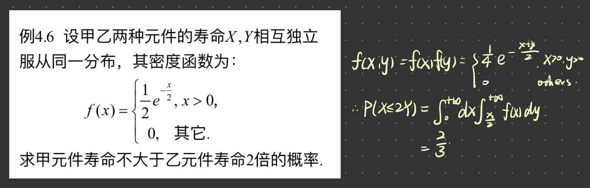

<center><font size = '7'><strong>概率论与数理统计</strong></font></center><br />
<div align = "right">Powered by CXY</div><br />
<center><i><font size = '5'>Table of Contents</font></i></center><br/>
[toc]

# Ch0 README

```markdown
1. In these chapters all f_X means the density function of X rather then the partial derivative of f(x) (MENTION THE DIFF BETWEEN UPPER AND LOWER char)


```

# Ch1 频率与概率 独立性

## 基本

### 相容与互斥

$相容：A \cap B \neq \varnothing \\ 互斥：A \cap B = \varnothing$

### 独立

Def: P(AB) = P(A)P(B)
即P(B|A) = P(B) 或 P(A|B) = P(A) (P(A)·P(B)≠0)

**相互独立**

$P(A_{i_1}A_{i_2}...A_{i_n}) = \prod_{i=1}^n P(A_{i_i})\\相互独立 \Rightarrow 两两独立\\相互独立 \nLeftarrow 两两独立$

## 全概率 & Bayes

**划分**

$B_iB_j = \varnothing, \forall i \neq j \\ \bigcup _{i=1}^{n}B_i = S$

**全概率公式**

$P(A) = \sum_{i=1}^{n}P(B_i)P(A|B_i)$

**Bayes公式**

$P(B_k|A) = \frac{P(B_kA)}{P(A)} = \frac {P(B_k)P(A|B_k)} {\sum_{i=1}^n P(B_i)P(A|B_i)}\\(其中B_1, B_2, ..., B_n为S的一个划分)$

# Ch2 随机变量

## 离散型(伯努利、泊松、超几何、几何、巴斯卡)

**二项分布**

**泊松(Poisson)分布**

* $P(X = k) = {\frac {e ^ {-\lambda}\lambda ^ k} {k!}}$
* nota: $X\sim P(\lambda)$
* ==近似表示二项分布：二项分布中n足够大(n>10)，p充分小(p\<0.1)，则可用P(λ=np)表示B(n,p)==
* $E(X) = Var(X) = \lambda$

**超几何分布**

**几何分布**

* $P(X=k) = {p(1-p)^{k-1}}$
* 表示查到一次 次品 时的检查次数X的分布

**巴斯卡分布**

* nota: $X \sim bsk(r,p)$(双参)
* $P(X = k) = C_{k-1}^{r-1} p^r (1-p)^{k-r},k = r, r+1, ...;r \in Z^+; 0<p<1$
* 表示实验进行到出现r次成功时的实验次数X(第X次时摸到第r个红球)的分布

## 连续型(均匀、正态、指数)

**UD**

* nota: $X \sim U(a,b)$
* $Var(X) = {\frac{(b-a)^2}{12}}$

**ND**

* nota: $X \sim N(\mu, \sigma^2)$
* $f(x) = \frac 1 {\sqrt{2\pi}\sigma} e^{-\frac{(x-\mu)^2}{2\sigma^2}}$
* 正态分布概率计算
  * $P(X \leqslant b) = \Phi(\frac {b-\mu} \sigma) \\ \Phi(x) = 1 - \Phi (-x)$

**exp D**

* $nota:X \sim E(\lambda)$
* $f(x) =  \left \{ \begin{array}{cc} \lambda e^{-\lambda x} & ,x > 0\\ 0 & ,x \leqslant 0\\ \end{array}\right.$
* $F(x) =  \left \{ \begin{array}{cc} 1 - e^{-\lambda x} & ,x > 0\\ 0 & ,x \leqslant 0\\ \end{array}\right.$
* $无记忆性: P(X > t_0 + t | X > t_0) = P (X > t)$
* $E(X) = \frac1\lambda, Var(X) = {\frac1{\lambda^2}}$

## 随机变量函数、分布函数的换元

已知：$Y = g(X), f_X(x)$，

则有${\begin{cases}F_Y(y) = P (Y \leqslant y) = P (g(x) \leqslant y)\\f_Y(y) = {\frac{dF_Y}{dy}}\end{cases}}$

**Ex**. 

$g(X) = |X| \Rightarrow P (|X| \leqslant y) = F_X(y) - F_X(-y) \\ \Rightarrow f_Y(y) = f_X(y) + f_X(-y)$

**定理**

已知y=g(x) 为严格单调可微函数，值域为D，

则f~Y~(y) = 
$\left \{ \begin{array}{cc} f_X(h(y))|h'(y)| & ,y \in D \\ 0 & ,y \notin D\\\end{array}\right.$

，其中x = h(y)为y = g(x)反函数

**推论1**

连续型X的分布函数为F(x), 记 Y = F(X)，则 Y~U(0,1)?

需用：$[F^{-1}(y)]' = \frac{1}{F'(x)}{}$

# Ch3 多元随机变量

## 离散

**联合**

$P(x_1 < X \leqslant x_2, y_1 < Y \leqslant y_2) = F(x_2, y_2) - F(x_1, y_2) - F(x_2, y_1) + F(x_1, y_1)$

**边际**

$P\{ X = x_i \} = \sum_{j=1}^{+\infty}p_{ij} \triangleq {p_{i\cdot}}$

**条件**

$P\{ X=x_i|Y=y_j\} = \frac{P\{ X=x_i,Y=y_j\}}{P\{ Y=y_i\}} =\frac{p_{ij}}{p_{\cdot j}} \\ F_{Y|X}(y|x) = P(Y \leqslant y | X = x )$

若分母概率为零但极限不为0，则用极限，此即得出连续随机变量的情况

## 连续

**联合**

$f(x,y) = \frac{\partial^2 F(x,y)}{\partial x \partial y}\\P\{(x,y) \in D\} = {\mathop\iint_D f(x,y)dxdy}$

**边际**

$F_X = P\{ X \leqslant x, Y< +\infty\} = F(x,+\infty)$

${\begin{cases}f_X(x) = \int_{-\infty}^{+\infty}f(x,v)dv \\ f_Y(y) = \int_{-\infty}^{+\infty}f(u,y)du \\ \end{cases}}$

**条件**

**Def**: 

$\displaystyle F_{Y|X}(y|x) = \lim_{\delta \rightarrow0^+}P\{ Y\leqslant y | x<X\leqslant x+\delta\} = ... =\int_{-\infty}^y \frac{f(x,v)}{f_X(x)}dv \\ \Longrightarrow f_{X|Y}(x|y) = \frac{f(x,y)}{f_Y(y)}, f_Y(y) \neq 0$

$f(x,y) = f_{X|Y}(x|y)f_Y(y) = f_{Y|X}(y|x)f_X(x)$

$\displaystyle P\{Y \in D_y | X = x\} = \int_{D_y} f_{Y|X}(v|x) dv = \int_{D_y} \frac {f(x,v)} {f_X(x)}dv =\frac {\int_{D_y} f(x,v)dv} {f_X(x)}\\若 {D_y} = (a,b), 则为\int_a^b f_{Y|X}(v|x) dv$

**Ex**. 见ljy的笔记的Page10

## 分布模型

### 二元均匀分布

$$

$$

### 二元正态分布

* $(X,Y) \sim N(\mu_1,\mu_2,\sigma_1^2,\sigma_2^2,\rho)$
* $\displaystyle f(x,y)=\frac{1}{2\pi \sigma_X\sigma_Y\sqrt{1-\rho^2}}\exp\left(-\frac{1}{1-\rho^2}\left[\frac{(x-\mu_X)^2}{\sigma_X}+\frac{(y-\mu_Y)^2}{\sigma_Y}-\frac{2\rho(x-\mu_X)(y-\mu_Y)}{\sigma_X\sigma_Y} \right]\right)$
* $X \sim N(\mu_1,\sigma_1^2),Y \sim N(\mu_2,\sigma_2^2)$,即(X,Y)边际分布为一元正态分布

## 独立性

### 成立条件

**充要条件**

Def:

$P\{ X \in D_1, Y \in D_2\} = P\{X \in D_1\} \cdot P\{Y \in D_2\} \\ \Rightarrow F(x,y) = F_X(x) \cdot F_Y(y)$

<u>特别的</u>，

${\begin{cases}	对离散型，有P\{ X=x_i, Y=y_i\} = P\{ X=x_i\}P\{ Y=y_i\}\\	对连续型，有f(x,y) = f_X(x) \cdot f_Y(y)\end{cases}}$

**定理**：除面积为0的区域外，f(x,y)可表示为m(x)·n(y)

**充分条件**

**必要条件**

相关系数ρ = 0，特别的，对于二元正态分布，ρ=0 为充要条件

### Ex. 利用独立性可解的不一定要构造随机变量函数



### 不独立判据

==取两个特殊x~0~与y~0~使得$P(X=x_0, Y=y_0)\neq P(X=x_0)P(Y=y_0)$==

## 随机变量函数(换元)

### Z=X+Y

**离散型**

$\displaystyle P\{ Z = z_k\} = P\{X+Y=z_k\} = \sum_{i=1}^{+\infty} P\{ X=x_i,Y=z_k-x_i \} = \\ \displaystyle {\sum_{i=1}^{+\infty} P\{ X=z_k-y_i,Y=y_i \}}$

| $x_i$ | $y_i$ | $z_i$ | $x_i$ | $z_k-x_i$ |
| :---: | :---: | :---: | :---: | :-------: |
|   1   |   4   |   7   |   1   |     6     |
|   2   |   5   |       |   2   |     5     |
|   3   |   6   |       |   3   |     4     |
|   4   |   7   |       |   4   |    N/A    |
|   5   |   8   |       |   5   |    N/A    |
|   6   |   9   |       |   6   |    N/A    |


**连续型**

$$
F_Z(z) = P(Z \leqslant z) = P(X+Y \leqslant z)
= {\mathop{\iint}_{x+y\leqslant z}} f(x,y)dxdy
= \int_{-\infty}^{+\infty}dx\int_{-\infty}^{z-x}f(x,y)dy
$$

作积分变换

$\left \{ \begin{array}{l}	u = x\\	v = x + y\end{array} \right.$，在这样的变换下dxdy = dudv

**Proof**:

$$
dudv = \frac{J_{uv}}{J_{xy}}dxdy = 
\left[ \begin{array}{cc}
	\frac{\partial u}{\partial x} & \frac{\partial u}{\partial y}\\
	\frac{\partial v}{\partial x} & \frac{\partial u}{\partial y}
\end{array} \right] dxdy =
\left [ \begin{array}{cc}
	1 & 0\\
	1 & 1
\end{array} \right]
dxdy = dxdy

\\
可得F_z(z) = \int_{-\infty}^z dv \int_{-\infty}^{+\infty}f(u,v-u)du
\\
\therefore f_z(z) = \frac{d\int_{-\infty}^z dv \int_{-\infty}^{+\infty}f(u,v-u)du}{dz} = \int_{-\infty}^{+\infty}f(u,z-u)du
$$

#### ==求密度函数f_(X+Y)的三种算法==

$$
\begin{cases}
	f_Z(z) = \int_{-\infty}^{+\infty} f(x,z-x)dx\\
	f_Z(z) = \int_{-\infty}^{+\infty}f_X(x)f_Y(z-x)dx(仅X与Y独立时成立)\\
	f_Z(z) = \frac{dF_Z}{dz}\\
\end{cases}
$$

#### 分布模型

1. $X \sim P(\lambda_1),Y \sim P(\lambda_1) \longrightarrow X+Y \sim P(\lambda_1+\lambda_2)$
2. $X \sim B(n_1, p), Y\sim B(n_2, p) \longrightarrow X+Y \sim B(n_1 + n_2, p)$
3. $X,Y \sim N(0,1) \longrightarrow X+Y \sim N(0,2)\\\Longrightarrow X \sim N(\mu_1, \sigma_1^2),Y \sim N(\mu_2, \sigma_2^2) \\ \longrightarrow aX+bY+c \sim N(a\mu_1+b\mu_2+c, a^2\sigma_1^2+b^2\sigma_2^2)$


### Z=min/max{X,Y}

$$
\begin{cases}
F_{max}(z) = P(X \leqslant z, Y \leqslant z) \xlongequal{X,Y独立} F_X(z)F_Y(z)
\\
F_{min}(z) = 1 - P(X > z, Y > z) \xlongequal{X,Y独立} 1- (1-F_X(z)) \cdot (1-F_Y(z))
\end{cases}
$$

课本那题好像就是min{max{s1,s2},s3}

推广到n个相互独立的随机变量，分布函数为F~i~(t)

$$
\begin{cases}
F_{max}(t) = \prod_{i=1}^n F_i(t)\\
F_{min}(t) = 1 - \prod_{i=1}^n [1-F_i(t)]
\end{cases}
$$

# Ch4 随机变量的数字特征

## 期望

### 定义

$$
E(X) = \sum_{i=i_0}^{+\infty}x_ip_i\\
E(X) = \int_{-\infty}^{+\infty} xf(x)dx
$$

**存在条件**

==$\displaystyle\sum x_ip_i$绝对收敛(即$\displaystyle\lim_{n\rightarrow +\infty}\sum|x_i|p_i$存在)==

### 特殊模型

* **泊松分布**
  $$
  E(X) = \sum_{k=0}^{+\infty}k \frac{e^{-\lambda}\lambda^k}{k!}
  = 0 + \lambda e^{-\lambda} \sum_{k'=1}^{+\infty}\frac{\lambda^{(k'-1)}}{(k'-1)!}
  = \lambda e^{-\lambda} \cdot e^\lambda = \lambda
  $$

* **指数分布**
  $$
  E(X) = \int_{0}^{+\infty} x \cdot (\lambda e^{-\lambda x})dx
  \xlongequal{分部求导} -(xe^{-\lambda x})|_{x=0}^{+\infty} + \int_{0}^{+\infty}e^{-\lambda x}dx
  = \frac 1 \lambda
  $$

* **标准N**

  $E(X) = 0$

### 随机变量函数

$$
Y= g(X), 且 \sum/\int |g(x)|f(x) 存在（绝对收敛） \Longrightarrow E(Y) = \int_{-\infty}^{+\infty} g(x)f(x)dx
\\
h(X,Y)，若\int h(x,y)dxdy绝对收敛 \Longrightarrow E(h(X,Y))
= \iint h(x,y)f(x,y)dxdy
\\
如E(XY) = \int_{-\infty}^{+\infty} \int_{-\infty}^{+\infty} (xy)f(x,y)dydx
$$

**性质**

**线性组合**

$\displaystyle E(c_0 + \sum_{i=1}^n c_iX_i) = c_0 + \sum_{i=1}^nE(X_i)$

**独立性**

$X,Y独立 \Longrightarrow E(XY) = E(X)E(Y)$

<u>* 此结论为必要不充分条件</u>

### EG. 电梯载人与互赠礼物(期望)

**Ex1**.**不运用分布律求解期望**(一般<u>利用独立性</u>)

1. 电梯载12人，10层楼全下完，求停留次数X期望
   $设X_i = \left \{ \begin{array}{l} 1,i层有人下\\ 0,i层无人下\\ \end{array} \right. \\ 则X = \sum X_i \\ \forall i \in [1,10], E(X_i) = P(X_i = 1) = 1 - 0.9^{12} \\ E(X) = 10E(X_i) =$
   
2. n人互赠礼物，求拿到自己礼物人数期望
   $E(X) = n \times \frac1n = 1$

## 方差

### 定义

nota: $Var(X), D(X), V(X),\sigma^2(X)$

Def: $D(X) = E\{[X-E(X)]^2\}.$

**导出定理**

$D(X) = E(X^2) - E^2(X)$

### 性质

**方差特性**

$Var(aX) = a^2 Var(X)$

$Var(X) = 0 \Longleftrightarrow P(X=const) = 1, const = E(X)$

$Var(XY) = E(X^2Y^2) - E^2(XY) \xlongequal{独立} E(X^2)E(Y^2) -E^2(X)E^2(Y)$

**线性组合**

==$Var(X+Y) = Var(X)+Var(Y) +2Cov(X,Y)$==

**独立性**

$Var(XY) = E(X^2Y^2) - E^2(XY) \xlongequal{独立} E(X^2)E(Y^2) -E^2(X)E^2(Y)$

==$独立(其实不相关即可)\Longrightarrow Cov(X,Y) = 0 \Longrightarrow Var(aX+bY+c) = a^2Var(X) + b^2Var(Y)$==

Proof(没什么好证的)：

$E\{[X-E(X)][Y-E(Y)]\}
\xlongequal{独立} E(X-E(X)) \times E(Y-E(Y))\\= (E(X)-E(X)) \times (E(Y)-E(Y))= 0$


### 模型

* **0-1分布**

  $Var(X) = p(1-p)$

* **泊松分布**

  $Var(X) = \lambda$

* **均匀分布**

  $Var(X) = \frac{(b-a)^2}{12}.$

* **指数分布**
  
  $Var(X) = \frac{1}{\lambda^2}.$
  
* **二项分布**
  
  **暴力算法**
  
  ${\displaystyle X \sim B(n,p)	\\	\displaystyle E(X) = \sum_{k=1}^n k(\frac{n!}{k!(n-k)!})p^k(1-p)^{n-k}	\\	\displaystyle = np \sum_{k=1}^n (\frac{(n-1)!}{(k-1)!(n-k)!})p^{k-1}(1-p)^{n-k}	\\	\displaystyle = np \sum_{k=1}^n C_{n-1}^{k-1}p^{k-1}(1-p)^{(n-1)-(k-1)}\\= np}$
  
  **利用独立性和两点分布结论与方差**
  
  * $X \sim B(n,p),X_i \sim B(p),X = \sum X_i$
  * $E(X) = E(\sum X_i) = \sum E(X_i) = np$
  * $Var(X) = Var(\sum X_i) = \sum Var(X_i) = np(1-p)$
  
* **正态分布**

  * E(X) = μ
  * Var(X) = σ^2^

  **标准正态分布**

  * E(X) = 0
  * Var(X) = 1

**Ex**.

X~P($\lambda$)，求E(X(X-1)(X-2))

$\displaystyle E(X(X-1)(X-2)) = \sum_{k=0}^\infty k(k-1)(k-2)\frac{\lambda^k e^{-\lambda}}{k!} = 3 \times 0 + \sum_{k=3}^\infty \frac{\lambda^k e^{-\lambda}}{(k-3)!} = \lambda^3$


**正态分布性质**

$X-Y \sim N(\mu_1-\mu_2, \sigma_1^2 + \sigma_2^2)$

标准化变量：$X^* = \frac{X - \mu}{\sigma}.$

### ==EG. 互赠礼物(方差)==

1. 还是互赠礼物的那题，求X方差
   
   $\displaystyle Var(X_i) = \frac1n(1-\frac1n) \\ \displaystyle E(X_iX_j) = P(ij同时拿到) = \frac1{n(n-1)} \\ \displaystyle Cov(X_i,X_j) = E(X_iX_j)-E(X_i)E(E_j) = \frac1{n(n-1)} - \frac1{n^2} = \frac1{n^2(n-1)} \\ \displaystyle Var(X) = \sum_{i=1}^{n} Var(X_i) + 2\sum_{1 \leqslant i < j \leqslant n} Cov(X_i,X_j) \\ \displaystyle = n \times \frac1n(1-\frac1n) + 2 \times \frac{n(n-1)}2 \times \frac1{n^2(n-1)} = 1$


## 协方差

### 定义

> $Cov(X,Y) \triangleq E[(X-E(X))(Y-E(Y))]$

**计算公式**

* $\displaystyle Cov(X,Y) = E(XY) -E(X)E(Y)$
* ${\displaystyle Cov(X,Y) = \sum_{i=1}^{+\infty}\sum_{j=1}^{+\infty}(x_i-E(X))(y_j-E(Y))p_{ij}}$
* $\displaystyle Cov(X,Y) = \int_{-\infty}^{+\infty}\int_{-\infty}^{+\infty}(x-E(X))(y-E(Y))f(x,y)dxdy$

### 性质

**线性性质**(由期望的性质可以很容易得出)

* $Cov(aX,bY) = ab \cdot Cov(X,Y)$
* $Cov(X_1+X_2,Y) = Cov(X_1,Y) +Cov(X_2,Y)$

**特殊**

* $Cov(X,X) = Var(X)$
* $Var(X)Var(Y) \neq 0时，Cov^2(X,Y) \leqslant Var(X)Var(Y)$，当且仅当X与Y有严格线性关系时取等，显然此时相关系数为$\pm 1$

**Ex**.

1. $\displaystyle Cov(aX+bY,cX+dY) = acVar(X) + bdVar(Y) + (ad+bc)Cov(X,Y)$
2. $\displaystyle Var(aX+bY+c) = a^2Var(X) + b^2Var(Y) + 2abCov(X,Y)$
3. $\displaystyle Var(\sum_{i=1}^n X_i) = \sum_{i=1}^n Var(X_i) + 2 \sum_{1 \leqslant i<j \leqslant n} Cov(X_i,Y_j)$

## 相关系数ρ

### 定义

> $\rho_{XY} = \frac{Cov(X,Y)}{\sqrt{Var(X)Var(Y)}}	\\	= Cov(\frac{X-E(X)}{\sqrt{Var(X)}},\frac{Y-E(Y)}{\sqrt{Var(Y)}})$

### 性质

* $|\rho| \leqslant 1$
* $|\rho| = 1 \Longleftrightarrow X,Y间存在严格线性关系(\exist const\ a,b, s.t.P(Y = a + bX) = 1), \\ 特别的,\left\{\begin{array}{lc}	\rho = 1 & , b>0 \\ \rho = -1 & , b<0	\end{array}\right.$

### 不相关

**定义：满足一下三条任一（均为充要条件）**

1. Cox(X, Y) = 0​
2. E(XY) = E(X)·E(Y)
3. Var(X + Y) = Var(X) + Var(Y)

*注：这三个是等价互推的*

特别的，对于二元正态分布N(μ~1~, μ~2~, σ~1~^2^, σ~2~^2^, ρ)，不相关与独立等价

> 随机变量X满足$f(X) = \frac{e^{-|x|}}2,-\infty<x<+\infty$，则如何说明X与|X|是不独立的
>
> > 取特殊值，±1应该即可

### 均方差 e

> e(a,b) = E([Y-(a+bX)]^2^)，用于表示用aX+b近似表示Y的好坏程度。e(a,b)越小，X与Y线性相关度越高

求最佳近似式Y=a~0~X+b~0~：

$a_0 = E(Y)-b_0E(X)  \\  b_0 = \frac{Cov(X,Y)}{Var(X)} .$

此时有$e(a_0,b_0) = (1-\rho_{XY}^2)Var(Y)$

## 其他数字特征

### 矩

* E(X^k^)，k阶(原点)矩
* E\{\[X-E(X)^k^]}，k阶中心矩
* E\{X^k^Y^l^}，k阶混合(原点)矩
* E\{\[X-E(X)^k^]\[Y-E(Y)^l^]\}，k阶混合中心矩

### 上α分位数x~α~

P(X>z~α~) = α

z~0.5~称为中位数

标准正态分布的记为z~α~

## 多元

### 随机向量的数学期望

$若 \vec X = (X_1, X_2, ... ,X_n)^T，则E(\vec X) = (E(X_1), E(X_2), ... ,E(X_n))^T$

### 协方差矩阵

$$
Cov[(X_1, X_2, ... ,X_n)^T]= 
\left ( \begin{array} {cccc}
    Var(X_1) & Cov(X_1,X_2) & ... & Cov(X_1,X_n)
    \\
    Cov(X_2,X_1) & Var(X_2) & ... & Cov(X_2,X_n)
    \\
    ...
    \\
    Cov(X_n,X_1) & Cov(X_n,X_2) & ... & Var(X_n)
\end{array} \right )
$$

是个对称的半正定矩阵(非负定)

可以获得n元正态变量的概率密度

设协方差矩阵为C，行列式为|C|，伴随矩阵为C^*^，则$C^{-1} = \frac{C^*}{|C|} = \frac{1}{\sigma_1^2\sigma_2^2(1-\rho^2)}\left ( \begin{array} {cc} \sigma_2^2 & -\rho\sigma_1\sigma_2 \\ -\rho\sigma_1\sigma_2 & \sigma_1^2  \end{array} \right ) \\ = \frac{1}{1-\rho^2}\left ( \begin{array} {cc} \frac{1}{\sigma_1^2} & -\frac\rho{\sigma_1\sigma_2} \\ -\frac\rho{\sigma_1\sigma_2} & \frac1{\sigma_2^2}  \end{array} \right )$

后续略

### n元正态分布的四条性质

1. n元正态分布任意k元子向量服从k元正态分布
   * 特别的，若每个元素服从一元正态分布$\Longleftrightarrow$X服从n元正态分布
2. 任意线性组合服从正态分布
3. 任意线性变换也服从正态分布，此性质也称为正态变量的线性变换不变形
4. 随机变量向量的分量(一维)相互独立 $\Leftrightarrow$ 分量(一维)两两不相关 $\Leftrightarrow$ 协方差为对角矩阵(除了主对角线其他皆为0的矩阵)

# Ch5 某不等式 大数定理 中心极限定理

## 依概率收敛

依概率收敛的定义与分析中的收敛定义不同

对于随机变量序列X~1~,X~2~,...，若$\exist c$， 使得$\displaystyle \forall \varepsilon > 0, \lim_{n\rightarrow +\infty}P\{|X_n - c| \geqslant 0 \} = 0$，则称{T~n~, n>=1}依概率收敛于c

### 性质

~~类似于数列收敛~~

若$X_n \xrightarrow{P} a, Y_n \xrightarrow{P} b$，g在(a,b)连续，则有$g(X_n,Y_n) \xrightarrow{P} g(a,b)$

特殊的(取Y~n~为constant)，若$X_n \xrightarrow{P} a$，f在a连续，则$f(X_n) \xrightarrow{P} f(a)$

。。。

## 两个不等式

### 马尔科夫不等式

设随机变量Y的k阶矩存在(k⩾1)，则$\forall \varepsilon > 0$，有$\displaystyle P(|Y| \geqslant \varepsilon) \leqslant \frac{E(|Y|^k)}{{\varepsilon}^k}$

Proof: 取$Z = \left \{ \begin{array}{cc} \varepsilon, & |Y| \geqslant \varepsilon \\ 0, & |Y| < \varepsilon \end{array} \right. \Rightarrow \displaystyle P(|Y| \geqslant \varepsilon) \xlongequal{E(|Z|^k)=\varepsilon^kP(|Y| \geqslant \varepsilon)} \frac{E(|Z|^k)}{{\varepsilon}^k}\leqslant \frac{E(|Y|^k)}{{\varepsilon}^k}$

> 用中心矩估计的所以误差其实挺大的

### 切比雪夫不等式

对$\forall \varepsilon>0$，都有$\displaystyle P(|X-E(X)| \geqslant \varepsilon) \leqslant \frac{Var(X)}{{\varepsilon}^2}$

Proof: 取马尔科夫中 Y = X - E(X)，k = 2

#### 重要应用：估计概率


## 几个大数定律

### 弱大数定律

> 对随机变量序列{Y~i~, i>=1}，存在常数序列{c~i~, i>=1}，使得当n$\rightarrow$+∞，有$\displaystyle \frac1n \sum_{i=1}^n Y_i -c_n \xrightarrow{P} 0$，即$\displaystyle \lim_{n\rightarrow\infty} P(|\frac1n \sum_{i=1}^n Y_i -c_n| \geqslant \varepsilon) = 0$，则称{Y~i~, i>=1}服从(弱)大数定理。

### 贝努里大数定理

<u>用频率的极限值定义概率</u>

n~A~\~B(n,p)，则$\frac{n_A}n \xrightarrow{P} p, n \rightarrow +\infty$

证明思路同下电梯问题

### 辛钦大数定理

<u>不要求方差存在</u>

X~1~, X~2~, ...,X~n~独立同分布，期望均为μ，则$\displaystyle \frac1n \sum_{i=1}^n X_i \xrightarrow{P} \mu$

**推论**：X~1~, X~2~, ...,X~n~独立同分布，若h(x)为连续函数，E(h(X~i~))=a存在(==注意是E(h(X~i~))不是h(E(X~i~))==)，则$\displaystyle \frac1n \sum_{i=1}^n h(X_i) \xrightarrow{P} a$

**Ex**.


**推论的推论**：<u>k次方和依概率收敛于k阶矩，更普适的推论：样本矩依概率收敛于对应的总体钜</u>

### 切比雪夫大数定律

<u>不要求同分布，仅需方差有共同上界即可</u>

X~1~, X~2~, ...,X~n~相互独立，期望均为μ，方差存在且有共同的有限上界，则$\displaystyle \frac1n \sum_{i=1}^n X_i \xrightarrow{P} \mu$

## 中心极限定理

#### 独立同分布的中心极限定理

X~1~, X~2~, ...,X~n~独立同分布，期望均为μ，方差均为σ^2^，则对任意实数x，有$\displaystyle\lim_{n\rightarrow\infty} P(\frac{\sum_{i=1}^nX_i - n\mu}{\sqrt{n}\sqrt{\sigma^2}} \leqslant x) = \Phi(x)$

因此，当n充分大时，有$\begin{cases}\displaystyle\sum_{i=1}^nX_i \overset{近似}{\sim} N(n\mu,n\sigma^2) \\ \displaystyle\frac1n\sum_{i=1}^nX_i \overset{近似}{\sim} N(\mu,\frac{\sigma^2}n)\end{cases}.$

#### 棣莫弗(de Moivre)拉普拉斯中心极限定理

n~A~~B(n,p)，则有$\displaystyle \lim_{n\rightarrow\infty}P(\frac{n_A-np}{\sqrt{np(1-p)}} \leqslant x) = \Phi(x)$

即$B(n,p) \overset{近似}{\sim} N(np, np(1-p))$

> **Ex**. 某学校有1000名学生,在某一时间内每个学生去某个阅览室自修的概率是0.05,切设每个学生去阅览室自修与否相互独立,试问该阅览至少应有多少座位才能以不低于0.95的概率保证每个学生来都有座位?
>
> 初步分析,满足二项分布B-(1000,0.05),如果直接套用排列组合的公式,则非常麻烦.由于n非常大,可以运用棣莫弗——拉普拉斯公式,即近似正态分布.
>
> 利用公式,代入FEI(x)=0.95,查出来x的值,代入n=1000,p=0.05,q=0.95,x是查表得到为1.65,解出来m=62,则至少要有62个座位.

**Q：估算概率的题目该如何确定是用切比雪夫不等式还是中心极限定理？** slide33

# Ch6 抽样

## 基本概念

* 总体X
* 随机样本，从总体中随机抽取n个个体
* 简单随机样本，从总体中随机抽取n个个体，且每个个体独立抽取（<b><u>书中“样本”均指简单随机样本</u></b>）
  1. 代表性：每个X~i~与X同分布
  2. 独立性
  3. 在有限容量样本中通过重复抽样获得
* 样本值(观测值)，对X~i~进行观测的结果x~i~

**多元函数**

\* 已知总体的分布函数和密度函数为F(x), f(x)，则样本的（这是个常数而不是函数？）为：

* $\displaystyle F^*(x_1, x_2, ..., x_n) = \prod_{i=1}^n F(x_i)$
* $\displaystyle f^*(x_1, x_2, ..., x_n) = \prod_{i=1}^n f(x_i)$

> 统计量：样本的不含任何未知参数的函数

### 常用统计量

* 样本均值：${\overline{X}}$
* 样本方差：$S^2 = \frac{1}{n-1}(\sum_{i=1}^n X_i^2 -n \overline{X}^2)$
  * 样本标准差：$S = {\sqrt{S^2}}$
* 样本矩
  * 样本k阶(原点)矩：$A_k = \frac{1}{n}\sum_{i=1}^nX_i^k$
  * 样本k阶中心矩：$B_k = \frac{1}{n}\sum_{i=1}^n(X_i-\overline{X})^k$

==**常用统计量的性质**==

* 一般，用样本均值、样本方差、样本原点矩作为总体均值μ，总体方差σ^2^、总体原点矩μ~k~的估计，特别注意的是样本方差的🈚️偏性，即==有$E(S^2) = \sigma^2$==
* 总体方差也可以用B~2~估计，不过这是有偏的，但是这是总体方差的矩估计和(μ未知条件下的)极大似然估计
* $A_k \xrightarrow{P} \mu_k$
* <u>最大值最小值的期望得转化为分布函数，然后求密度函数，然后再求</u>

|      | $\overline X$ | $\overline X^2$            | $S^2$ | $S^4$ |
| ---- | -------------------- | -------------------------- | ----------------------- | ------------------------- |
| 期望 | $\mu$ | $\frac{\sigma^2}{n}+\mu^2$ | $\sigma^2$ | $\frac{n+1}{n-1}\sigma^4$ |
| 方差 | $\frac{\sigma^2}{n}{}$ |  | $\frac{2}{n-1}\sigma^4$ |  |

**概率论与统计量区别**

* 样本的统计量是随机变量，
* 概率论中的是定数

## χ^2^分布

> X~i~相互独立，均~N(0,1)，则$\chi^2 = \sum _{i=1}^n X_i^2$
> 
> 服从自由度为n的χ^2^分布，记为χ^2^~χ^2^(n)


### 性质

**可加性**（不是线性性质）：若两者相互独立，则Y~1~ + Y~2~ = χ^2^(n~1~ + n~2~)；由定义易得

==**期望与方差**==

* E(χ^2^(n)) = n
* Var(χ^2^(n)) = 2n

E(X~i~^4^) = 3(用k阶矩算的分部积分也可)

<strike>**χ^2^分布分位数**

称满足$P(\chi^2 > \chi_\alpha^2(n))=\int_{\chi_\alpha^2(x)}^{+\infty} f_{\chi^2}(x)dx = \alpha$的点$\chi_\alpha^2(n)$为$\chi^2(n)$分布的上(侧)α分位数

注意，这密度函数不对称的没有χ^2^~1-α~(n) = -χ^2^~α~(n)的性质

对于不同的a，n可查表获得$\chi_\alpha^2(n)$

<i><u>自问：这里的$f_{\chi^2}(x)$是个啥？</u></i>自答：$\chi_\alpha^2(n)$是关于α和n的函数，所以$f_{\chi^2}(x)$就是χ^2^(n)的密度函数，只不过在表示上隐去了n而已</strike>

**Ex**.

> 总体X ~ N(μ,σ^2^)，取样本X1~X5，若a(X1 - X2)^2^ + b(2X3 - X4 - X5)^2^ ~ χ^2^(k)，求问a，b，k各为多少？

$\frac{X1-X2}{\sqrt{2}\sigma} \sim N(0,1), \frac{2X3-X4-X5}{\sqrt{6}\sigma} \sim N(0,1),$

$a = \frac{1}{2\sigma^2},  b = \frac{1}{6\sigma^2}, k = 2$

## t分布

> X~0~\~N(0,1), Y~χ^2^(n), 且X，Y相互独立，则称$T = {\frac{X_0}{\sqrt{Y/n}}} = {\frac{X_0}{\sqrt{\frac{1}{n}(X_1^2 + X_2^2 + ... + X_n^2)}}}$服从自由度为n的t分布，记为T~t(n)，特殊的，n=1的t分布为柯西分布

### 性质

**期望与方差**

显然期望为0，方差为$\frac{n}{n-2}{}$

**密度函数是偶函数**

**当n足够大，t分布近似与标准正态分布（密度函数）**

**分位数**

称满足$P(t > t_\alpha(n))=\int_{t_\alpha(n)}^{+\infty} f_{t}(x)dx = \alpha$的点$t_\alpha(n)$为$t(n)$分布的上(侧)α分位数

由对称性，相比χ^2^分布额外多出一个t~1-α~(n) = -t~α~(n)的性质

## F分布

> U ~ χ^2^(n~1~)，V ~ χ^2^(n~2~)吗，且UV独立，则称随机变量$\it F = \frac{U/n_1}{V/n_2}$为服从自由度为(n_1, n_2)的$\it F$分布，记为$\it F$ ~ $\it F$(n~1~, n~2~)

### 性质

1. 若$\it F$ ~ $\it F$(n~1~, n~2~)，则$\frac 1{\it F}$ ~ $\it F$(n~1~, n~2~)
2. 若X ~ t(n)，则X^2^ ~ $\it F$(1, n)
3. **分位数**
   1. 称满足$P(F > F_\alpha(n))=\int_{F_\alpha(n_1,n_2)}^{+\infty} f_{F}(x)dx = \alpha$的点$F_\alpha(n_1,n_2)$为$\it F(n)$分布的上(侧)α分位数
   2. ==$F_{1-\alpha}(n_1,n_2) = \frac{1}{F_\alpha(n_2,n_1)}{}$==

## 正态总体下的抽样分布

定理1. $\overline{X} \sim N(\mu, \frac{\sigma^2}{n})$（由大数定理易得）

定理2.

1. $\frac{(n-1)S^2}{\sigma^2} \sim \chi^2(n-1)$
2. $\overline{X}$与$S^2$相互独立

定理3. $\frac{\overline{X} - \mu}{S/\sqrt{n}} \sim t(n-1)$

定理4. 

1. $\displaystyle \frac{S_1^2/\sigma_1^2}{S_2^2/\sigma_2^2} \sim \it F (n_1-1,n_2-1)$
2. $\displaystyle \frac{(\overline{X}-\overline{Y})-(\mu_1-\mu_2)}{\sqrt{\frac{\sigma_1^2}{n_1}+\frac{\sigma_2^2}{n_2}}} \sim N(0,1)$
3. 当$\displaystyle \sigma_1^2 = \sigma_2^2 \triangleq \sigma^2$，有$\displaystyle \frac{(\overline{X}-\overline{Y})-(\mu_1-\mu_2)}{S_w\sqrt{\frac{1}{n_1}+\frac{1}{n_2}}} \sim t(n_1+n_2-2)$，其中$\displaystyle S_w = \sqrt{{\frac{(n_1-1)S_1^2 + (n_2-1)S_2^2}{n_1+n_2-2}}}$
   * 相等未知的情况中若参数是样本均值的线性组合，则乘方是在根号里搞的而不是在Sw里，例如(2Xbar-Ybar)对应的根号中数变为$\sqrt{4/n_1 + 1/n_2}{}$

其他补充结论

* $\displaystyle\sum_{i=1}^{n}\frac{(X_i-\mu)^2}{\sigma^2} \sim \chi^2(n)$
* $\displaystyle\frac{n(\overline{X}-\mu)^2}{\sigma^2} \sim \chi^2(1)$
* $\displaystyle\frac{n(\overline{X}-\mu)^2}{S^2} \sim \it F(1, n-1)$

思考题

对于 $\displaystyle \frac{(\overline{X}-\overline{Y})}{\sigma\sqrt{\frac{1}{n_1}+\frac{1}{n_2}}}$，σ^2^是否能用

1. S~1~^2^代替？否
2. $\frac{1}{2}$(S~1~^2^+S~2~^2^)代替？否（我觉得这两个的证明都是显然的？）
3. 另有(Z~1~, Z~2~, ..., Z~n3~)，来自N(μ~3~, σ^2^)，$\overline Z$, S~3~^2^分别为其均值方差，则σ^2^可用(S^*^)代替，求S^*^  

# Ch7 参数估计

$$
参数估计方法
\begin{cases}
    点估计:\begin{cases}
        矩估计
        \\
        极大似然估计
    \end{cases}
    \\
    区间估计:\begin{cases}
        
    \end{cases}
\end{cases}
$$

## 点估计

> 设总体X的分布函数为F(x;θ)，其中θ为待估参数(可能为θ=(θ~1~, θ~2~, ..., θ~n~))，X~1~, X~2~, ..., X~n~为X的一个样本。点估计即为构造一个适当的统计量$\hat\theta$(X~1~, X~2~, ..., X~n~)来估计θ。
> 
> 称$\hat\theta$(X~1~, X~2~, ..., X~n~)为**估计量**，若将样本用样本值$\hat\theta$(x~1~, x~2~, ..., x~n~)代替，则称$\hat\theta$(x~1~, x~2~, ..., x~n~)为**估计值**

### 矩估计

以样本矩(原点和中心)估计总体矩，以样本矩的函数估计总体矩的函数。

**基本步骤**

Ak,Bk,μk,vk分别为样本k原点矩、中心矩，总体原点矩、中心矩

1. 已知m个待测参数，并假定X的前m阶矩存在 
2. 写出总体的前m阶矩，表示成待估参数函数的形式的方程组${\begin{cases} \mu_1 = E(X) = g_1(\theta_1, \theta_2, ..., \theta_n) \\ ... \\ \mu_i = E(X^i) = g_i(\theta_1, \theta_2, ..., \theta_n) \\ ... \\ \mu_m = E(X^m) = g_m(\theta_1, \theta_2, ..., \theta_n) \end{cases}}$
3. 解出各待估参数关于前m阶(总体)矩的函数$\theta_k = h_k(\mu_1,\mu_2, ..., \mu_m)$
4. 将样本矩代入总体矩

\* 也可用中心矩B~k~, v~k~代替进行估计

**Ex**. $\mu^2 = A_2 - A_1^2 = B_2$

### 极大似然估计

若总体X为**连续型**随机变量，概率密度函数为f(x,θ),未知参数θ∈$\Theta$，则对于样本(X~1~, X~2~, ..., X~n~)，其观察值(x~1~, x~2~, ..., x~n~)，==似然函数为$\displaystyle L(\theta) = \prod_{i=1}^nf(x_i,\theta)$==

**极大似然原理**

**本质**：<u>尽量使每个样本值出现的概率和最大</u>

$\displaystyle L(\hat{\theta}(x_1, x_2, ..., x_n)) = \max_{\theta\in\Theta}L(\theta)$

\* 若不止一个待估参数也可以，θ=(θ~1~, θ~2~, ..., θ~n~)，$\Theta$为线性空间

**使用方法**

0. 注意，是关于*待估参数*求偏导
2. 直接求偏导：${\frac{\partial L(\theta)}{\partial \theta_i}}|_{\hat{\theta}_i,1 \leqslant i \leqslant m} = 0\ (i = 1, 2, ..., m)$得到最大值$\hat\theta = (\hat\theta_1,\hat\theta_2, ..., \hat\theta_m)$
3. 利用对数似然函数：$\displaystyle l(\theta) = \ln L(\theta) = \sum_{i=1}^n \ln f(x_i,\theta)$的单调性，也求偏导零点
4. 若偏导零点不存在，则根据极大似然原理求区间上的最大值作为估计值

**Ex**.

> 已知样本，求μ与σ^2^的极大似然估计量

${\begin{cases} \displaystyle \mu = \overline{X} & (无论总体方差是否已知) \\ \displaystyle \sigma^2 = \begin{cases} \frac1n \sum_{i=1}^n (X_i-\mu)^2  & (总体方差已知) \\ \frac1n \sum_{i=1}^n (X_i-\overline X)^2 = B_2 & (总体方差未知) \end{cases}\end{cases}}$

注意这里的估计量是二阶中心样本矩而不是样本方差啊哈哈哈

**极大似然估计不变性**

已知参数$\theta$的极大似然估计为$\hat{\theta}$，$\theta^* = g(\theta)$为关于$\theta$的连续函数，则有$\theta^*$的极大似然估计为$\hat\theta^* = g(\hat{\theta})$

**Ex**.

> 有来自正态总体$X\sim N(\mu,\sigma^2)$的正态总体X1~Xn，求P(X>1)的极大似然估计

$P(X>1) = 1 - \Phi(\frac{1-\mu}{\sigma})$

### 评价准则

#### 无偏性准则(E)

> 若$E(\hat\theta) = \theta$，则称$\hat\theta$为$\theta$的<b><u>无偏估计</u></b>
>
> 若$E(\hat\theta) \neq \theta$，则称$B(\hat\theta) = E(\hat\theta) - \theta$为$\hat\theta$的偏差
>
> 若$\displaystyle\lim_{n\rightarrow\infty} E(\hat\theta) = \theta$，则称$\hat\theta$为$\theta$的渐进无偏估计量

**结论**

1. $\overline X$和$S^2$分别为μ和σ^2^的无偏估计
2. B~2~为σ^2^的渐进无偏估计

**纠偏方法**

$E(\hat\theta) = a\theta + b, \theta\in\Theta$，ab为常数，a不为0，则$\frac{1}{a}(\hat\theta-b)$为无偏估计

#### 有效性准则(Var)

> $\hat\theta_1, \hat\theta_2$是θ的两个**无偏估计**(Premise)，若$\forall \theta \in \Theta, Var(\hat\theta_1) \leqslant Var(\hat\theta_2)$，且$\exist \theta \in \Theta$使等号成立，则称$\hat\theta_1$比$\hat\theta_2$<b><u>有效</u></b>

#### 均方误差准则()

> 均方误差$Mse(\hat\theta) \triangleq E[(\hat\theta-\theta)^2] = Var(\hat\theta) + [E(\hat\theta) - \theta]^2$
> 
> > 若$\hat\theta$是θ的无偏估计，则有$Mse(\hat\theta) = Var(\hat\theta)$
> 
> $\hat\theta_1, \hat\theta_2$是θ的两个无偏估计量，若$\forall \theta \in \Theta, Mse(\hat\theta_1) \leqslant Mse(\hat\theta_2)$，且$\exist \theta \in \Theta$使等号成立，则称$\hat\theta_1$<b><u>优于</u></b>$\hat\theta_2$

Ex. 评价S^2^与B~2~估计正态总体

* $Mse(S^2)=Var(S^2) \xlongequal{\frac{(n-1)S^2}{\sigma^2} \sim \chi^2(n-1)} \frac{2\sigma^4}{n-1}{}$
* $Mse(B_2)=Var(B_2) + [E(B_2) - \sigma^2]^2 = Var(\frac{n-1}{n}S^2) + [E(\frac{n-1}{n}S^2) - \sigma^2]^2 = \frac{2n-1}{n^2}\sigma^2$
* B~2~优于S^2^

#### 相合性准则(依概率收敛)

> 若对$\forall \theta \in \Theta$，当$n\rightarrow +\infty$，$\hat\theta \xrightarrow{P} \theta$，即$\forall \varepsilon > 0, \lim_{n\rightarrow+\infty} P(|\hat\theta-\theta| \geqslant \varepsilon) = 0$，则称$\hat\theta$为θ的<b><u>相合估计量或一致估计量</u></b>

## 区间估计

### 置信区间

> 若$\forall \theta \in \Theta, P(\hat\theta_L < \theta < \hat\theta_U) \geqslant 1 - \alpha$，则称$(\hat\theta_L,\hat\theta_U)$为θ的双侧置信区间
> 
> 置信度(置信水平)：1-α
> 
> 双侧置信下/上限：$\hat\theta_L$/$\hat\theta_U$
> 
> 精确度：置信区间平均长度$E(\hat\theta_U-\hat\theta_L)$
> 
> 误差限：$\frac{1}{2}E(\hat\theta_U-\hat\theta_L)$

==单侧直接取就行了；但对于双侧置信区间，由于一个1-α对应多个$(\hat\theta_L,\hat\theta_U)$(若是连续函数则有无数个)，因此才有精确度和误差限一说==

**含义**

反复抽样n次确定了n个不同的双侧置信区间，其中有m次的包含了θ的真值，则$\frac{m}{n} \approx 1-\alpha$

**单侧置信限**

> 单侧置信下限：$\theta > \hat\theta_L$
> 
> 单侧置信上限：$\theta > \hat\theta_U$

单双侧置信区间的关系：1-α = 1-α~L~-α~U~

**Neman原则**：

由于置信水平和精确度相互制约，因此要在置信度达到一定的前提下尽可能提高精确度

### 枢轴量法

枢轴量与统计量的区别

* 统计量<u>只是</u>样本的函数，其分布(随机变量分布)常常依赖于未知参数(但函数不能含有未知参数)
* 枢轴量是样本(X~i~, Xbar, S^2^, ...)和未知参数(其他的参数都不行)的函数 **G(X~1~, X~2~, ..., X~n~; θ)**；其分布(随机变量分布)不依赖于任何未知参数(有时候μ, σ等会是未知的)，即分布是完全已知的

**Ex**.

$X\sim N(\mu, \sigma^2)$，μ，σ^2^均未知，取样本X~1~, ..., X~n~，则对于$\overline{X}, \frac{\sqrt{n}(\overline{X}-\mu)}{\sigma}, \frac{\sqrt{n}(\overline{X}-\mu)}{S}{}$

0. 隐藏条件：n,S,Xbar 为已知量
1. 仅有Xbar为统计量
2. 若待估参数为μ，则仅有$\frac{\sqrt{n}(\overline{X}-\mu)}{S}{}$为枢轴量
   1. $\overline{X}\sim N(\mu, \frac{\sigma^2}{n})$，分布依赖未知参数σ
   2. $\frac{\sqrt{n}(\overline{X}-\mu)}{\sigma}{}$显然不成立

### 构造置信区间

**Basic steps**

1. 构造枢轴量 G(X~1~, X~2~, ..., X~n~; θ)
2. 对给定置信度1-α，构造常数a\<b
   1. 若X是连续型，使得$P_\theta(a<G(X_1,X_2,...,X_n;\theta)<b) = 1-\alpha$
   2. 若X是离散型，$P_\theta(a<G(X_1,X_2,...,X_n;\theta)<b) \geqslant 1-\alpha$(“置信度达到一定的前提下”)，且尽可能接近1-α(“尽可能提高精确度”)
3. 分离参数θ，转化不等式：$a<G(X_1,X_2,...,X_n;\theta)<b \Longrightarrow \hat\theta_L < \theta < \hat\theta_U$
   1. 连续离散找置信上下限操作同上
4. ==由于ab的不唯一性，上下界也是不唯一的，因此习惯上让ab满足$P_\theta(G(X_1,X_2,...,X_n;\theta) \leqslant a) = P_\theta(G(X_1,X_2,...,X_n;\theta) \leqslant b) = \frac{\alpha}{2}{}$==

### 正态总体的常见枢轴量

**单个正态总体$N(\mu,\sigma^2)$**

* μ的枢轴量：$\left\{ \begin{array}{ll} \frac{\sqrt{n}(\overline{X} - \mu)}{\sigma} \sim N(0,1) & (\sigma 已知) \\ \frac{\overline{X} - \mu}{S/\sqrt{n}} \sim t(n-1) & (\sigma^2 未知) \end{array} \right.$
* σ^2^的枢轴量：$\begin{array}{ll}\frac{(n-1)S^2}{\sigma^2} \sim \chi^2(n-1) & (\mu未知) \end{array}{}$

**两个正态总体$N(\mu_1,\sigma_1^2),N(\mu_2,\sigma_2^2)$**

* μ~1~-μ~2~的枢轴量(注意n_1,n_2无平方)：$\left\{ \begin{array}{ll} \frac{(\overline{X}-\overline{Y})-(\mu_1-\mu_2)}{\sqrt{\frac{\sigma_1^2}{n_1}+\frac{\sigma_2^2}{n_2}}} \sim N(0,1)  & (\sigma_1,\sigma^2已知) \\ \frac{(\overline{X}-\overline{Y})-(\mu_1-\mu_2)}{S_w\sqrt{\frac{1}{n_1}+\frac{1}{n_2}}} \sim t(n_1+n_2-2),S_w = \sqrt{{\frac{(n_1-1)S_1^2 + (n_2-1)S_2^2}{n_1+n_2-2}}} & (\sigma_1^2=\sigma_2^2未知) \\ \frac{(\overline{X}-\overline{Y})-(\mu_1-\mu_2)}{\sqrt{\frac{S_1^2}{n_1}+\frac{S_2^2}{n_2}}} \begin{cases} n>50 & 取S为\sigma 无偏估计套已知 \\ n \leqslant 50 & 自由度为\min(n_1-1,n_2-1)的t分布 \end{cases} & 不同且未知见书P197 \end{array}\right.$
  * ==相等未知的情况中若参数是样本均值的线性组合，则乘方是在根号里搞的而不是在Sw里，例如(2Xbar-Ybar)对应的根号中数变为$\sqrt{4/n_1 + 1/n_2}$==
* σ~1~^2^/σ~2~^2^的枢轴量：$\displaystyle \frac{S_1^2/\sigma_1^2}{S_2^2/\sigma_2^2} \sim \it F (n_1-1,n_2-1)$

Ex. 

[第7章 参数估计.pdf](file:///Users/ulysses/Documents/大二上/概统_152/课件pdf/第7章-参数估计.pdf) 的slide84

Key: <u>Find the mapping from Xbar to the given random variable. And from the bounds of the given random variable and the inverse **mapping** derive the bounds of Xbar.</u>

### 接上：各种情况

==课本P201==

#### 单个正态总体

> 成对数据：令$D_i=X_i-Y_i$，则$\displaystyle \overline{D} = \overline{X}-\overline{Y}, S_D^2 = \frac{1}{n-1}\sum_{i=1}^n (D_i-\overline{D})^2$

1. 双侧就取α，单侧就取α/2
2. μ的置信区间
   1. σ^2^已知，容易，套公式：$\overline{X} \mp \frac{\sigma}{\sqrt{n}}z_{(\frac{\alpha}{2}or\alpha)}{}$
   2. σ^2^未知，也容易，也套公式：$\overline{X} \mp \frac{S}{\sqrt{n}}t_{(\frac{\alpha}{2}or\alpha)}(n-1)$
   3. 成对数据，用差值X~i~-Y~i~代换后套公式：
3. σ^2^的置信区间
   1. 只要求μ未知情况，同样也套公式：$(\frac{(n-1)S}{\chi_{\frac{\alpha}{2}}^2(n-1)},\frac{(n-1)S}{\chi_{1-\frac{\alpha}{2}}^2(n-1)})/\frac{(n-1)S}{\chi_{\alpha}^2(n-1)}/\frac{(n-1)S}{\chi_{1-\alpha}^2(n-1)}$
4. 由于μ的枢轴量的分布均是关于y轴对称的(N分布,t分布)，所以才有$z_{1-\alpha} = -z_\alpha$，不然是得现成1-α的形式的

#### 两个正态总体

1. μ~1~-μ~2~的置信区间
   1. σ~1~,σ~2~已知，套公式：$(\overline{X}-\overline{Y}) \mp z_{\frac{\alpha}{2}}\sqrt{\frac{\sigma_1^2}{n_1}+\frac{\sigma_2^2}{n_2}}$
   2. σ~1~=σ~2~未知，套公式：$(\overline{X}-\overline{Y}) \mp t_{\frac{\alpha}{2}}(n_1+n_2-2)S_w\sqrt{\frac{1}{n_1}+\frac{1}{n_2}}$
   3.  σ~1~≠σ~2~均未知，需分类讨论
       1.  <u>样本量</u>n~1~与n~2~均足够大时(>50)，可以拿S近似替代σ，于是有：$\frac{(\overline{X}-\overline{Y})-(\mu_1-\mu_2)}{\sqrt{\frac{\sigma_1^2}{n_1}+\frac{\sigma_2^2}{n_2}}} \overset{近似}{\sim} N(0,1)$，解得置信区间为：$(\overline{X}-\overline{Y}) \mp z_{\frac{\alpha}{2}}\sqrt{\frac{S_1^2}{n_1}+\frac{S_2^2}{n_2}}$
       2.  样本不够大，那只能用t分布拟合，且自由度$k \approx \min(n_1-1,n_2-1)$(精确值见书)，置信区间略
2. σ~1~^2^/σ~2~^2^略(用F分布)

### ==非正态总体==

1. 0-1分布：大数定理(棣莫弗拉普拉斯中心极限)
2. 其他分布均值估计
   1. n足够大用大数定理
   2. 不够大用$\frac{\overline{X} - \mu}{S/\sqrt{n}} \sim t(n-1)$

# Ch8 假设检验

## 基本概念

**原假设与备择假设**

原假设(零假设)H~0~；备择假设(对立假设)H~1~

关于总体参数θ的假设(其中$\theta_0$已知)

1. 左侧检验：$H_0:\theta \geqslant \theta_0, H_1: \theta < \theta_0$
2. 右侧检验：$H_0:\theta \leqslant \theta_0, H_1: \theta > \theta_0$
3. 双侧检验：$H_0:\theta = \theta_0, H_1: \theta \neq \theta_0$

==取等的是原假设==

在计算第一类错误的时候，有可能12中的原假设需要$\theta=\theta_0$

**Ex**.例如对于减肥药前后体重差的均值μ提出原假设μ=0，备择假设μ>0

**检验统计量**

同样是上面那个例子，取Xbar作为μ的无偏估计，则Xbar就是个**检验统计量**

1. 若Xbar >= C，拒绝原假设(药有用)
2. 若Xbar < C，不拒绝原假设(药没用)

==这里变成拒绝的取等了==

临界值C是一个待定常数

**拒绝域**

对于原假设

1. 拒绝域：==拒绝**原假设**的**样本值**范围==
2. 接受域

对上例，$W=((X1,X2,...,X9):\overline{X} \geqslant C)$

## 两类错误与N-P原则

* 第I类，弃真错误
  * 概率为α=P(拒绝H0|H0是真实的)
* 第II类，存伪错误
  * 概率为β=P(接受H0|H0是错误的)

对上例题，$\alpha(C) = P(\overline{X} \geqslant C | \mu = 0) \xlongequal{\frac{\overline{X}}{\sigma/\sqrt{n}}\sim N(0,1)}1-\Phi(\frac{C}{\sigma/\sqrt{n}})$

**EX2**.

$H_0: \mu = 1; H_1:\mu \neq 1$

$\begin{cases}\alpha(C) = P(\frac{|\overline{X}-1|}{\overline{X}-1} \geqslant C)\\\beta(C) = P(z_{-\alpha/2}-\frac{\mu - 1}{\sigma/\sqrt{n}} < \frac{\overline{X}-\mu}{\overline{X}-1} < z_{-\alpha/2}+\frac{\mu - 1}{\sigma/\sqrt{n}})\end{cases}{}$

对于第二类错误，不等式与接受$H_0$时等价，但是由于服从正态分布的随机变量不同，因此需要移项配凑。

**Neyman-Pearson原则**

**在犯第一类错误概率不超过常数α(显著水平)**的情况下，尽可能减小范第二类错误的概率(先确定把握)

上例，$1-\Phi(\frac{C}{\sigma/\sqrt{n}}) \leqslant 0.05 \Longrightarrow C \geqslant z_{0.05}\frac{\sigma}{\sqrt{n}}{} = 0.329$，有NP原则，取C为0.329，而计算获得Xbar=0.522落入拒绝域中，说明有95%把握认为原假设不成立，即减肥药可靠。

**步骤**：<u>给出原假设与备择假设 $\Longrightarrow$ 给出检验统计量和拒绝域的**形式** $\Longrightarrow$ 由显著水平确定临界值 $\Longrightarrow$ 由临界值确定拒绝域 $\Longrightarrow$ 看检验统计量是否落入拒绝域</u>

## P_值与统计显著性

定义：当原假设成立时(假设成立)，检验统计量取到比观察结果或比其更**极端**的数值(==要取等==)(更远离临界值偏向拒绝域)的概率，同时也是最小的显著水平。

P值越小，本次观察到的结果(xbar=0.522)在一次实验中发生的概率越小，(然而这个结果毕竟发生了，因此)拒绝原假设的理由越充分

**P\_值法步骤**：<u>给出原假设与备择假设 $\Longrightarrow$ 给出检验统计量及其拒绝域的形式 $\Longrightarrow$ 计算检验统计量的观测值及P\_值 $\Longrightarrow$ 比较P\_与α，进行判断</u>

* ==若P\_ <= α，~~样本落入了拒绝域，~~因此拒绝原假设==
  * 此检验结果在水平α下统计显著
  * P\_越小，拒绝理由越充分
* 若P\_ > α，~~样本不在拒绝域，~~因此接受原假设
  * 此检验结果在水平α下统计不显著

如上例，$\overline{X} \sim N(0,\frac{0.36}{9}), \overline{x} = 0.522, P_\_ = P_{H_0}(\overline{X} \geqslant 0.522) = P_{H_0}(\frac{\overline{X}}{0.2} \geqslant 2.61) = 1 - \Phi(2.61) = 0.0045$，<u>检验统计量Xbar取到比观察结果xbar更极端的概率只有0.0045 <= 0.05，表示“若H0为真，在无限次重复试验中，Xbar >= 0.522的概率仅有0.0045”，然而这样的小概率事件竟然发生了</u> $\Rightarrow$ H0为真是不合理的假设，因此拒绝原假设

**正态总体略**

==注意\chi^2与\it F分布是非对称的。因此当无法确定P\_值是往哪一侧时需要求出双边的最小值(检验统计量更靠近哪边就是哪边)再×2( = 2min(p_0,1-p_0))==

<u>特别注意两个正态求Δμ在方差未知且不等的情形，P197</u>

**假设检验与区间估计**

1-α置信度的置信区间 $\Longleftrightarrow$ 显著水平为α的接受域

## 拟合优度检验

将要支持的结论作为原假设，分为k类

取**检验统计量**$\chi^2 = \sum \frac{(n_i-np_i)^2}{np_i} = (\sum \frac{n_i^2}{np_i} - n) = \sum\frac{(n_i-n\hat{p}_i)^2}{n\hat{p}_i}{}$

则拒绝域为$W = \{\chi^2 | \chi^2 \geqslant \chi_\alpha^2(k-r-1)\}$，k为分类数(频数不足5的合并)，r为未知参数量(参数估计要求极大似然估计)。直接求出拒绝域或再求P\_都可以检验假设，特别地，P\_称为拟合优度。


# Appendix

## 一些模型的数学期望与方差

| 分布      | 分布律或密度函数                                             | 数学期望            | 方差                    | Appendix |
| --------- | ------------------------------------------------------------ | ------------------- | ----------------------- | ----------------------- |
| 0-1分布   |                                                              | $p$                 | $p(1-p)$                |                 |
| B(n,p)    |                                                              | $np$                | $np(1-p)$               |                |
| P(λ)      | $P(X=k) = \frac{\lambda^ke^{-\lambda}}{k!} \\ k=0,1,2,...$         | ==$\lambda$==       | ==$\lambda$==           |            |
| U(a,b)    |                                                              | $\frac{a+b}2$       | $\frac{(a-b)^2}{12}.$    |     |
| E(λ)      | $f(x) =  \left \{ \begin{array}{lc} \lambda e^{-\lambda x} & ,x > 0\\ 0 & ,x \leqslant 0\\ \end{array}\right.\\ F(x) =  \left \{ \begin{array}{lc} 1 - e^{-\lambda x} & ,x > 0\\ 0 & ,x \leqslant 0\\ \end{array}\right.$ | ==$\frac1\lambda$== | ==$\frac1{\lambda^2}$== |  |
| N(μ,σ^2^) | $f(x) = \frac{1}{\sqrt{2\pi}\sigma} e^{-\frac{(x-\mu)^2}{2\sigma^2}}$<br />F(x): N/A | $\mu$               | $\sigma^2$              | Var(S^2^) = $\frac{2\sigma^4}{n-1}{}$ |
| χ^2^(n) |  | n | 2n | |
| t(n) |  | 0 | $\frac{n}{n-2}{}$ | |
| F(n_1,n_2) |  | N/A | N/A | |

## 样本参数的期望与方差

|      | $\overline X$ | $\overline X^2$            | $S^2$ | $S^4$ | $B_2$ |
| ---- | ------- | ------------------- | ------------- | ------------------ | ---|
| 期望 | $\mu$ | $\frac{\sigma^2}{n}+\mu^2$ | $\sigma^2$ | $\frac{n+1}{n-1}\sigma^4$ |  $\frac{n-1}{n}\sigma^2$ ?|
| 方差 | $\frac{\sigma^2}{n}{}$ |  | $\frac{2}{n-1}\sigma^4$ |  | $\frac{2(n-1)}{n^2} \sigma^4$ ?|

## 正态总体的常见枢轴量

**单个正态总体$N(\mu,\sigma^2)$**

* μ的枢轴量：$\left\{ \begin{array}{ll} \frac{\sqrt{n}(\overline{X} - \mu)}{\sigma} \sim N(0,1) & (\sigma 已知) \\ \frac{\overline{X} - \mu}{S/\sqrt{n}} \sim t(n-1) & (\sigma^2 未知) \end{array} \right.$
* σ^2^的枢轴量：$\begin{array}{ll}\frac{(n-1)S^2}{\sigma^2} \sim \chi^2(n-1) & (\mu未知) \end{array}{}$

**两个正态总体$N(\mu_1,\sigma_1^2),N(\mu_2,\sigma_2^2)$**

* μ~1~-μ~2~的枢轴量(注意n_1,n_2无平方)：$\left\{ \begin{array}{ll} \frac{(\overline{X}-\overline{Y})-(\mu_1-\mu_2)}{\sqrt{\frac{\sigma_1^2}{n_1}+\frac{\sigma_2^2}{n_2}}} \sim N(0,1)  & (\sigma_1,\sigma^2已知) \\ \frac{(\overline{X}-\overline{Y})-(\mu_1-\mu_2)}{S_w\sqrt{\frac{1}{n_1}+\frac{1}{n_2}}} \sim t(n_1+n_2-2),S_w = \sqrt{{\frac{(n_1-1)S_1^2 + (n_2-1)S_2^2}{n_1+n_2-2}}} & (\sigma_1^2=\sigma_2^2未知) \\ \frac{(\overline{X}-\overline{Y})-(\mu_1-\mu_2)}{\sqrt{\frac{S_1^2}{n_1}+\frac{S_2^2}{n_2}}} \begin{cases} n>50 & 取S为\sigma 无偏估计套已知 \\ n \leqslant 50 & 自由度为\min(n_1-1,n_2-1)的t分布 \end{cases} & 不同且未知见书P197 \end{array}\right.$
  * ==相等未知的情况中若参数是样本均值的线性组合，则乘方是在根号里搞的而不是在Sw里，例如(2Xbar-Ybar)对应的根号中数变为$\sqrt{4/n_1 + 1/n_2}$==
* σ~1~^2^/σ~2~^2^的枢轴量：$\displaystyle \frac{S_1^2/\sigma_1^2}{S_2^2/\sigma_2^2} \sim \it F (n_1-1,n_2-1)$

结论

* $\displaystyle\sum_{i=1}^{n}\frac{(X_i-\mu)^2}{\sigma^2} \sim \chi^2(n)$
* $\displaystyle\frac{n(\overline{X}-\mu)^2}{\sigma^2} \sim \chi^2(1)$
* $\displaystyle\frac{n(\overline{X}-\mu)^2}{S^2} \sim \it F(1, n-1)$